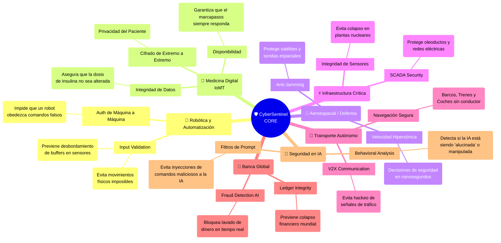

# Visión Futura: El Ecosistema CyberSentinel

Este diagrama conceptualiza la visión pedagógica de cómo los módulos fundamentales de ciberseguridad que estamos construyendo se aplican a sectores críticos de vanguardia.

La ciberseguridad ya no es solo "proteger datos", es **proteger la integridad física y operativa** en el mundo real.

## Explicación Pedagógica de la Aplicación

### 1. Robótica: El peligro de los "Números Negativos"
En el **Lab 01**, vimos cómo un número negativo aumentaba el saldo.
*   **En un Banco:** Pierdes dinero.
*   **En un Robot Industrial:** Si le dices al brazo robótico "muévete -1000 cm", podría atravesar la pared o herir a un operario. La **Validación de Inputs** se convierte en una norma de **Seguridad Física**.

### 2. Medicina (IoMT): Autenticación de Vida o Muerte
En el **Lab 02**, vimos ataques de identidad.
*   **En una Red Social:** Te roban la cuenta.
*   **En un Marcapasos:** Si un atacante suplanta la identidad del médico, podría enviar una descarga letal. La **Autenticación Robusta** (MFA, Certificados) es vital.

### 3. Aeroespacial: La Importancia del API Gateway
El diagrama del **API Gateway** que hicimos actúa como un escudo contra la radiación de datos basura. En el espacio, el ancho de banda es limitado; un ataque DDoS a un satélite podría dejarlo incomunicado en una maniobra crítica.

### 4. IA vs IA: El Futuro Inmediato
Estamos entrando en una era donde:
*   **IA Ofensiva:** Crea malware mutante y correos de phishing perfectos.
*   **IA Defensiva (Nosotros):** Analiza patrones de comportamiento en tiempo real (nuestro próximo módulo) para detener amenazas que ningún humano vería a tiempo.
