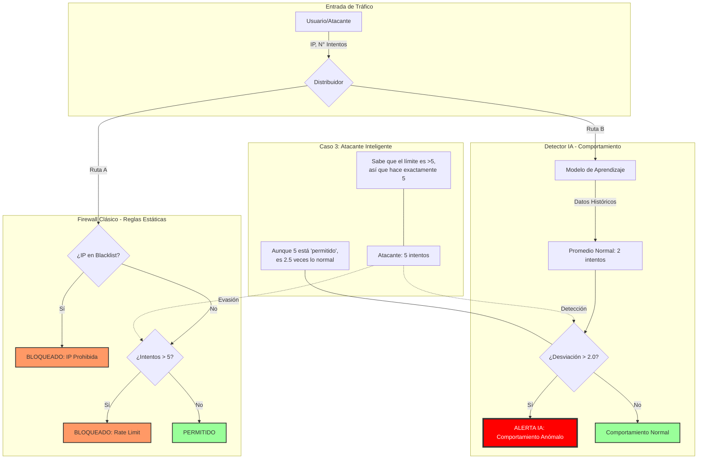

# Diagrama de Flujo: Reglas vs Comportamiento

Este diagrama visualiza la lógica implementada en `lab01_behavior_vs_rules.py`, mostrando cómo un atacante inteligente puede evadir reglas estáticas pero es detectado por análisis de comportamiento.

## Leyenda de Componentes

### 🚦 INPUT (Entrada)
*   **Usuario/Atacante:** La fuente del tráfico. Puede ser legítimo o malicioso.
*   **Router:** Simula el punto que recibe la petición y la envía a los dos sistemas de análisis simultáneamente.

### 🧱 CLASSIC (Firewall Clásico)
*   **Lógica:** Basada en reglas fijas ("IF/ELSE").
*   **RuleIP (Blacklist):** Lista negra de IPs prohibidas conocidas.
*   **RuleRate (Límite):** Regla simple que bloquea si hay más de 5 intentos.
*   **Debilidad:** Si el atacante conoce la regla (hace 5 intentos), pasa desapercibido.

### 🧠 MODERN (Detector IA)
*   **Lógica:** Basada en estadística y contexto.
*   **Modelo de Aprendizaje:** No tiene reglas fijas, aprende lo que es "normal" (2 intentos).
*   **Desviación:** Calcula qué tan lejos de lo normal está el tráfico actual.
*   **Fortaleza:** Detecta que 5 intentos es anómalo (250% más de lo normal), aunque sea un número pequeño.

### 🎭 SCENARIO (Caso de Uso)
*   **Atacante Inteligente:** Un actor que conoce las reglas del Firewall Clásico y ajusta su ataque para evadirlas, pero no puede esconder su "comportamiento" anómalo ante la IA.
