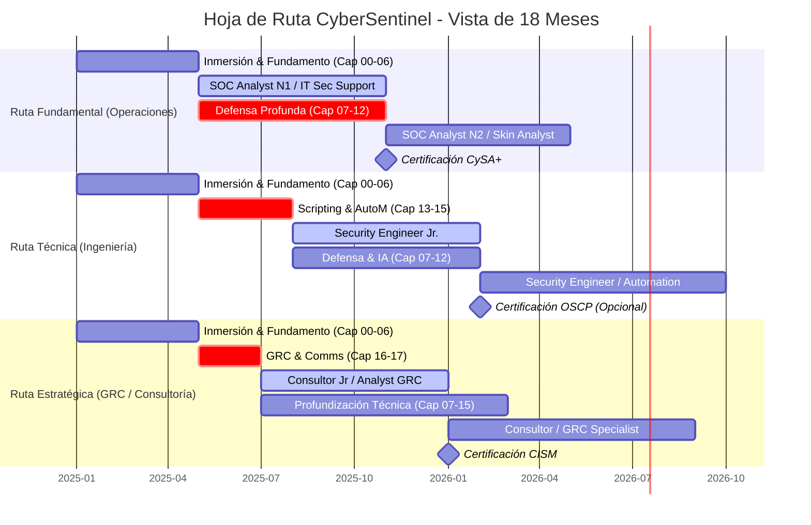

# 🗺️ Apéndice A: Hoja de Ruta de Carrera CyberSentinel

> **"Un objetivo sin un plan es solo un deseo. Tu carrera en ciberseguridad comienza aquí."**

Este apéndice no es teoría. Es tu mapa estratégico para navegar desde el "Hola Mundo" hasta tu primer rol senior en la industria.

## 🗺️ EL MAPA VISUAL: TRES RUTAS, UN DESTINO

---

## 🔰 RUTA 1: EL OPERADOR (SOC / THREAT INTELLIGENCE)
**Perfil:** Metódico, analítico, resistente a la presión. Le gustan los procesos claros y la acción en tiempo real.

### Fase 1: Fundamento Operativo (Meses 1-4)
*   **Capítulos Clave:** 00-06 + Labs 01-06.
*   **Focus Absoluto:** Dominar modelado de amenazas (PASTA) y análisis básico.
*   **Portafolio para CV:**
    *   Tu informe ejecutivo de **CardioGuard (Lab 04)**.
    *   Tu DFD y tabla STRIDE de **ProdSync 4.0 (Lab 06)**.
*   **Certificación a Buscar:** CompTIA Security+ (el curso cubre +70%).
*   **Puesto Objetivo (Meses 4-6):** SOC Analyst N1 | Vulnerability Assessment Analyst.

### Fase 2: Profundización Técnica (Meses 5-10)
*   **Capítulos Clave:** 07-12 + Labs 07-12.
*   **Focus:** Convertirte en el analista que entiende el "por qué" detrás de las alertas.
*   **Habilidades a Vender:**
    *   "Puedo correlacionar alertas del IDS con tácticas MITRE ATT&CK (Cap 08)"
    *   "Sigo metodología de threat hunting (Cap 11) para investigar proactivamente"
*   **Certificación:** CompTIA CySA+ (análisis de seguridad).
*   **Puesto Objetivo (Meses 10+):** SOC Analyst N2/N3 | Threat Intelligence Analyst.

> **Proyección a 18 Meses:** Threat Hunter o SOC Team Lead, con capacidad para diseñar reglas de detección y mejorar procesos del SOC.

---

## ⚙️ RUTA 2: EL INGENIERO (SEGURIDAD / AUTOMATIZACIÓN)
**Perfil:** Creativo técnico, le gusta construir, resolver puzzles complejos, automatizar tareas repetitivas.

### Fase 1: Fundamento + Automatización (Meses 1-6)
*   **Capítulos Clave:** 00-06 + 13-15 (Scripting y SOAR).
*   **Focus Absoluto:** Python para seguridad + fundamentos sólidos.
*   **Portafolio para CV:**
    *   Tu script `risk_calc.py` (Lab 05) mejorado con funciones adicionales.
    *   Un script que automatice una tarea de análisis de logs (inspirado en Cap 14).
*   **Puesto Objetivo (Meses 6-8):** Security Engineer Junior | DevSecOps Assistant.

### Fase 2: Arquitectura y Defensa (Meses 7-14)
*   **Capítulos Clave:** 07-12 + profundizar en 13-15.
*   **Focus:** Aprender a implementar lo que diseñas.
*   **Proyecto Estrella:** Construir un "mini-SOAR" personal que automatice la respuesta a un tipo específico de alerta (ej: bloquear IP en firewall tras X intentos fallidos).
*   **Certificación (Opcional):** OSCP (Red Team) o Azure/AWS Security.
*   **Puesto Objetivo (Meses 14+):** Security Automation Engineer | Cloud Security Engineer.

> **Proyección a 18 Meses:** Especialista en Automatización (SOAR) o Arquitecto de Seguridad Junior, capaz de diseñar e implementar controles técnicos complejos.

---

## 📈 RUTA 3: EL ESTRATEGA (GRC / CONSULTORÍA)
**Perfil:** Comunicador, ve el panorama general, entiende el negocio, traduce riesgos técnicos a impacto financiero.

### Fase 1: Fundamento + Comunicación (Meses 1-5)
*   **Capítulos Clave:** 00-06 + 16-17 (GRC y Comunicación).
*   **Focus Absoluto:** Comunicación ejecutiva + procesos GRC.
*   **Portafolio para CV:**
    *   Tus informes ejecutivos (Labs 04, 06) pulidos al máximo.
    *   Un "One-Pager" que explique un concepto técnico complejo (ej: Zero Trust) a un director financiero.
*   **Puesto Objetivo (Meses 5-7):** Consultor de Ciberseguridad Junior | GRC Analyst.

### Fase 2: Profundización Técnica y Especialización (Meses 6-14)
*   **Capítulos Clave:** 07-15 (para ganar credibilidad técnica).
*   **Focus:** Construir credibilidad técnica profunda para respaldar tus recomendaciones estratégicas.
*   **Proyecto Estrella:** Desarrollar un marco de políticas de seguridad para una startup hipotética, alineado con NIST CSF o ISO 27001 (conceptos de Cap 16).
*   **Certificación:** CISM o CRISC.
*   **Puesto Objetivo (Meses 14+):** Consultor de Riesgos | GRC Specialist | Security Auditor.

> **Proyección a 18 Meses:** Manager de GRC o Consultor Senior, actuando como puente entre el CISO, el negocio y los equipos técnicos.

---

## 🔄 PLAN DE ACCIÓN SEMANAL (PLANTILLA)

| Semana | Objetivo de Aprendizaje | Acción de Carrera | Entregable de Portafolio |
| :--- | :--- | :--- | :--- |
| **1-4** | Cap 00-02: Panorama y Laboratorio. | Crear perfil en LinkedIn con título "Aspirante a [Ruta]". | Screenshot de tu Kali funcionando. |
| **5-8** | Cap 03-04: IA/ML y Modelado. | Conectar con 5 profesionales en tu ruta deseada. | DFD de CardioGuard (Lab 04). |
| **9-12** | Cap 05-06: Riesgo y Proyecto. | Participar en 1 foro/webinar de la industria. | Informe ejecutivo de ProdSync 4.0 (Lab 06). |
| **13-16** | Cap 07-09: Defensa. | Actualizar LinkedIn con proyectos. | Documentar 1 ejercicio de hardening. |
| **17-20** | Cap 10-12: Detección Moderna. | Enviar primeras aplicaciones a puestos Junior. | Script de Python (de los labs). |
| **21+** | Cap 13-18: Especialización. | Preparar para entrevistas técnicas/conductuales. | Portafolio completo PDF para enviar. |

---

## 💡 CONSEJOS ESTRATÉGICOS FINALES

1.  **No sigas las rutas ciegamente:** Son guías. Puedes híbridarlas (ej: Ingeniero que sabe comunicar = perfil de arquitecto).
2.  **El portafolio es tu arma principal:** En cada entrevista, pregunta: *"¿Puedo mostrarle un análisis que hice para un caso similar?"*.
3.  **La comunidad es tu red de seguridad:** Únete a Discord de TryHackMe, HackTheBox, foros locales. Pregunta, comparte tu progreso.
4.  **Tu primer trabajo NO será tu último trabajo:** El objetivo del primer año es aprender en el campo, ganar credibilidad y especializarte.

**CyberSentinel te da el mapa, las herramientas y el mindset. Caminar la ruta depende de ti.**
