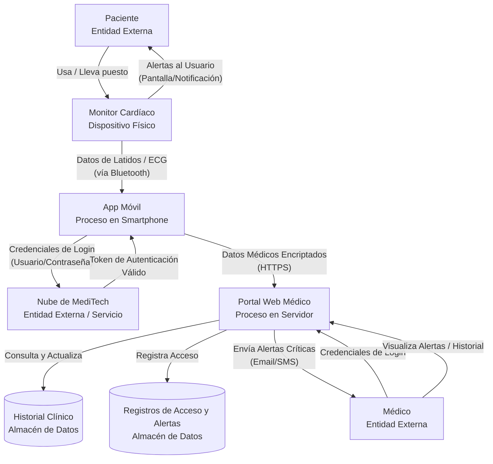

# LABORATORIO 04: TU PRIMER MODELO DE AMENAZAS (THREAT MODELING)

## 🎯 Objetivo de la Misión
Aplicar los conceptos de **STRIDE**, **Kill Chain** y **DFD** a un escenario realista de la salud digital. Crearás un modelo de amenazas básico que podría ser la base de un informe profesional.

*   **⏱️ Tiempo Estimado:** 90-120 minutos.
*   **📝 Entregable:** Informe de Modelado de Amenazas (Plantilla disponible en Recursos).

---

## 📖 Escenario: El Nuevo Monitor Cardíaco Conectado de MediTech

**MediTech Solutions** está a punto de lanzar el **"CardioGuard Connect"**, un monitor cardíaco wearable para pacientes de alto riesgo.
*   Se conecta vía **Bluetooth** a una app en el smartphone del paciente.
*   La app envía datos **encriptados** a la **nube de MediTech**.
*   Los médicos revisan los datos en un **portal web**.

El CEO ha escuchado de los incidentes con bombas de insulina y quiere un análisis de amenazas antes del lanzamiento.

**Tu rol:** Analista de Seguridad Junior en el equipo de consultoría de CyberSentinel.

---

## 🛠️ Parte A: Diagramar el Sistema (30 min)

Dibuja un **Diagrama de Flujo de Datos (DFD) Nivel 1** para el sistema "CardioGuard Connect". Debe incluir al menos:

1.  **Entidades Externas:** Paciente, Médico, Nube de MediTech.
2.  **Procesos:** Monitor Cardíaco (Dispositivo), App Móvil, Portal Web Médico.
3.  **Almacenes de Datos:** Historial Clínico en la Nube.
4.  **Flujos de Datos:** Datos de Latidos (Bluetooth), Alertas, Credenciales de Login.

(Puedes dibujarlo a mano, en un papel, o usar una herramienta digital simple como draw.io o excalidraw).

Identifica en tu DFD 3 activos críticos que deben ser protegidos (ej: datos de latidos en tránsito, historial clínico en la nube).

### �️ Paso 4: Validación con CyberSentinel DFD Helper (Nuevo)

Para ayudarte a reflexionar sobre tu diseño, crea un archivo llamado `validator_dfd.sh` en tu terminal Kali y ejecútalo:

```bash
cat > validator_dfd.sh << 'EOF'
#!/bin/bash
echo "🛡️  CYBERSENTINEL DFD HELPER v0.1"
echo "================================"
echo "Este script no califica, sino que hace preguntas críticas."
echo ""
echo "1. SOBRE ENTIDADES EXTERNAS:"
echo "   ¿Tu DFD incluye al 'PACIENTE' como entidad? (Sí/No)"
echo "   ¿Incluye algo del 'MUNDO EXTERNO' que podría ser malicioso?"
echo ""
echo "2. SOBRE FLUJOS DE DATOS:"
echo "   ¿Etiquetaste el flujo 'DATOS DE LATIDOS'? ¿Qué tecnología usaste (Bluetooth/HTTP)?"
echo "   ¿Hay un flujo de 'CREDENCIALES' hacia la nube? ¿Está etiquetado como 'encriptado'?"
echo ""
echo "3. SOBRE ACTIVOS CRÍTICOS:"
echo "   ¿Qué TRES activos en tu DFD son más sensibles?"
echo "   Ejemplo: 1) Historial clínico en DB, 2) Datos en tránsito, 3) Claves de API."
echo ""
echo "4. COMPARACIÓN CON REFERENCIA:"
echo "   La diferencia más grande entre tu DFD y el de referencia es:"
echo "   [ ] Agregué componentes     [ ] Simplifiqué algo     [ ] Cambié flujos"
echo ""
echo "📌 Reflexión final: Si un atacante viera tu DFD, ¿cuál es el primer componente que atacaría?"
echo "   Escribe tu respuesta en una línea:"
echo "   ________________________________________________________"
EOF

chmod +x validator_dfd.sh
./validator_dfd.sh
```

📝 Propósito del validador:

*   No es un examen automatizado. Es una guía de pensamiento crítico.
*   Fuerza al cadete a verbalizar sus decisiones de diseño.
*   Prepara el terreno para la Parte B (STRIDE), porque ya ha identificado activos y flujos.
*   Crea un diálogo interno entre el cadete y su propio trabajo.

### �🔍 Referencia: Nuestro DFD de Análisis (Cómo Lo Haría CyberSentinel)

"Antes de que empieces, aquí está el DFD que el equipo de CyberSentinel creó para este sistema. Úsalo como guía, no como una trampa para copiar. Tu versión puede (¡y debe!) tener variaciones basadas en tus suposiciones."



#### Análisis de los 3 Activos Críticos (Ejemplo):

1.  **Datos de Latidos/ECG en Tránsito (Flujo Bluetooth):** Confidencialidad. Si no está encriptado, es una filtración de información (I).
2.  **Historial Clínico (Almacén de Datos):** Confidencialidad e Integridad. Es el activo principal. Un acceso no autorizado es filtración (I), una alteración es manipulación (T).
3.  **Credenciales de Login (Flujo App→Nube):** Confidencialidad. Si se interceptan, permiten suplantación (S) del paciente o médico.

> **Instrucción para el Estudiante (Modificada):**
>
> "Ahora, dibuja tu propio DFD para el sistema CardioGuard Connect. Usa el nuestro como referencia, pero no lo copies directamente. Piensa en componentes adicionales (¿un servidor de notificaciones?). Cuando termines, compáralo con nuestro modelo y anota: ¿Qué flujos o componentes se te olvidaron? ¿Cuáles añadiste que nosotros no consideramos? Esto es clave para desarrollar tu criterio."

---

## 🕵️ Parte B: Identificar Amenazas con STRIDE (30 min)

Toma cada componente principal de tu DFD y pregúntate: *"¿Podría ocurrir aquí...?"*

Llena una tabla como la siguiente para al menos **5 amenazas distintas**:

| Componente (Del DFD) | Categoría STRIDE | Descripción de la Amenaza | Impacto Potencial (Bajo/Medio/Alto) |
| :--- | :--- | :--- | :--- |
| *Ej: Flujo Bluetooth* | *Information Disclosure* | *Un atacante cercano podría espiar los datos de latidos sin encriptar.* | *Alto (Privacidad del paciente violada)* |
| *Ej: App Móvil* | *Spoofing* | *Una app falsa podría suplantar a la legítima para robar credenciales.* | *Alto (Acceso a datos sensibles)* |
| [Tu respuesta] | ... | ... | ... |

---

## ⚔️ Parte C: Mapear una Cadena de Ataque (Kill Chain) (20 min)

Elige **UNA** de las amenazas de tu tabla y describe cómo un atacante podría ejecutarla, etapa por etapa de la Kill Chain.

**Amenaza Elegida:** [Ej: Alterar (Tampering) los datos de latidos enviados al médico]

1.  **Reconocimiento:** [¿Cómo investigaría el atacante?]
2.  **Preparación del Arma:** [¿Qué herramienta o método prepararía?]
3.  **Entrega:** [¿Cómo llegaría el ataque al sistema?]
4.  **Explotación:** [¿Qué vulnerabilidad explotaría?]
5.  **Instalación:** [¿Cómo se establecería en el sistema?]
6.  **Comando y Control (C2):** [¿Cómo controlaría el ataque?]
7.  **Acción en los Objetivos:** [¿Cuál sería el resultado final?]

---

## 🛡️ Parte D: Proponer Mitigaciones (10 min)

Para la misma amenaza que elegiste en la Parte C, propón una medida de mitigación concreta para cada una de estas fases defensivas:

1.  **Prevención (Evitar que ocurra):** [Ej: Implementar encriptación de extremo a extremo en la conexión Bluetooth.]
2.  **Detección (Saber si ocurrió):** [Ej: El portal médico alerta si los datos de latidos son fisiológicamente imposibles.]
3.  **Respuesta (Contener el daño):** [Ej: Protocolo para verificar manualmente con el paciente ante alertas graves.]

---

## 📝 ENTREGABLE: INFORME DE MODELADO DE AMENAZAS

Puedes copiar la estructura de este apartado en tu propio documento o usar la **Plantilla Informe Lab 04** en formato `.md` descargable desde la plataforma, que contiene esta misma estructura lista para editar. Complétala con la siguiente información:

1.  **Diagrama del Sistema** (Captura o descripción).
2.  **Tabla Resumen de Amenazas Identificadas** (STRIDE).
3.  **Análisis de una Cadena de Ataque en Profundidad** (Kill Chain).
4.  **Mitigaciones Propuestas** (Prevención, Detección, Respuesta).
5.  **Conclusión y Recomendación Principal:** En 2-3 oraciones, resume el riesgo más crítico y la recomendación más importante.

> **¡Misión Cumplida!** Has dado el salto de pensar en "vulnerabilidades" a pensar en "adversarios con objetivos".

---

## 📊 CyberSentinel Tracker – Evaluación Práctica

### Rúbrica de Evaluación del Laboratorio
Marca lo que hayas completado satisfactoriamente. Usa esta rúbrica para autoevaluarte antes de entregar el informe.

<div class="lab-tracker-container" data-lab-id="lab04">
  <table class="lab-tracker-table">
    <thead>
      <tr>
        <th>Criterio de Ejecución</th>
        <th>✅ Completado</th>
        <th>Puntos</th>
      </tr>
    </thead>
    <tbody>
      <tr>
        <td><strong>Parte A:</strong> DFD propio dibujado y comparado críticamente con la referencia.</td>
        <td style="text-align:center;">
          <input type="checkbox" class="lab-checkbox" data-row="dfd" data-points="3">
        </td>
        <td>/3</td>
      </tr>
      <tr>
        <td><strong>Parte B:</strong> Tabla STRIDE con al menos 5 amenazas bien descritas.</td>
        <td style="text-align:center;">
          <input type="checkbox" class="lab-checkbox" data-row="stride" data-points="3">
        </td>
        <td>/3</td>
      </tr>
      <tr>
        <td><strong>Parte C:</strong> Una Kill Chain completa, etapa por etapa, para una amenaza.</td>
        <td style="text-align:center;">
          <input type="checkbox" class="lab-checkbox" data-row="killchain" data-points="2">
        </td>
        <td>/2</td>
      </tr>
      <tr>
        <td><strong>Parte D:</strong> Mitigaciones propuestas para Prevención, Detección y Respuesta.</td>
        <td style="text-align:center;">
          <input type="checkbox" class="lab-checkbox" data-row="mitigaciones" data-points="2">
        </td>
        <td>/2</td>
      </tr>
      <tr>
        <td><strong>Informe:</strong> Entregable completo con conclusión personal clara.</td>
        <td style="text-align:center;">
          <input type="checkbox" class="lab-checkbox" data-row="informe" data-points="2">
        </td>
        <td>/2</td>
      </tr>
    </tbody>
  </table>

  <div class="lab-score-display">
    PUNTUACIÓN DEL LAB: <span class="lab-score-value">0 / 12</span>
  </div>
  <div class="lab-feedback">
    Usa esta rúbrica como checklist antes de considerar el laboratorio como completado.
  </div>
</div>
