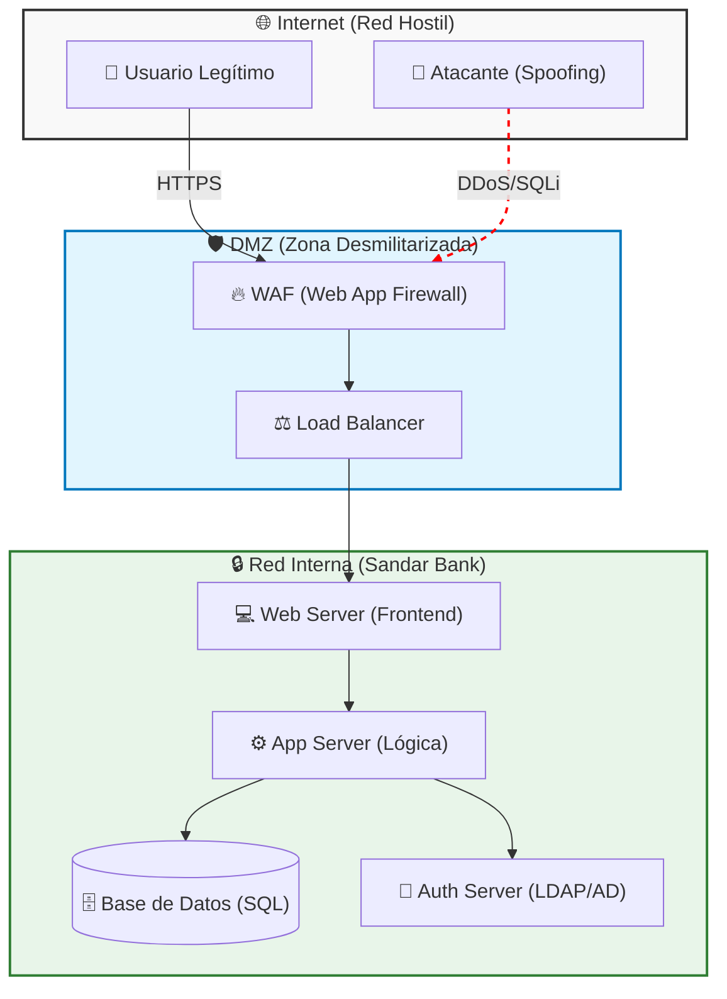
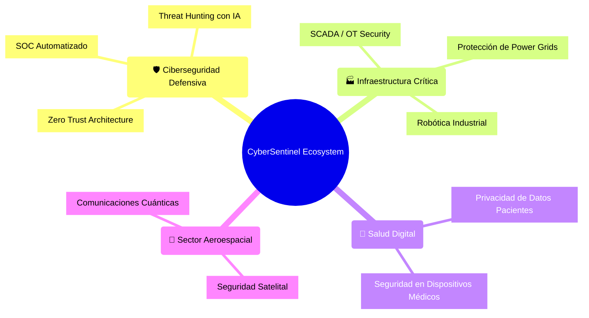

# 📊 Recursos Visuales del Libro

Este archivo contiene el código fuente (Mermaid) de los diagramas clave para ser insertados en el libro.

## 1. Diagrama General de Sandar Digital Bank (Capítulo 1)
Representa la arquitectura de alto nivel y los puntos de entrada.



## 2. Detalle del API Gateway (Capítulo 2)
Muestra las capas de defensa específicas para APIs.

```mermaid
graph TD
    Client["📱 Cliente Móvil / Web"] -->|1. Request (HTTPS)| Gateway
    
    subgraph APIGateway ["🛡️ API Gateway Seguro"]
        style APIGateway fill:#fff3e0,stroke:#f57c00,stroke-width:2px
        
        RateLimit["⏱️ Rate Limiter\n(Frena Brute Force)"]
        AuthCheck["🔑 Auth Guard\n(Valida JWT)"]
        InputVal["✅ Input Validator\n(Limpia XSS/SQLi)"]
        
        Gateway["🚪 Entrada Gateway"] --> RateLimit
        RateLimit --> AuthCheck
        AuthCheck --> InputVal
    end
    
    InputVal -->|2. Request Limpia| Microservices
    
    subgraph Backend ["🏭 Microservicios"]
        ServiceA["💰 Servicio Pagos"]
        ServiceB["👤 Servicio Usuarios"]
    end

    linkStyle 0 stroke-width:2px;
```

## 3. Ecosistema Futuro (Capítulo 5 / Epílogo)
Mapa mental de la expansión de la ciberseguridad a otros sectores.


