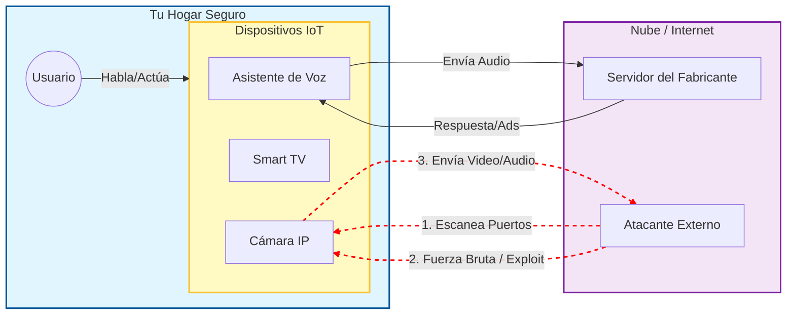
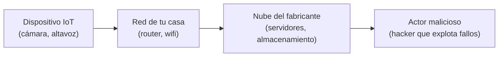

# Concepto 6: El Internet de las Cosas (IoT) y la Privacidad

## ¿Tus Dispositivos te Escuchan?

Imagina que invitas a un mayordomo muy servicial a vivir en tu casa. Él te pone música, te dice el clima y apaga las luces. Pero, tiene una condición: **nunca duerme y tiene un teléfono conectado las 24 horas con su jefe en una oficina central**, contándole todo lo que haces para "mejorar su servicio".

Esto es el **IoT (Internet of Things)**. Dispositivos como **Alexa**, **Smart TVs** o **Cámaras IP** son ordenadores completos con sensores (micrófonos, cámaras) conectados permanentemente a Internet.

### Los Vectores de Riesgo

Existen tres formas principales en las que estos dispositivos comprometen tu privacidad:

1.  **La "Escucha Activa" (El Fabricante):**
    *   Dispositivos como Alexa o Google Home graban fragmentos de audio para procesar comandos. A veces, se activan por error y envían conversaciones privadas a la nube para ser "analilzadas" por humanos para mejorar el algoritmo.
    *   Las Smart TVs rastrean qué ves (ACR - Automatic Content Recognition) para vender esos datos a publicistas.

2.  **Vulnerabilidades de Software (El Hacker):**
    *   Si el dispositivo tiene un fallo de seguridad (bug) y no se actualiza, un atacante puede tomar control remoto, activando la cámara o el micrófono sin que se encienda la luz LED de aviso.

3.  **Configuraciones por Defecto (El Descuido):**
    *   Muchas cámaras de seguridad baratas vienen con contraseñas por defecto (ej: usuario: `admin`, pass: `1234`). Existen buscadores en internet (como [Shodan](#shodan)) que rastrean el mundo buscando estas cámaras abiertas para que cualquiera las vea.

### Visualizando el Riesgo

A continuación, un diagrama de cómo un dispositivo IoT puede ser un puente hacia tu intimidad:

### Mini-diagrama visual: del dispositivo al actor malicioso

Si alguna de esas flechas se rompe (mal cifrado, contraseñas débiles o falta de actualizaciones), el camino hacia tu privacidad queda abierto.
