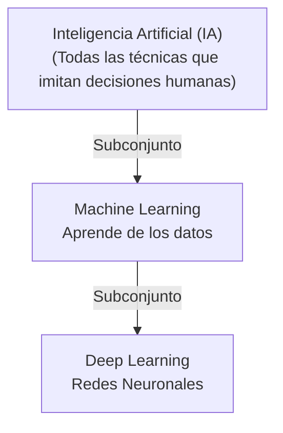
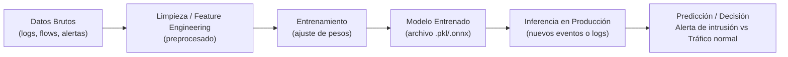

# Capítulo 03: Vocabulario Esencial de IA/ML
*(Desmitificando la "Magia" Negra)*

> **La analogía del capítulo:** Programar tradicionalmente es como darle a un robot instrucciones exactas: "Camina 10 pasos, gira 90 grados". Machine Learning es como entrenar a un perro: le muestras 100 veces qué es una pelota y qué es un palo, y dejas que su cerebro entienda la diferencia por sí mismo.

Hasta ahora, la ciberseguridad se basaba en reglas estáticas: "Si el tráfico viene de Rusia, bloquéalo". "Si el archivo tiene este hash, bórralo". Pero los atacantes cambian sus reglas cada día. Aquí es donde entra la Inteligencia Artificial. No para reemplazar al analista, sino para procesar los millones de datos que un humano no puede ver.

En este capítulo, vamos a romper las "Buzzwords" de marketing y entender qué es realmente lo que estamos usando.

---

## 3.0 Inmersión: El Caja Negra que Nadie se Atrevía a Apagar

Un proveedor le vende a TechSafeLock una "Caja de IA" para detectar fraudes en tiempo real.

Promete:

- "99.9% de precisión".
- "Zero-Day detection".
- "Reducción del 80% de trabajo en el SOC".

La conectan frente a la API de pagos. Durante las primeras 24 horas:

- Bloquea 50 transacciones legítimas de clientes VIP.
- Deja pasar 2 intentos de fraude pequeños que el sistema antiguo sí habría detenido.
- El equipo de operaciones está furioso, el proveedor insiste en que "el modelo necesita más datos".

### 💭 El dilema del cadete

  
<strong>Si fueras el responsable de seguridad, ¿qué te preocuparía más en las primeras 24 horas?</strong>

  

    <button class="quiz-option" data-option-id="a" data-correct="true">
      A. Que deje pasar fraudes pequeños (Falsos Negativos), aunque bloquee de más.
    </button>
    <button class="quiz-option" data-option-id="b">
      B. Que bloquee operaciones legítimas (Falsos Positivos), aunque detecte todo.
    </button>
    <button class="quiz-option" data-option-id="c">
      C. Que la interfaz gráfica no tenga modo oscuro.
    </button>
  

  

No hay respuesta perfecta, pero como CyberSentinel necesitas entender el **trade-off**:

- Demasiados Falsos Positivos matan la operación.
- Un solo Falso Negativo grave puede matar la empresa.

En el resto del capítulo vas a poner nombre y estructura a esta tensión: IA vs ML vs DL, tipos de aprendizaje y métricas que importan en un SOC real.

---

## 3.1 La Matrioska: IA vs. ML vs. DL

Es común usar estos términos indistintamente, pero son capas diferentes de la misma cebolla.

1.  **Inteligencia Artificial (IA):** El concepto general. Cualquier técnica que permita a las máquinas imitar la inteligencia humana. Puede ser tan simple como un script de "If/Else" en un videojuego de los 80s.
2.  **Machine Learning (ML):** Un subconjunto de la IA. Aquí la máquina **aprende** de los datos sin ser explícitamente programada para cada caso.
    *   *Ejemplo:* Un filtro de Spam. No le dices "bloquea correos con la palabra Viagra". Le das 10,000 correos de spam y 10,000 legítimos, y el algoritmo aprende qué patrones (palabras, horas, remitentes) definen al spam.
3.  **Deep Learning (DL):** Un subconjunto del ML inspirado en el cerebro humano (Redes Neuronales). Es capaz de aprender patrones extremadamente complejos.
    *   *Ejemplo:* Reconocimiento facial o entender que un archivo binario ofuscado sigue siendo malware, aunque nunca antes lo haya visto.

> **En resumen:** Todo Deep Learning es Machine Learning, pero no todo Machine Learning es Deep Learning.

### Diagrama 3.1: La Matrioska de la IA

Lee el diagrama de arriba hacia abajo: todo lo que está dentro de Deep Learning también es Machine Learning, y todo lo que está dentro de Machine Learning pertenece al paraguas más grande de IA.

---

## 3.2 Tipos de Aprendizaje (El Enfoque Táctico)

Como CyberSentinel, usarás algoritmos para cazar amenazas. Dependiendo de qué datos tengas, usarás un tipo de entrenamiento diferente.

### 1. Aprendizaje Supervisado (El Profesor Estricto)
Tienes datos etiquetados. Sabes la respuesta correcta ("Ground Truth").
*   **Cómo funciona:** Le das al modelo un archivo y le dices: "Esto es Malware". Le das otro y le dices: "Esto es benigno".
*   **Uso en Ciberseguridad:** Detección de malware conocido, clasificación de correos de Phishing.
*   **Limitación:** Si aparece un ataque nuevo que nunca ha visto (Zero-Day), probablemente fallará.

### 2. Aprendizaje No Supervisado (El Detective Solitario)
No tienes etiquetas. Solo tienes un montón de datos crudos y buscas patrones ocultos.
*   **Cómo funciona:** Le das al modelo 1TB de logs de red y le dices: "Agrúpalos por similitud". El modelo te dirá: "El 99% del tráfico se ve así, pero este 1% es muy raro y diferente".
*   **Uso en Ciberseguridad:** Detección de anomalías (User Behavior Analytics - UBA). "Juan de Contabilidad nunca se conecta a las 3 AM desde Ucrania. Esto es raro".
*   **Poder:** Es excelente para encontrar cosas que no sabías que debías buscar.

### 3. Aprendizaje Por Refuerzo (El Videojuego)
El agente aprende a base de prueba y error, recibiendo recompensas o castigos.
*   **Uso en Ciberseguridad:** Agentes autónomos de Red Teaming que intentan penetrar una red y aprenden qué técnicas funcionan mejor para evadir el firewall.

---

## 3.3 Métricas de Vida o Muerte

En un laboratorio de datos, un error del 5% es aceptable. En un SOC (Centro de Operaciones de Seguridad), un error puede significar una brecha de datos o bloquear el acceso a todo el hospital.

*   **Falso Positivo (La Falsa Alarma):** El sistema dice que es un ataque, pero es tráfico legítimo.
    *   *Consecuencia:* Fatiga de alertas. El analista deja de prestar atención. Bloqueo de operaciones críticas.
*   **Falso Negativo (El Silencio Mortal):** El sistema dice que todo está bien, pero hay un ataque real ocurriendo.
    *   *Consecuencia:* Hackeo exitoso. Es el peor escenario posible.

> **Dilema del Analista:** ¿Prefieres un sistema paranoico que te despierte a las 3 AM por nada (Muchos Falsos Positivos) o uno relajado que deje pasar un Ransomware (Falsos Negativos)? Ajustar este umbral es un arte.

---

## 3.4 Entrenamiento vs. Inferencia (El Gimnasio vs. La Pelea)

*   **Entrenamiento (Training):** Es la fase pesada. Requiere GPUs potentes y horas/días de cómputo para enseñar al modelo. Es como el boxeador entrenando durante meses en el gimnasio.
*   **Inferencia (Inference):** Es cuando pones el modelo a trabajar en producción. Es rápido. El modelo toma una decisión basada en lo que aprendió. Es el boxeador en el ring dando el golpe en milisegundos.

### Diagrama 3.2: Flujo de Trabajo de un Modelo

Arriba puedes ver el ciclo completo: la parte izquierda es el "gimnasio" (entrenamiento) y la parte derecha es la "pelea" (inferencia en el SOC).

---

## 🎯 Resumen Práctico del Capítulo

1.  **ML** es encontrar patrones en datos. **DL** es encontrar patrones en patrones (más complejo).
2.  Usa **Supervisado** para encontrar lo que ya conoces (Firmas, Malware viejo).
3.  Usa **No Supervisado** para encontrar lo desconocido (Anomalías, Zero-Days).
4.  En Ciberseguridad, un **Falso Negativo** es mucho más peligroso que un Falso Positivo, pero demasiados Falsos Positivos matan la productividad.

### 📝 Checklist de Comprensión
- [ ] ¿Puedes explicar la diferencia entre Supervisado y No Supervisado usando una analogía de seguridad?
- [ ] Si un IDS alerta sobre un ataque que no existió, ¿es un Falso Positivo o Negativo?
- [ ] ¿Qué fase requiere más poder de cómputo: entrenar el modelo o usarlo (inferencia)?

**Próximo paso:** Pasaremos a la **Parte 01: Modelado de Amenazas**, donde empezaremos a pensar como el enemigo antes de escribir una sola línea de código.

---

{{INSERTAR_LABORATORIO:lab_03}}

[← Capítulo 02: Fundamentos Técnicos Acelerados](../capitulo_02_fundamentos_tecnicos/README.md) · [Capítulo 04: Modelado de Amenazas →](../../parte_01_modelado/capitulo_04_modelado_amenazas/README.md)
