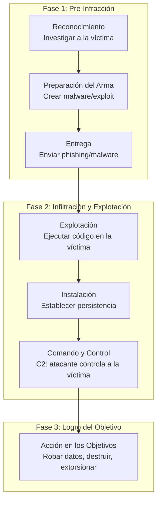
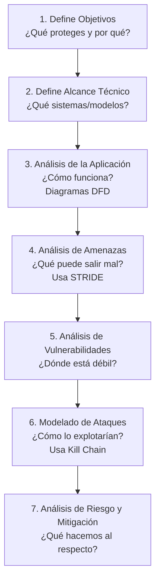

# Capítulo 04: Modelado de Amenazas - El Arte de Sistematizar la Paranoia

> "Un profesional espera lo inesperado. Un amateur solo reacciona a lo que ya conoce."

---

## 🎯 Objetivo de la Misión
Transformar la paranoia intuitiva en un proceso metódico. Aprenderás a identificar, catalogar y priorizar amenazas de seguridad **antes** de que se conviertan en incidentes, utilizando frameworks de la industria.

*   **⏱️ Tiempo Estimado de Estudio:** 75-90 minutos.
*   **🛡️ Frameworks Clave:** STRIDE, Kill Chain de Lockheed Martin, PASTA, Diagramas de Flujo de Datos (DFD).

---

## 4.0 El Detective Ciego: Encuentra el Patrón en el Caos

*Antes de aprender jerga, usa tu intuición. A continuación hay 3 mini-casos reales de fallos de seguridad. Tu misión: ¿Qué tienen en común estos desastres?*

### 🕵️‍♂️ CASO ALFA - El Login que Cualquiera Podía Usar
Un desarrollador creó una API para una app bancaria. Para "facilitar las pruebas", dejó credenciales por defecto: `admin/admin`. Se olvidó de eliminarlo. Un bot encontró la API, usó esas credenciales y transfirió fondos.

  
<strong>🔍 Tu Análisis (Selecciona la causa raíz):</strong>

  

    <button class="quiz-option" data-option-id="a">Alguien adivinó una contraseña muy débil.</button>
    <button class="quiz-option" data-option-id="b" data-correct="true">Alguien usó una identidad que no le pertenecía.</button>
    <button class="quiz-option" data-option-id="c">El sistema no podía registrar quién hizo la acción.</button>
  

  

### 🕵️‍♂️ CASO BETA - El Reporte que Mintió
Un empleado descontento en una fábrica alteró un script que generaba reportes de calidad. Cambió "10% defectos" por "1% defectos". Los lotes defectuosos se enviaron a clientes. Cuando lo confrontaron, dijo: "El sistema debe haber fallado, yo no toqué nada".

  
<strong>🔍 Tu Análisis (Selecciona las dos causas raíz):</strong>

  

    <button class="quiz-option" data-option-id="a" data-correct="true">Los datos dentro del sistema fueron alterados intencionalmente.</button>
    <button class="quiz-option" data-option-id="b" data-correct="true">La persona que hizo el cambio pudo negar su responsabilidad.</button>
    <button class="quiz-option" data-option-id="c">El servicio de reportes se cayó y no estuvo disponible.</button>
  

  

### 🕵️‍♂️ CASO GAMMA - La Base de Datos en la Calle
Un hospital guardaba historiales de pacientes en un servidor. Por error, una carpeta con 50,000 archivos fue configurada con "acceso público" en la red interna. Un visitante en el WiFi público del hospital accedió y copió todos los datos.

  
<strong>🔍 Tu Análisis (Selecciona la causa raíz):</strong>

  

    <button class="quiz-option" data-option-id="a" data-correct="true">Información confidencial quedó expuesta a personas no autorizadas.</button>
    <button class="quiz-option" data-option-id="b">Los doctores no pudieron acceder a los historiales cuando los necesitaban.</button>
    <button class="quiz-option" data-option-id="c">Un atacante externo hackeó el servidor con técnicas sofisticadas.</button>
  

  

### 🔗 CONEXIÓN DE PATRONES: Tu Primer Framework
Mira tus selecciones. No son fallas aleatorias. Cada una representa una categoría fundamental de fallo en sistemas digitales:

*   Caso Alfa = Suplantación de identidad (usar credenciales que no son tuyas).
*   Caso Beta = Manipulación de datos + Negación de acciones.
*   Caso Gamma = Filtración de información confidencial.

Acabas de descubrir 4 de las 6 categorías del framework **STRIDE**, sin que te hayamos dicho su nombre. Tu cerebro ya hizo la conexión *problema real → concepto abstracto*.

💡 Insight CyberSentinel: Los frameworks de seguridad no son teoría inventada. Son patrones observados una y otra vez en incidentes reales. STRIDE es simplemente la taxonomía para nombrar estos patrones.

Respuestas esperadas: Alfa = B, Beta = A y B, Gamma = A. Si coincidiste, ya estás pensando como un modelador de amenazas.

Ahora, cuando leas sobre STRIDE formalmente, tendrás anclajes concretos en tu memoria. Esto es inmersión pura: experimentar el concepto antes de conocer su nombre técnico.

---

## 4.1 Por Qué el Modelado (Y No Solo un Firewall Más Potente)

Imagina que estás a cargo de la seguridad de un castillo medieval.

*   **Enfoque del Amateur:** Pones un guardia más fornido en la puerta, subes el muro unos metros. Reaccionas a la última amenaza que viste.
*   **Enfoque del Profesional (Modelador de Amenazas):** Antes de construir, te sientas con los planos. Te preguntas: *¿Dónde están las puertas secretas? ¿El suministro de agua puede ser envenenado? ¿Un traidor podría abrir la puerta principal desde dentro?* Diseñas el castillo pensando en cómo fallará.

En ciberseguridad es igual. Los fallos catastróficos que hemos visto — **TechSafelock** perdiendo $2M por un error de código, el hospital paralizado por un WiFi abierto — no fueron fallos de **herramientas** (tenían firewalls), sino fallos de **diseño** y **proceso**.

El modelado de amenazas es ese proceso de sentarse con los planos, antes de que el primer ladrillo digital sea puesto.

> **🔍 Conexión con el Caso - TechSafelock:**
> Si hubieran modelado las amenazas de su API de conversión de moneda, se habrían preguntado: *"¿Qué pasa si el parámetro de moneda se altera o se confunde?"*. Un simple control de validación (costo: 2 horas de desarrollo) habría prevenido una pérdida de $2M (costo: millones + reputación).

---

## 4.2 STRIDE: El "ABC" de las Amenazas (Aplicado a Nuestros Casos)

Microsoft desarrolló STRIDE como una **lista de control mnemotécnica** para categorizar amenazas. Es tu primer y más útil kit de diagnóstico. No es teoría abstracta; cada letra corresponde a un fallo que has visto.

| Categoría | Pregunta que Responde | Ejemplo del Mundo Real | Caso CyberSentinel |
| :--- | :--- | :--- | :--- |
| **S**poofing (Suplantación) | ¿Puede alguien falsificar su identidad? | Phishing, emails falsos, DNS spoofing. | El **phishing perfecto con IA** (Cap 00) que suplanta al jefe. |
| **T**ampering (Manipulación) | ¿Puede alguien alterar datos o sistemas? | Modificar una base de datos, alterar logs. | Cambiar los **parámetros de la bomba de insulina** (Cap 00) a través del WiFi. |
| **R**epudiation (No Repudio) | ¿Puede alguien negar que hizo una acción maliciosa? | "Yo no transferí ese dinero", "No fui yo quien borró el archivo". | El **empleado 'Carlos'** (Cap 00) podría negar haber insertado el código malicioso si no hay logs robustos. |
| **I**nformation Disclosure (Filtración) | ¿Puede información confidencial ser expuesta? | Bases de datos filtradas, archivos con permisos incorrectos. | El archivo **secreto.txt** con permisos `777` que creaste en el Lab 02, accesible por cualquiera en el sistema. |
| **D**enial of Service (Denegación) | ¿Puede el servicio ser hecho inaccesible? | Ataques DDoS, ransomware que encripta sistemas. | El **ransomware WannaCry** (Cap 00) que paralizó hospitales, negando el servicio a pacientes. |
| **E**levation of Privilege (Escalación) | ¿Puede un usuario normal obtener privilegios de administrador? | Explotar una vulnerabilidad para obtener acceso root. | Un atacante que, desde una cuenta de usuario baja en el **servidor de TechSafelock**, logra ejecutar código como administrador. |

> **🧠 Ejercicio Rápido:** Toma el caso del **robo de 45 millones de tarjetas en TJX** (Cap 00). ¿Qué categorías STRIDE identificas en ese ataque? *(Pista: empezaron con WiFi sin cifrar...)*.

  
<strong>Quiz rápido:</strong> ¿Cuál de estas situaciones es principalmente un caso de <strong>Spoofing</strong> según STRIDE?

  

    <button class="quiz-option" data-option-id="a">Un atacante sobrecarga un servidor con millones de peticiones.</button>
    <button class="quiz-option" data-option-id="b" data-correct="true">Una app falsa se hace pasar por la app oficial del banco para robar credenciales.</button>
    <button class="quiz-option" data-option-id="c">Un atacante modifica los logs para borrar evidencia.</button>
  

  

<!-- Marcamos la opción correcta mediante atributo data-correct en la opción B -->

---

## 4.3 El Ciclo de Vida del Atacante: La "Kill Chain"

Lockheed Martin adaptó un concepto militar a la ciberseguridad: la **Cyber Kill Chain**. Describe las **etapas secuenciales de un ataque dirigido**, desde la planificación hasta el logro del objetivo. Entenderla te permite **interrumpir el ataque en múltiples puntos**, no solo en la "explosión" final.

#### Diagrama 4.x: Ciclo de Vida del Atacante (Kill Chain)

### La Magia está en la Interrupción:
*   **Fase 1 (Pre-Infracción):** La defensa más barata y efectiva. ¿Cómo? Concienciación anti-phishing (romper la **Entrega**), hardening de sistemas (reducir vectores de **Preparación**).
*   **Fase 2 (Infiltración):** El territorio del SOC y los EDR. Detectar la **Explotación** con firmas/heurísticas, bloquear el tráfico de **Comando y Control** (C2).
*   **Fase 3 (Objetivo):** La última línea. Encriptación de datos (minimizar el daño de la **Acción**), segmentación de red (limitar el movimiento lateral).

### 📋 Aplicación al Caso TJX:
1.  **Reconocimiento:** Conducir cerca de tiendas, escanear redes WiFi.
2.  **Preparación del Arma:** Herramientas para sniffear tráfico de red (Wireshark, etc.).
3.  **Entrega:** Conectarse físicamente a la red WiFi abierta.
4.  **Explotación:** No se necesitó un exploit de software; la vulnerabilidad fue la **configuración** (WiFi sin cifrar).
5.  **Instalación:** Instalar software para capturar números de tarjetas en la red.
6.  **Comando y Control:** Recoger los datos capturados periódicamente.
7.  **Acción en los Objetivos:** Usar los números de tarjetas para comprar bienes.

> **⚠️ Lección Clave:** TJX pudo haber roto la Kill Chain en la **Fase 1** con una simple política de **WiFi cifrado (WPA2/WPA3)**. El modelado de amenazas les habría hecho esa pregunta.

---

## 4.4 PASTA: Un Proceso Paso a Paso para No Perderte

STRIDE te dice **qué** buscar. La Kill Chain te dice **cómo** progresan. **PASTA** (Process for Attack Simulation and Threat Analysis) te da **el proceso** para hacerlo de manera consistente y repetible.

Es un marco de **7 etapas** que vincula los objetivos de negocio con las amenazas técnicas. Para este curso, nos centramos en su esencia: **un flujo de trabajo**.

#### Diagrama 4.x: Flujo General de PASTA

### Caso de Estudio Sencillo (PASTA Lite): La "App Oficial Falsa" del Banco

1.  **Objetivo:** Proteger el dinero y la confianza de los clientes.
2.  **Alcance:** App móvil, servidor de autenticación, base de datos de credenciales.
3.  **Análisis de la App:** Flujo: Usuario introduce credenciales → App las envía al servidor → Servidor verifica y da acceso.
4.  **Análisis de Amenazas (STRIDE):**
    *   *Spoofing:* App falsa que se hace pasar por la legítima.
    *   *Tampering:* Manipular la comunicación entre app y servidor (MitM).
    *   *Information Disclosure:* Robar credenciales de la base de datos.
5.  **Vulnerabilidades:** La tienda de apps (supply chain) es un vector. La comunicación podría no usar certificados pinning.
6.  **Modelado de Ataque (Kill Chain):** Crear app falsa → Subirla a store → Usuario la descarga → App roba credenciales → Se envían al atacante.
7.  **Mitigación:** Educar a usuarios, implementar certificado pinning en la app, monitorear tiendas de apps por clones.

---

## 4.5 Laboratorio 04: Tu Primer Modelo de Amenazas (Threat Modeling)

{{INSERTAR_LABORATORIO:lab_04}}

---

## 📊 Autoevaluación: El Modelador de Amenazas

¿Estás listo para modelar el caos antes de que ocurra?

  <table class="tracker-table">
    <thead>
      <tr>
        <th>Competencia Clave</th>
        <th>Mi Nivel (1-5)</th>
      </tr>
    </thead>
    <tbody>
      <tr>
        <td><strong>STRIDE:</strong> Puedo nombrar las 6 categorías y dar un ejemplo original de cada una.</td>
        <td>
          1
          2
          3
          4
          5
        </td>
      </tr>
      <tr>
        <td><strong>Kill Chain:</strong> Puedo describir las 7 etapas y dar una forma de interrumpir cada una.</td>
        <td>
          1
          2
          3
          4
          5
        </td>
      </tr>
      <tr>
        <td><strong>DFD:</strong> Puedo dibujar un DFD nivel 1 para un sistema simple e identificar activos críticos.</td>
        <td>
          1
          2
          3
          4
          5
        </td>
      </tr>
      <tr>
        <td><strong>Diferenciar:</strong> Puedo explicar la diferencia clara entre 'amenaza', 'vulnerabilidad' y 'riesgo'.</td>
        <td>
          1
          2
          3
          4
          5
        </td>
      </tr>
      <tr>
        <td><strong>Aplicar:</strong> Puedo aplicar el proceso PASTA (en esencia) a un caso nuevo.</td>
        <td>
          1
          2
          3
          4
          5
        </td>
      </tr>
    </tbody>
  </table>
  

    PUNTUACIÓN: 0 / 10
  

  

    Selecciona tu nivel de confianza en cada competencia.
  

