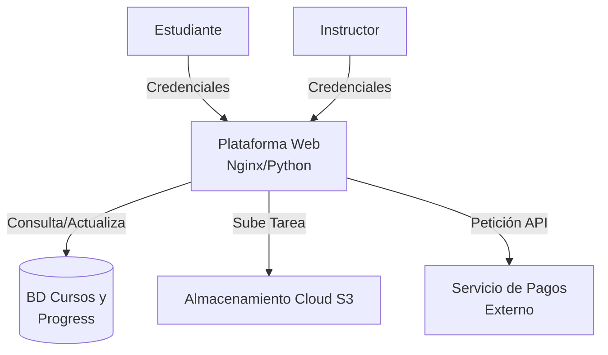
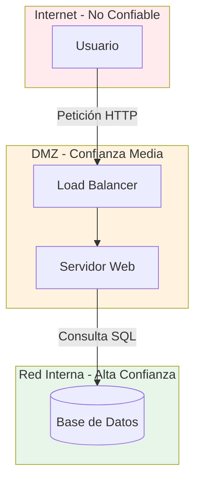
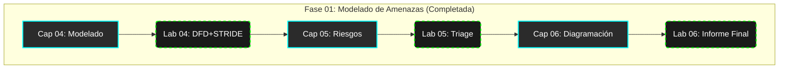

# Capítulo 06: Diagramación de Arquitecturas y Proyecto Final

### De los Diagramas a la Decisión Ejecutiva

> **La cita del capítulo:** *"Un diagrama claro vale más que cien páginas de especificaciones. Un modelo de amenazas claro vale más que mil firewalls mal configurados."*
>
> **🎯 Objetivo de la Misión:** Integrar STRIDE, DFDs, Kill Chain y Análisis de Riesgo en un flujo de trabajo profesional. Aprenderás a producir el entregable más valioso de un modelador de amenazas: un **informe ejecutivo claro y accionable** que impulse decisiones de negocio.
>
> **⏱️ Tiempo Estimado:** 90-120 minutos.
>
> **🛡️ Habilidades Integradas:** DFDs avanzados, PASTA completo, comunicación de riesgos, informe ejecutivo.

---

## 6.0 Inmersión: El Arquitecto vs. El Hacker – La Misma Imagen, Distinto Lente

Observa este diagrama simplificado de una plataforma de **"EduTech Global"** (cursos online). Tienes **60 segundos**.

**🔍 Tu Misión Rápida:**
* **Como HACKER (Red Team):** ¿Cuál es el **primer componente** que probarías atacar y por qué?
* **Como ARQUITECTO DE SEGURIDAD (Blue Team):** ¿Cuál es el **primer control** que implementarías y dónde?

> **💡 Insight CyberSentinel:** El modelador de amenazas efectivo debe poder usar **ambos lentes**. Piensa como el atacante para encontrar puntos débiles, luego piensa como el defensor para priorizar soluciones. Esta dualidad es tu superpoder.

---

## 6.1 DFDs Avanzados: Límites de Confianza y Niveles de Profundidad

Un DFD de nivel 1 (como el de CardioGuard) es el punto de partida. Los profesionales añaden capas de detalle.

### Límites de Confianza (Trust Boundaries)

La **línea roja punteada** más importante en tus diagramas. Separa zonas con **diferentes niveles de confianza**.

* Ejemplo: Todo lo dentro de tu **data center privado** es una zona. **Internet** es otra. El **smartphone del paciente** es otra.
* Cada vez que un flujo de datos cruza un límite de confianza, es un **punto de ataque potencial**.

En el diagrama anterior, el flujo `Consulta SQL` cruzando de la **DMZ** a la **Red Interna** es crítico. ¿Está encriptado? ¿El servidor web tiene permisos mínimos en la base de datos?

### Niveles de DFD: Del Panorama al Detalle

* **Nivel 0 (Contexto):** La caja negra. "El sistema se comunica con el usuario y la nube".
* **Nivel 1 (Funciones Principales):** Los principales procesos y almacenes.
* **Nivel 2+ (Detalle de Proceso):** Desglosas un proceso específico. Ejemplo: `(Servidor Web)` se convierte en `(Autenticar Usuario)`, `(Servir Contenido)`, `(Registrar Log)`.

Para este curso, dominar el **Nivel 1** con límites de confianza es más que suficiente.

---

## 6.2 PASTA en Acción: Recorriendo las 7 Etapas con un Caso Guiado

El poder de **PASTA** es que documenta tu razonamiento. No dices "es riesgoso", dices **"es riesgoso porque en la etapa 4 encontramos X, en la etapa 5 vimos Y, por lo tanto en la etapa 7 priorizamos Z"**.

Ahora aplicaremos el proceso PASTA a un componente de **TechSafeLock**: su función de **Pagos Rápidos entre Contactos**.

| Etapa PASTA | Preguntas y Acciones Clave (Aplicado a "Pagos Rápidos") | Ejemplo de Respuesta / Documentación |
| :--- | :--- | :--- |
| **1. Define Objetivos** | ¿Qué valor de negocio proteges? | "Facilitar transferencias seguras y instantáneas, manteniendo la confianza del cliente y cumpliendo regulaciones (PCI DSS)". |
| **2. Define Alcance** | ¿Qué componentes técnicos están involucrados? | App móvil, API de pagos, servicio de verificación de identidad, base de datos de transacciones, conectores a redes bancarias. |
| **3. Analiza la Aplicación** | ¿Cómo funciona? (DFD + Límites de confianza) | Aquí dibujarías un DFD Nivel 1. |
| **4. Analiza Amenazas** | ¿Qué puede salir mal? (STRIDE por componente) | Spoofing: Suplantar identidad del contacto. Tampering: Alterar el monto durante la transacción. Information Disclosure: Filtrar historial de pagos. |
| **5. Analiza Vulnerabilidades** | ¿Dónde está débil? | "La API no tiene rate limiting por usuario", "La verificación de contactos depende solo del número de teléfono". |
| **6. Modela Ataques** | ¿Cómo lo harían? (Kill Chain) | 1. Reconocimiento: Investigar víctima en redes sociales. 2. Preparación: SIM swapping o robo de cuenta. 3. Explotación: Acceder como contacto confiable y transferir fondos. |
| **7. Analiza Riesgo y Mitiga** | ¿Qué hacemos? (Matriz de Riesgo + 4T's) | Riesgo Alto (15): Suplantación de contacto y desvío de fondos. Mitigación (Tratar): MFA para nuevos beneficiarios, límites diarios por usuario, alertas en tiempo real. |

---

## 6.3 El Arte del Informe Ejecutivo: De lo Técnico a lo Accionable

El informe para el equipo de desarrollo es técnico. El informe ejecutivo para el Director o el CEO es diferente. Su tiempo es limitado y necesita claridad para decidir.

### Estructura de un Informe Ejecutivo de Modelado de Amenazas (1–2 páginas)

**Resumen Ejecutivo (lo más importante):**

* Propósito: "Evaluar riesgos de la nueva función 'Pagos Rápidos'".
* Hallazgo Principal: "El riesgo más alto es la suplantación de contactos, lo que podría llevar a pérdidas financieras directas y daño reputacional".
* Recomendación Clave: "Implementar verificación de doble factor para agregar nuevos beneficiarios, con un costo estimado de X horas de desarrollo".
* Riesgo General: "Medio-Alto. Mitigable con controles planeados".

**Metodología (muy breve):**

* "Se utilizó el framework PASTA, analizando componentes con STRIDE y priorizando con matriz de riesgo".

**Riesgos Principales (Top 3–5 en tabla):**

| Riesgo | Componente afectado | Impacto probable | Nivel de riesgo | Recomendación |
| :--- | :--- | :--- | :--- | :--- |
| Suplantación de contacto | Servicio de verificación | Pérdida financiera, fraude | Alto | MFA para nuevos beneficiarios |
| Alteración de monto en tránsito | API de pagos | Pérdida financiera | Medio | Firmar digitalmente transacciones |

**Siguientes pasos y cronograma:**

* "1. Diseñar MFA (Sprint 24). 2. Auditar logs de transacciones (2 semanas)".

Regla de oro: **Si el ejecutivo solo lee el Resumen Ejecutivo, debe entender el problema y la acción necesaria.**

---

## 6.5 Laboratorio 06: Proyecto Final – Asesor de Seguridad para "AutoManufact Inc."

🎯 Objetivo de la Misión: Actuar como consultor de ciberseguridad. Realizarás un modelado de amenazas completo e integrado para un sistema industrial, aplicando PASTA y generando un informe ejecutivo.

⏱️ Tiempo Estimado: 2–3 horas.  
📝 Entregable: Informe Ejecutivo de Modelado de Amenazas (usando plantilla).

### Escenario: La Fábrica 4.0 Desprotegida

AutoManufact Inc. está modernizando su línea de ensamblaje principal. El nuevo sistema "ProdSync 4.0" integra:

* Sensores IoT en robots que envían datos de vibración y temperatura.
* Una pasarela (gateway) industrial en la fábrica que recibe datos y los envía.
* La plataforma cloud de AutoManufact (AWS) que analiza datos para predicción de mantenimiento.
* Una aplicación web para que los ingenieros de planta vean alertas y manuales.
* Tablets en la fábrica que acceden a esa app web.

El CIO te contrata: "Necesitamos entender los riesgos de seguridad antes de conectar todo. Enséñanos los agujeros más grandes".

---

## 📊 CyberSentinel Tracker – Evaluación de Proyecto
*Autoevalúa tu dominio de la integración de amenazas.*

  <table class="tracker-table">
    <thead>
      <tr>
        <th>Competencia Clave</th>
        <th>Mi Nivel (1-5)</th>
      </tr>
    </thead>
    <tbody>
      <tr>
        <td><strong>Visión Dual:</strong> Puedo alternar entre el "Lente Hacker" (ataque) y el "Lente Arquitecto" (defensa).</td>
        <td>
          1
          2
          3
          4
          5
        </td>
      </tr>
      <tr>
        <td><strong>Límites de Confianza:</strong> Identifico correctamente dónde el dato cruza de una zona a otra en un DFD.</td>
        <td>
          1
          2
          3
          4
          5
        </td>
      </tr>
      <tr>
        <td><strong>PASTA Integrado:</strong> Puedo seguir las 7 etapas sin perderme, conectando el negocio con la técnica.</td>
        <td>
          1
          2
          3
          4
          5
        </td>
      </tr>
      <tr>
        <td><strong>Comunicación Ejecutiva:</strong> Puedo escribir un resumen de riesgo que un CEO entienda en 30 segundos.</td>
        <td>
          1
          2
          3
          4
          5
        </td>
      </tr>
      <tr>
        <td><strong>Priorización Real:</strong> Sé diferenciar entre un riesgo teórico y uno que realmente requiere presupuesto inmediato.</td>
        <td>
          1
          2
          3
          4
          5
        </td>
      </tr>
    </tbody>
  </table>
  

    PUNTUACIÓN: 0 / 10
  

  

    Selecciona tu nivel de confianza en cada competencia.
  

---

## 6.6 Informe de Estado de Misión: Fin de Fase 01

Has completado el ciclo fundamental del pensamiento proactivo en ciberseguridad. En esta fase, has pasado de ser un observador pasivo a un arquitecto de riesgos.

### 🛑 Checkpoint Estratégico: ¿Estás listo para la Defensa?

En CyberSentinel, no avanzamos "por inercia". Avanzamos por competencia.
La **Parte 02 (Defensa en Profundidad)** te entregará herramientas poderosas (Firewalls, IDS, SIEM). Pero, como dice el adagio militar: *"La defensa sin inteligencia es solo ruido".*

Si no entiendes **qué** estás protegiendo (Cap 04), **cuánto** importa (Cap 05) y **cómo** se ataca (Cap 06), tus firewalls serán inútiles.

### 📊 Tablero de Disponibilidad Operativa (Readiness)

Este tablero no es un adorno. Es tu **Semáforo de Acceso** a la siguiente fase.
Analiza tus métricas acumuladas:

*   **Verde (>80%):** Tienes luz verde. Tu mentalidad es predictiva. Estás listo para diseñar arquitecturas defensivas.
*   **Amarillo/Rojo (<50%):** **ALTO.** No avances. Si construyes defensas ahora, dejarás brechas. Regresa al capítulo débil (clic en la barra) y refuerza los conceptos o repite el laboratorio.

#### 🧭 Cómo usar este tablero (modo cadete novel)

1. Mira cada fila (Cap 04, Lab 04, Cap 05, etc.) y fíjate en el número que aparece a la derecha (por ejemplo, `8 / 10` o `3 / 12`).
2. Identifica cuál es tu **punto más débil** de toda la Parte 01 (la barra más corta o el puntaje más bajo).
3. Si tu punto más débil está **por debajo del 50%**, no avances todavía a la Parte 02:
   - Vuelve al capítulo o laboratorio correspondiente.
   - Relee el contenido, refuerza los conceptos y actualiza tu autoevaluación o rúbrica.
4. Usa este tablero como si fuera el panel de un reactor: no se trata de que esté “bonito”, se trata de que no haya indicadores en rojo antes de subir la potencia.

> Este tablero se alimenta de:
> - Tus autoevaluaciones en los trackers de **Cap 04, Cap 05 y Cap 06**.
> - Tus rúbricas prácticas en los **Laboratorios 04, 05 y 06**.
>
> Si ves muchos ceros, no es que “no sirva el tablero”: es que aún no has registrado tus avances. Marca primero tus niveles en cada capítulo/laboratorio y vuelve aquí para ver tu foto real.

  

    

      
Cap 04

      

        

      

      
0 / 10

    

    

      
Lab 04

      

        

      

      
0 / 12

    

    

      
Cap 05

      

        

      

      
0 / 10

    

    

      
Lab 05

      

        

      

      
0 / 12

    

    

      
Cap 06

      

        

      

      
0 / 10

    

    

      
Lab 06

      

        

      

      
0 / 12

    

  

> **Estado del Sistema:** Esperando sincronización de datos de misión...
