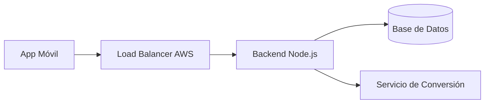
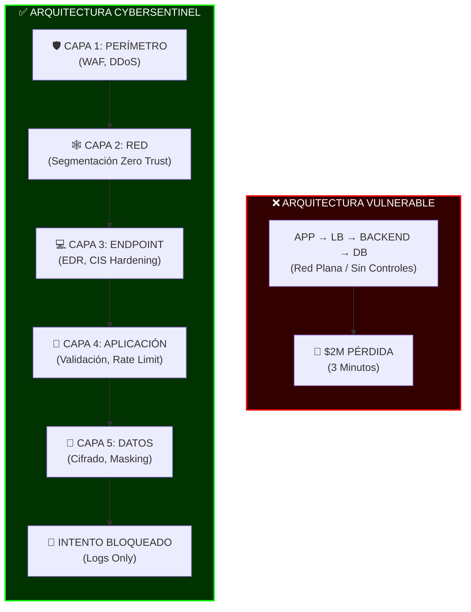
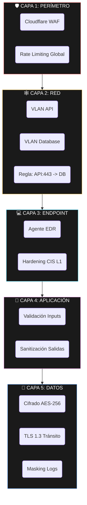
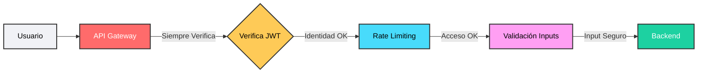
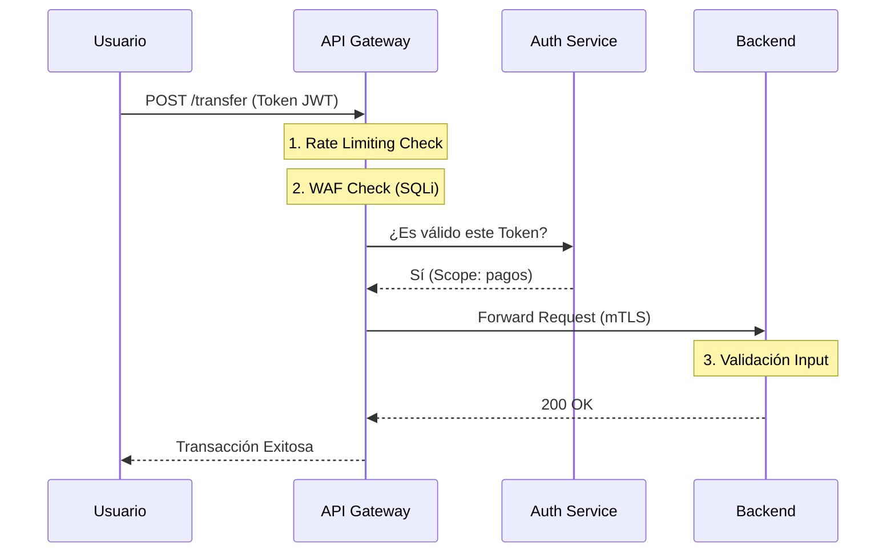
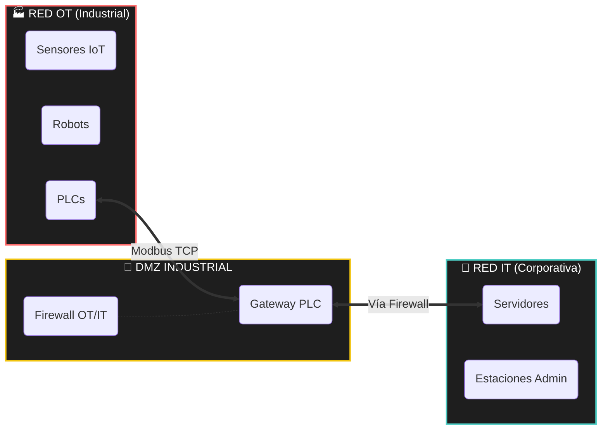
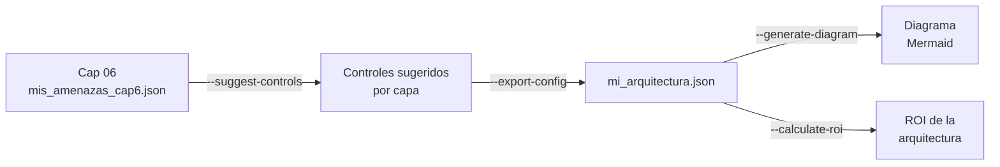
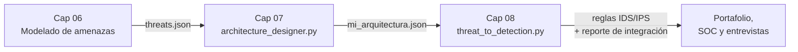

# Capítulo 07: Diseñando Arquitecturas Seguras - De la Amenaza a la Defensa

*Si en el Capítulo 6 identificaste las amenazas, aquí aprenderás a construir las defensas específicas para detenerlas.*

---

## 7.0 Inmersión: El Rediseño de TechSafelock - Cuando $2M en 3 Minutos Cambió Todo

Fecha: 15 de marzo, 02:17 AM  
Localización: Centro de Operaciones de Seguridad, TechSafelock HQ

El monitor principal parpadea en rojo. Los números no paran de subir:

```text
00:00 - $0
00:30 - $124,850
01:00 - $512,300
01:30 - $987,450
02:00 - $1,520,800
02:30 - $1,998,750
03:00 - $2,047,100  ⚠ ALERTA CRÍTICA
```

Tres minutos. Dos millones de dólares. Un ataque perfecto.

Lo que sucedió esa noche (y por qué importa):

TechSafelock, la fintech que procesaba pagos entre startups, había priorizado el
time-to-market por encima de todo. Su arquitectura era la típica de "moverse rápido":



Parecía sólida. Funcionaba rápido. Era lo que todos hacían. Hasta esa noche.

El ataque fue simple pero devastador:

- 00:00: Botnets inician 50,000 requests/minuto a `/api/convert`.
- 00:30: El backend empieza a fallar bajo carga.
- 01:00: La ausencia de rate limiting permite transacciones ilimitadas.
- 02:00: El servicio de conversión procesa tasas erróneas.
- 03:00: $2M en pérdidas antes de que alguien presione "stop".

La autopsia arquitectural: las cinco fallas fatales

Falla 1: El perímetro fantasma

```yaml
# Lo que tenían:
firewall: "Security Groups AWS básicos"
waf: "No implementado"
rate_limiting: "Ninguno"

# Lo que el atacante vio:
# "Puerta abierta. Sin guardias. Sin alarmas."
```

Falla 2: La red plana

Toda la infraestructura vivía en una sola red:

- Servidores de API: 10.0.1.10-50
- Base de datos: 10.0.1.100
- Servicio de conversión: 10.0.1.200
- Monitoring: 10.0.1.250

Un atacante que comprometía un servidor podía verlo todo.

Falla 3: Los endpoints expuestos

Ningún servidor tenía:

- Endpoint Detection and Response (EDR).
- Hardening basado en CIS.
- Logging centralizado.
- Alertas de comportamiento anómalo.

Falla 4: La aplicación ingenua

El endpoint crítico `/api/convert` aceptaba cualquier cosa:

```javascript
app.post('/api/convert', (req, res) => {
  const { amount, from, to } = req.body
  // Procesar transacción...
})
```

Sin validación de tipo, rango ni límites de negocio.

Falla 5: Los datos desnudos

- Credenciales de base de datos en variables de entorno sin rotación ni bóveda segura.
- Logs con números de tarjeta completos.
- Transacciones sin firma digital ni trazabilidad robusta.

Tu misión en este capítulo: ser el arquitecto del cambio.

TechSafelock sobrevivió, pagó los $2M, despidió al CISO y te contrata a ti.
No para poner parches ni configurar "un firewall más", sino para rediseñar todo
desde cero.

El CEO te mira a los ojos:

Quiere una fortaleza digital que resista el próximo ataque de $20M y entender
por qué cada pieza está donde está.

El desafío: pasar de esto:



En los capítulos anteriores aprendiste a identificar amenazas y riesgos (Cap 4-6).
En este capítulo aprenderás a diseñar las defensas arquitecturales que las detienen.

Cada sección de este capítulo responde a una falla específica de esa noche:

- Sin rate limiting → API Gateway con límites (7.2).
- Red plana → Segmentación con VLANs (7.1).
- Backend expuesto → Zero Trust (7.2 y 7.3).
- Sin validación de inputs → Controles en Capa 4 (7.1).
- Datos en texto plano → Cifrado y protección de datos (7.1).

El momento "ajá" de este capítulo llegará cuando puedas mirar tu diagrama y decir:

si pongo el WAF aquí, mitigo los ataques de capa 7; si segmento la red así,
contengo el movimiento lateral; y si aplico Zero Trust, verifico cada petición
aunque venga de dentro. No estarás memorizando conceptos: estarás reconstruyendo
TechSafelock con intención.

Conexión con lo que ya sabes:

en tu informe del Capítulo 6 sobre AutoManufact identificaste amenazas como
ataques a sensores IoT, exfiltración de datos o manipulación de parámetros.
Ahora responderás a la pregunta clave: ¿qué arquitectura habría prevenido
cada una de esas amenazas?

Lo que vendrá después:

- Capítulo 8: aprenderás a detectar cuando alguien intenta evadir tu arquitectura.
- Capítulo 12: conectarás la seguridad física (cámaras) con esta arquitectura digital.
- Capítulo 15: automatizarás la respuesta cuando tus defensas detecten algo.

Pero primero necesitas saber qué construir. Eso es exactamente lo que harás aquí.

Tu primera decisión como arquitecto:

imagina que eres el CTO de TechSafelock la mañana después del ataque y tienes tres opciones:

- Parche rápido: añadir un firewall y seguir adelante.
- Solución media: implementar WAF y algo de rate limiting.
- Rediseño completo: reconstruir con defensa en profundidad y Zero Trust.

En este capítulo verás por qué la tercera es la única opción viable si quieres
que el próximo intento de $20M sea solo un incidente bloqueado en los logs.

Insight CyberSentinel:

los ataques exitosos no ocurren porque falte "un firewall", ocurren porque falta
una arquitectura de seguridad coherente. Este capítulo es la diferencia entre
poner candados y diseñar una fortaleza.

---

## 7.1 Defensa en Profundidad Aplicada a TechSafelock

Hemos desglosado el rediseño aplicando **Defensa en Profundidad** estricta.

### CAPA 1: PERÍMETRO (La Muralla)
*   **Problema Anterior:** Ataque DDoS de capa de aplicación y bots saturando el login.
*   **Solución:** **Cloudflare WAF** con reglas específicas para APIs financieras.
*   **Configuración Concreta:**
    ```yaml
    waf_rules:
      - action: block
        target: "/api/v1/login"
        condition: "requests_per_second > 5 OR country != 'ALLOWED_LIST'"
      - action: challenge
        target: "/*"
        condition: "bot_score > 0.5"
    ```

### CAPA 2: RED (El Laberinto)
*   **Problema Anterior:** Movimiento lateral libre. Si entraban al servidor web, llegaban a la DB.
*   **Solución:** **Segmentación con Micro-VLANs**.
*   **Diseño:**
    *   `VLAN 10 (DMZ)`: Solo API Gateway y Load Balancers.
    *   `VLAN 20 (App)`: Microservicios de backend (sin acceso directo a internet).
    *   `VLAN 30 (Data)`: Bases de datos (solo aceptan tráfico puerto 5432 desde VLAN 20).
    *   `VLAN 99 (Admin)`: Solo accesible vía VPN con MFA.

### CAPA 3: ENDPOINT (Los Soldados)
*   **Problema Anterior:** Servidores web sin hardening, ejecutando servicios innecesarios.
*   **Solución:** **Hardening CIS Level 1 + EDR**.
*   **Checklist de Implementación:**
    *   [x] Deshabilitar SSH por contraseña (solo llaves).
    *   [x] Eliminar compiladores (gcc, make) de producción.
    *   [x] Instalar Agente EDR (Wazuh/CrowdStrike) en modo "Block".

### CAPA 4: APLICACIÓN (La Lógica)
*   **Problema Anterior:** Validación de inputs débil (SQL Injection).
*   **Solución:** **Validación en 3 puntos** (Frontend -> Gateway -> Backend).
*   **Código de Ejemplo (Python):**
    ```python
    def procesar_transaccion(monto):
        # Validación estricta de tipo y rango
        if not isinstance(monto, (int, float)):
            raise SecurityError("Tipo de dato inválido")
        if monto <= 0 or monto > 10000:
            raise SecurityError("Monto fuera de rango permitido")
        return True
    ```

### CAPA 5: DATOS (El Tesoro)
*   **Problema Anterior:** Datos de tarjetas en texto plano.
*   **Solución:** **Cifrado AES-256 + Enmascaramiento**.
*   **Configuración:** La base de datos cifra el disco (TDE) y la aplicación cifra campos sensibles (PAN) antes de insertar.

Diagrama de resumen de defensa en profundidad:



---

## 7.2 API Gateway: Flujo Zero Trust

En el modelo viejo, el Backend confiaba en todo lo que venía del Load Balancer.
En **Zero Trust**, asumimos que el Load Balancer ya fue hackeado.

### Diagrama de Flujo Zero Trust



### Secuencia Detallada



---

## 7.3 Zero Trust en la Práctica: Configuración del API Gateway

Un diseño Zero Trust no se queda en el diagrama. Se concreta en configuraciones
como esta del API Gateway de TechSafelock:

```yaml
# api_gateway_config.yaml
api_gateway:
  name: "techsafelock-payments"
  authentication:
    required: true
    method: "JWT"
    issuer: "auth.techsafelock.com"
  rate_limiting:
    requests_per_minute: 1000
    burst_limit: 100
    per_user: true
  validation:
    - validate_json_schema: "payment_schema.json"
    - sanitize_inputs: true
    - block_sql_injection: true
```

---

## 7.4 Segmentación Industrial OT/IT: Conectando con AutoManufact

Para unir este capítulo con los casos industriales de **AutoManufact**, necesitas
pensar en segmentación entre redes OT e IT:



Aplicación a AutoManufact:

- Los PLCs y robots viven en la **RED OT**.
- Solo el **Gateway PLC** en la **DMZ INDUSTRIAL** habla tanto con OT como con IT.
- Las estaciones de ingeniería y sistemas corporativos están en **RED IT**.
- Un firewall OT/IT controla y registra cada flujo entre mundos.

---

## 7.5 Laboratorio 07: Diseñando la Arquitectura de MediTech 2.0

**Contexto:** Tras el incidente de la bomba de insulina (Capítulo 00), **MediTech** te ha contratado. Quieren asegurar su nueva generación de dispositivos IoT médicos.

**TAREA 1: Análisis de la arquitectura fallida**
- ¿Qué permitió el ataque? (usa tu análisis del Capítulo 06).
- ¿En qué capas falló la defensa?

**TAREA 2: Diseño de nueva arquitectura Zero Trust**
Diseña un DFD con límites de confianza para:
- Dispositivo médico IoT.
- Gateway hospitalario.
- Servidor central.
- App móvil del médico.

**TAREA 3: Especificación técnica por capa**
Para cada componente, define:
- Autenticación: □ JWT □ Certificado X.509 □ Biometría.
- Autorización: □ RBAC □ ABAC.
- Cifrado: □ TLS 1.3 □ Cifrado en reposo.
- Logging: □ Qué eventos □ Dónde almacenar.

**TAREA 4: Justificación para dirección**
Para cada control propuesto:
- ¿Qué amenaza mitiga? (referencia Cap 6).
- ¿Costo estimado vs beneficio?
- ¿ROI esperado?

**Entregables del laboratorio:**
1. Diagrama de arquitectura (.png o .drawio).
2. Documento de especificación (1-2 páginas).
3. Presentación ejecutiva (5 diapositivas máximo).

Usa la plantilla `plantilla_informe_lab07.md` para estructurar tu informe.

---

## 7.6 Herramienta: architecture_designer.py

Para ayudarte a traducir amenazas en controles, hemos creado una herramienta en Python.

**🛠️ Herramienta:** `architecture_designer.py`  
Ubicación: carpeta de este capítulo.

Qué hace en la práctica:

- Toma un archivo JSON con amenazas del Capítulo 06 y sugiere controles por capa.
- Genera código **Mermaid** para diagramas de arquitectura con zonas de confianza.
- Calcula un ROI aproximado de la arquitectura usando tu valor de **ALE**.
- Exporta una configuración unificada para usarla luego en detección (Cap 08).

Ejemplos de uso:

```bash
# 1. De amenazas (Cap 06) a controles sugeridos (Cap 07)
python architecture_designer.py \
  --threats mis_amenazas_cap6.json \
  --suggest-controls

# 2. Generar diagrama de arquitectura en Mermaid
python architecture_designer.py \
  --components componentes_meditech.json \
  --generate-diagram > diagrama_meditech.mmd

# 3. Calcular ROI de tu arquitectura propuesta
python architecture_designer.py \
  --controls controles_meditech.json \
  --ale 750000 \
  --calculate-roi

# 4. Exportar configuración completa para detección (Cap 08)
python architecture_designer.py \
  --components componentes_meditech.json \
  --controls controles_meditech.json \
  --export-config mi_arquitectura.json
```

Diagrama del flujo de uso de la herramienta:



---

## 7.7 Conectando los Puntos: Del Capítulo 6 al Capítulo 8

La seguridad no son islas aisladas; es un proceso continuo. Aquí te mostramos cómo este capítulo conecta el pasado con el futuro.

### ⬅️ Con Capítulo 06 (Análisis de Riesgos)

**Ejercicio de Conexión:**
Toma tu informe de **AutoManufact** (del Laboratorio 06) y realiza lo siguiente:
1.  Para cada **amenaza de alto riesgo** identificada en tu matriz de riesgos.
2.  Diseña un **control arquitectural** específico (ej. si la amenaza es "Acceso físico al PLC", el control es "Jaula con control biométrico + Alerta a SOC").
3.  Clasifica: ¿En qué capa de **Defensa en Profundidad** va este control? (Perímetro, Red, Endpoint, App, Datos).
4.  Define: ¿Qué **configuración específica** necesita? (No digas "un firewall", di "Bloquear puerto 502 Modbus desde IP externas").

### ➡️ Con Capítulo 08 (Detección de Intrusos)

Tu arquitectura es sólida, pero **ningún muro es impenetrable**.
En el próximo capítulo, asumiremos que tus controles fallaron.

**Ejercicio Preparatorio:**
Para la arquitectura que acabas de diseñar en el Lab 07 (MediTech):
1.  Identifica **3 puntos de falla** donde un atacante persistente podría evadir tus controles (ej. "¿Qué pasa si roban el certificado mTLS de un médico?").
2.  Prepara el terreno para el Cap 08: Necesitarás escribir reglas **IDS/IPS (Snort/Suricata)** para detectar esos abusos.
3.  **Reflexión:** ¿Por qué necesitas detección si ya tienes prevención? (Pista: *Defense in Depth*).

Si quieres automatizar la conexión completa **Cap 06 → Cap 07 → Cap 08**, puedes usar:

```bash
# 1. Exporta tu arquitectura desde Cap 07
python architecture_designer.py \
  --components componentes_automantufact.json \
  --controls controles_automantufact.json \
  --export-config mi_arquitectura.json

# 2. Genera reglas IDS a partir de tu arquitectura (Cap 08)
python LIBRO_BORRADOR/volumen_01/parte_02_defensa/capitulo_08_ids_ips/threat_to_detection.py \
  --config mi_arquitectura.json \
  --output cybersentinel.rules
```

El archivo `cybersentinel.rules` resume:

- Cómo se traduce tu diseño arquitectural en reglas IDS concretas.
- Los puntos de monitoreo que vigilarán si tus controles fallan.

Diagrama del flujo completo Cap 06 → Cap 07 → Cap 08:



---

## 📊 Autoevaluación

<div class="tracker-container" data-chapter-id="07" data-points-per-row="2">
  <table class="tracker-table">
    <thead>
      <tr>
        <th>Competencia Clave</th>
        <th>Mi Nivel (1-5)</th>
      </tr>
    </thead>
    <tbody>
      <tr>
        <td><strong>Visión Arquitectónica:</strong> Puedo diseñar una red segmentada (VLANs) para aislar activos críticos.</td>
        <td>
          <span class="tracker-option" data-row="arch_vision" data-val="1">1</span>
          <span class="tracker-option" data-row="arch_vision" data-val="2">2</span>
          <span class="tracker-option" data-row="arch_vision" data-val="3">3</span>
          <span class="tracker-option" data-row="arch_vision" data-val="4">4</span>
          <span class="tracker-option" data-row="arch_vision" data-val="5">5</span>
        </td>
      </tr>
      <tr>
        <td><strong>Diseño Zero Trust:</strong> Entiendo cómo aplicar verificación explícita en APIs y Gateways.</td>
        <td>
          <span class="tracker-option" data-row="zero_trust" data-val="1">1</span>
          <span class="tracker-option" data-row="zero_trust" data-val="2">2</span>
          <span class="tracker-option" data-row="zero_trust" data-val="3">3</span>
          <span class="tracker-option" data-row="zero_trust" data-val="4">4</span>
          <span class="tracker-option" data-row="zero_trust" data-val="5">5</span>
        </td>
      </tr>
      <tr>
        <td><strong>Aplicación de Controles:</strong> Sé traducir una amenaza (ej. SQLi) en un control (ej. WAF/Validación).</td>
        <td>
          <span class="tracker-option" data-row="controls" data-val="1">1</span>
          <span class="tracker-option" data-row="controls" data-val="2">2</span>
          <span class="tracker-option" data-row="controls" data-val="3">3</span>
          <span class="tracker-option" data-row="controls" data-val="4">4</span>
          <span class="tracker-option" data-row="controls" data-val="5">5</span>
        </td>
      </tr>
    </tbody>
  </table>
  <div class="tracker-score-display">
    PUNTUACIÓN: <span class="score-value">0 / 10</span>
  </div>
</div>
