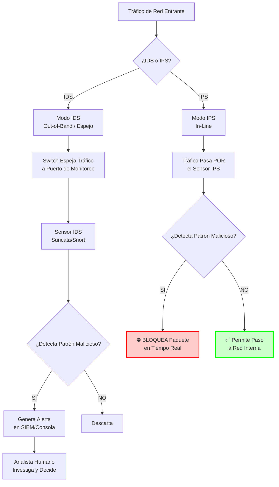
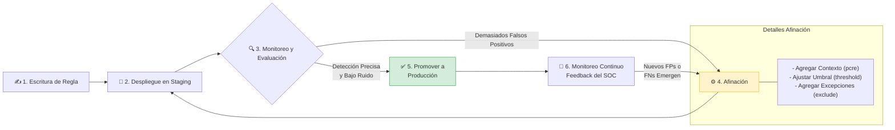
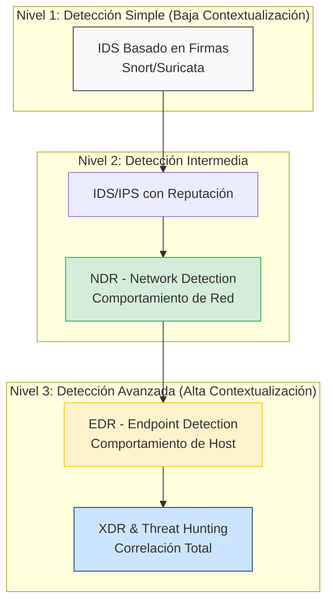

# Capítulo 08: Sistemas de Detección y Prevención - La Conciencia de la Red

> "Un firewall te dice quién llamó a la puerta. Un IDS te dice qué hicieron después de entrar."

---

### 🎯 OBJETIVOS DE LA MISIÓN
1.  **Diferenciar** entre IDS (Cámara) e IPS (Guardia) y cuándo usar cada uno.
2.  **Escribir y generar automáticamente** reglas de detección (Suricata) para identificar ataques específicos a partir de tu arquitectura (Capítulos 6 y 7).
3.  **Reducir** falsos positivos mediante afinación (tunning) de reglas.
4.  **Desplegar** un sensor IDS en una red aislada para detectar tráfico hostil.

---

## 8.0 Inmersión: Lo Que el Firewall de TJX No Vio

Recordemos el caso TJX (Capítulo 00): más de 45 millones de tarjetas robadas.  
El ataque comenzó en el estacionamiento, conectándose a la WiFi sin cifrar.

Lo que el firewall corporativo de TJX vio ese día:

```text
192.168.1.50 → 192.168.10.100:80   (HTTP interno, “normal”)
192.168.1.50 → 192.168.10.200:1433 (SQL Server, “normal”)
192.168.1.50 → 45.33.22.11:443     (HTTPS saliente, “backup” permitido)
```

Lo que un IDS hubiera detectado en minutos:

- Origen inusual: tráfico SQL desde una IP de tienda minorista hacia el servidor central de tarjetas.
- Comando anómalo: `SELECT card_number, expiration FROM dbo.credit_cards` ejecutándose desde una terminal de caja.
- Exfiltración masiva: 2GB de datos enviados vía HTTPS a un dominio extraño.

La lección: los firewalls protegen el perímetro. Los IDS protegen el interior.  
TJX no tenía ojos dentro de su propia red.

---

## 8.1 Cámaras (IDS) vs Guardias Armados (IPS): Aplicado a Nuestros Casos

IDS (Detección) vs IPS (Prevención):



| Escenario / Dimensión           | IDS (Detección)                                                                 | IPS (Prevención)                                                                 | Aplicación en Nuestros Casos                                                                 |
| :------------------------------ | :------------------------------------------------------------------------------ | :------------------------------------------------------------------------------- | :------------------------------------------------------------------------------------------- |
| Analogía                        | Cámaras en el pasillo                                                          | Guardia que bloquea puertas                                                      | IDS observa, IPS interviene                                                                 |
| Acción                          | ALERTA al SOC                                                                  | BLOQUEA el tráfico                                                               |                                                                                              |
| En TechSafelock (tormenta $2M)  | Hubiera alertado a los 10 segundos sobre la ráfaga de transacciones erróneas. | Hubiera bloqueado las transacciones, pero también algunas legítimas.            | Conclusión: IDS para monitoreo de APIs críticas.                                            |
| En MediTech (bomba de insulina) | Hubiera alertado sobre comandos SET_PARAM con dosis peligrosas.               | Hubiera bloqueado el comando, salvando al paciente.                             | Conclusión: IPS JUSTIFICADO en dispositivos médicos críticos.                               |
| Regla de Oro                    | Siempre empieza con IDS (modo monitor).                                        | Solo IPS cuando sabes exactamente qué bloquear.                                  |                                                                                              |

📌 **Regla de Oro de CyberSentinel:**  
Implementa IPS solo donde un falso positivo sea menos costoso que un ataque exitoso.  
En un dispositivo médico: **SÍ**. En la API de pagos de un banco: **NO**.

---

## 8.2 El Lenguaje del Cazador: Reglas para Nuestros Casos

### Caso 1: TechSafelock – Detectando la Tormenta de $2M

```suricata
alert tcp $FINTECH_NET any -> $API_SERVERS 8443 \
 (msg:"CYBERSENTINEL - TechSafelock - Ráfaga de transacciones de conversión anómala"; \
  flow:established,to_server; \
  content:"POST /api/convert"; nocase; http_uri; \
  content:"amount"; nocase; http_client_body; \
  threshold:type threshold, track by_dst, count 100, seconds 10; \
  classtype:denial-of-service; \
  reference:case,cybersentinel-techsafelock-001; \
  sid:1000101; rev:1;)
```

🔍 Análisis: detecta 100 peticiones `POST /api/convert` en 10 segundos.  
Hubiera generado una alerta a los 10 segundos del incidente, no a los 3 minutos.  
El SOC hubiera tenido 170 segundos extra para reaccionar.

### Caso 2: MediTech – Cazando al Manipulador de la Bomba

```suricata
alert tcp any any -> $MEDICAL_IOT_NET 5000 \
 (msg:"CYBERSENTINEL - MediTech - Comando peligroso a dispositivo médico"; \
  flow:to_server,established; \
  content:"SET_PARAM"; nocase; \
  pcre:"/(MAX_DOSE|MIN_BASAL)\\s*[>=]\\s*([7-9][0-9]|1[0-9][0-9])/"; \
  classtype:attempted-admin; \
  priority:1; \
  reference:case,cybersentinel-meditech-001; \
  sid:1000102; rev:1;)
```

🔍 Análisis: busca parámetros `MAX_DOSE` o `MIN_BASAL` con valores ≥70.  
Cualquier ocurrencia es crítica. Aquí sí justificarías un IPS para bloquear automáticamente.

### Caso 3: TJX – La Exfiltración Silenciosa

```suricata
alert tcp $INTERNAL_NETS any -> $EXTERNAL_NET $HIGH_PORTS \
 (msg:"CYBERSENTINEL - TJX - Posible exfiltración masiva de datos"; \
  flow:established,to_server; \
  content:"SELECT"; nocase; \
  byte_test:4,>,1073741824,0,relative; \
  pcre:"/(card_number|cc_num|pan)/i"; \
  classtype:data-leak; \
  reference:case,cybersentinel-tjx-001; \
  sid:1000103; rev:1;)
```

🔍 Análisis: detecta sesiones TCP que combinan:

- Consultas `SELECT` a campos de tarjetas.
- Transferencia de más de 1GB en la sesión (`byte_test`).

Esto se alinea con la exfiltración masiva que sufrió TJX.

---

## 8.3 Afinando Nuestras Reglas: De 1000 Alertas a 1 Certera

Recordemos AutoManufact (Capítulo 00): robots alterados sutilmente, causando fallas meses después.  
La peor regla no es la que falta, sino la que existe y nadie mira.

Regla inicial, demasiado amplia:

```suricata
alert tcp any any -> $OT_NET any \
 (msg:"Tráfico a red industrial"; \
  sid:1000201;)
```

Resultado: 10 000 alertas/día de tráfico normal.  
El analista la ignora.

Regla afinada, basada en comportamiento anómalo:

```suricata
alert tcp $ENGINEERING_NET any -> $ROBOT_CONTROLLERS 502 \
 (msg:"CYBERSENTINEL - AutoManufact - Cambio de parámetros de calibración fuera de ventana"; \
  flow:to_server,established; \
  content:"WRITE_REGISTER"; nocase; \
  pcre:"/(register_address=400[1-5]).*(value=[0-9]{3,})/"; \
  flowbits:set,calibration_change; \
  flowbits:isset,calibration_change; \
  window:3600; \
  threshold:type limit, track by_dst, count 1, seconds 3600; \
  classtype:policy-violation; \
  reference:case,cybersentinel-automanufact-001; \
  sid:1000202; rev:1;)
```

🔧 Lo que mejoramos:

- Especificidad: solo registros de calibración `4001–4005`.
- Contexto: valores de 3+ dígitos (cambios significativos).
- Estado: `flowbits` para seguir la “sesión” de cambios.
- Ventana temporal: `window:3600` (máximo 1 hora entre eventos relacionados).
- Umbral inteligente: `count 1` en 3600 segundos (cualquier cambio es sospechoso).

Resultado: 1–2 alertas/semana, cada una investigable.  
Esta regla hubiera detectado el ataque de alteración sutil en tiempo real.

El 90% del trabajo de un ingeniero de detección no es escribir reglas, es **afinarlas**.



### Caso Real: La Regla "Web Attack" que Despertaba al SOC a las 3 AM

```suricata
# REGLA ORIGINAL (Problemática)
alert http $HOME_NET any -> $EXTERNAL_NET any \
 (msg:"ET WEB_ATTACK SQL Injection Attempt"; \
  content:"' OR '1'='1"; nocase; \
  sid:2010001;)
```

Problema: detectaba cualquier cadena `' OR '1'='1`. Incluía:

- Blogs de seguridad citando el ataque ✅ Falso Positivo  
- Pruebas del equipo de desarrollo ✅ Falso Positivo  
- Ataques reales ❌ (solo 1 cada 1000 alertas)

```suricata
# REGLA AFINADA (Precisa)
alert http $HOME_NET any -> $EXTERNAL_NET $HTTP_PORTS \
 (msg:"ET WEB_ATTACK SQL Injection Attempt - Tuned"; \
  flow:established,to_server; \
  content:"POST"; nocase; http_method; \
  content:"' OR '1'='1"; nocase; fast_pattern; \
  pcre:"/(SELECT|UNION|INSERT).*' OR '1'='1/Ui"; \
  threshold:type threshold, track by_src, count 3, seconds 10; \
  exclude: stream_ip 192.168.10.0/24; \
  sid:2010002;)
```

🔧 Mejoras clave:

- `flow:established,to_server` → Solo peticiones HTTP establecidas hacia servidores.  
- `http_method` + `content:"POST"` → Solo en métodos POST (donde ocurren inyecciones).  
- `fast_pattern` → Optimiza búsqueda.  
- `pcre` → Exige contexto (debe haber `SELECT/UNION/INSERT` cerca).  
- `threshold` → Solo alerta si hay 3 intentos en 10 segundos (ataque, no prueba).  
- `exclude` → Ignora tráfico de la red de desarrollo.

📈 Resultado: alertas reducidas de ~1000/día a 2–3/semana, todas verdaderos positivos de alto valor.

---

## 8.4 Más Allá de las Firmas: NDR, EDR y el Futuro de la Detección



| Capa      | Tecnología                        | Qué detecta                                                                | Conexión CyberSentinel                                                     |
| :-------- | :-------------------------------- | :--------------------------------------------------------------------------| :------------------------------------------------------------------------- |
| Red       | NDR (Network Detection Response)  | Anomalías en comportamiento de red, por ejemplo accesos inusuales a la nube| Usa ML no supervisado para encontrar lo desconocido, ligado a Cap 03 y 10 |
| Endpoint  | EDR (Endpoint Detection Response) | Comportamiento sospechoso en laptops y servidores                          | El threat hunting de Cap 11 comienza aquí                                  |
| Integración | XDR (Extended Detection)        | Correlación de señales de red, endpoint y cloud                            | El SOAR de Cap 15 automatiza la respuesta                                  |

El futuro: las reglas estáticas basadas en contenido se ven complementadas por detección basada en comportamiento y modelos de ML. Aun así, las reglas bien escritas siguen siendo tu línea de base fundamental.

---

## 8.5 Laboratorio 08: El Cazador en su Red Aislada

Objetivo:
Instalar Suricata, generar tráfico de ataque simulado y escribir reglas personalizadas para detectarlo. Además, **conectar tu diseño del Capítulo 07** para **generar automáticamente** un archivo `.rules` base con la herramienta `threat_to_detection.py`.

### Parte A: Despliegue del Sistema de Detección

En tu máquina víctima:

```bash
sudo apt update && sudo apt install -y suricata
sudo systemctl start suricata
sudo tail -f /var/log/suricata/fast.log
```

Configuración básica en suricata.yaml:

- Define HOME_NET como la red de laboratorio.
- Define EXTERNAL_NET como todo lo que no sea HOME_NET.

### Parte B: Generación de Tráfico de Ataque

Desde tu Kali o máquina atacante, genera tráfico sospechoso:

```bash
nmap -p 22 192.168.1.0/24
hydra -l admin -P /usr/share/wordlists/rockyou.txt -t 4 192.168.1.10 ssh
curl "http://192.168.1.10/form.php?user=' OR '1'='1"
```

### Parte C: Escritura de Reglas Personalizadas

Opción 1 (Automática, conectando Cap 7 → Cap 8):

1) Exporta tu arquitectura desde el capítulo 07:

```bash
python LIBRO_BORRADOR/volumen_01/parte_02_defensa/capitulo_07_arquitecturas_red/architecture_designer.py \
  --export-config design_export.json \
  --components LIBRO_BORRADOR/volumen_01/parte_02_defensa/capitulo_07_arquitecturas_red/components_example.json \
  --controls LIBRO_BORRADOR/volumen_01/parte_02_defensa/capitulo_07_arquitecturas_red/controls_example.json
```

2) Genera reglas IDS a partir de ese diseño:

```bash
python LIBRO_BORRADOR/volumen_01/parte_02_defensa/capitulo_08_ids_ips/threat_to_detection.py \
  --config design_export.json \
  --output cybersentinel.rules
```

3) Cárgalas en Suricata:

```bash
sudo cp cybersentinel.rules /etc/suricata/rules/
sudo suricata -T -c /etc/suricata/suricata.yaml -v
sudo systemctl reload suricata
```

Opción 2 (Manual):

Crea el archivo de reglas de CyberSentinel:

```bash
sudo nano /etc/suricata/rules/cybersentinel.rules
```

Añade al menos:

- Regla 1: detectar escaneo SSH desde el atacante.
- Regla 2: detectar intento de fuerza bruta web básico.

Valida y recarga:

```bash
sudo suricata -T -c /etc/suricata/suricata.yaml -v
sudo systemctl reload suricata
```

Ejecuta nuevamente los ataques de la Parte B y revisa `/var/log/suricata/fast.log`.

### Parte D: Análisis y Afinación

Reflexiona:

- ¿Tu regla de SSH alertó? ¿Cuántas veces? ¿Fue precisa?
- Ajusta la regla de fuerza bruta para que solo cuente intentos fallidos y excluya tu IP de pruebas.
- ¿Qué fue más difícil, escribir la regla o afinarla para que no genere ruido?

Si quieres una guía aún más detallada y alineada con el validador, puedes seguir:

[👉 IR AL LABORATORIO 08 DETALLADO](../../../laboratorios/lab_08/guia_lab_08.md)

---

## 📊 CYBERSENTINEL TRACKER - CAPÍTULO 08

<div class="tracker-container" data-chapter-id="08" data-points-per-row="2">
  <table class="tracker-table">
    <thead>
      <tr>
        <th>Competencia Clave</th>
        <th>Mi Nivel (1-5)</th>
      </tr>
    </thead>
    <tbody>
      <tr>
        <td><strong>Diferencia IDS/IPS:</strong> Explicar diferencia crítica (Cámara vs Guardia) y caso de uso.</td>
        <td>
          <span class="tracker-option" data-row="ids_ips_diff" data-val="1">1</span>
          <span class="tracker-option" data-row="ids_ips_diff" data-val="2">2</span>
          <span class="tracker-option" data-row="ids_ips_diff" data-val="3">3</span>
          <span class="tracker-option" data-row="ids_ips_diff" data-val="4">4</span>
          <span class="tracker-option" data-row="ids_ips_diff" data-val="5">5</span>
        </td>
      </tr>
      <tr>
        <td><strong>Anatomía de Regla:</strong> Leer una regla Suricata e identificar <code>content</code>, <code>sid</code>, <code>flow</code>.</td>
        <td>
          <span class="tracker-option" data-row="rule_anatomy" data-val="1">1</span>
          <span class="tracker-option" data-row="rule_anatomy" data-val="2">2</span>
          <span class="tracker-option" data-row="rule_anatomy" data-val="3">3</span>
          <span class="tracker-option" data-row="rule_anatomy" data-val="4">4</span>
          <span class="tracker-option" data-row="rule_anatomy" data-val="5">5</span>
        </td>
      </tr>
      <tr>
        <td><strong>Tunning (Afinación):</strong> Usar <code>threshold</code>, <code>exclude</code> y <code>pcre</code> para reducir ruido.</td>
        <td>
          <span class="tracker-option" data-row="rule_tuning" data-val="1">1</span>
          <span class="tracker-option" data-row="rule_tuning" data-val="2">2</span>
          <span class="tracker-option" data-row="rule_tuning" data-val="3">3</span>
          <span class="tracker-option" data-row="rule_tuning" data-val="4">4</span>
          <span class="tracker-option" data-row="rule_tuning" data-val="5">5</span>
        </td>
      </tr>
      <tr>
        <td><strong>Despliegue Práctico:</strong> Instalar Suricata y analizar <code>fast.log</code> ante ataques.</td>
        <td>
          <span class="tracker-option" data-row="deployment" data-val="1">1</span>
          <span class="tracker-option" data-row="deployment" data-val="2">2</span>
          <span class="tracker-option" data-row="deployment" data-val="3">3</span>
          <span class="tracker-option" data-row="deployment" data-val="4">4</span>
          <span class="tracker-option" data-row="deployment" data-val="5">5</span>
        </td>
      </tr>
      <tr>
        <td><strong>Visión Holística:</strong> Entender rol de IDS frente a NDR, EDR y XDR.</td>
        <td>
          <span class="tracker-option" data-row="holistic_view" data-val="1">1</span>
          <span class="tracker-option" data-row="holistic_view" data-val="2">2</span>
          <span class="tracker-option" data-row="holistic_view" data-val="3">3</span>
          <span class="tracker-option" data-row="holistic_view" data-val="4">4</span>
          <span class="tracker-option" data-row="holistic_view" data-val="5">5</span>
        </td>
      </tr>
    </tbody>
  </table>
  <div class="tracker-score-display">
    PUNTUACIÓN: <span class="score-value">0 / 10</span>
  </div>
  <div class="tracker-feedback">
    Selecciona tu nivel de confianza en cada competencia para ver tu diagnóstico.
  </div>
</div>

---

### ✅ RESUMEN DEL CAPÍTULO

Has aprendido IDS/IPS no como teoría abstracta, sino como la herramienta que hubiera prevenido o detectado antes los desastres de nuestros casos emblemáticos.

La diferencia entre un técnico y un profesional:  
El técnico escribe reglas.  
El profesional escribe reglas para detectar amenazas específicas que conoce y entiende.  
Ahora eres el segundo.

Próxima estación: **Capítulo 09: Hardening de Sistemas – La Inmunización Digital.**  
Aprenderás a prevenir lo que ahora puedes detectar.
