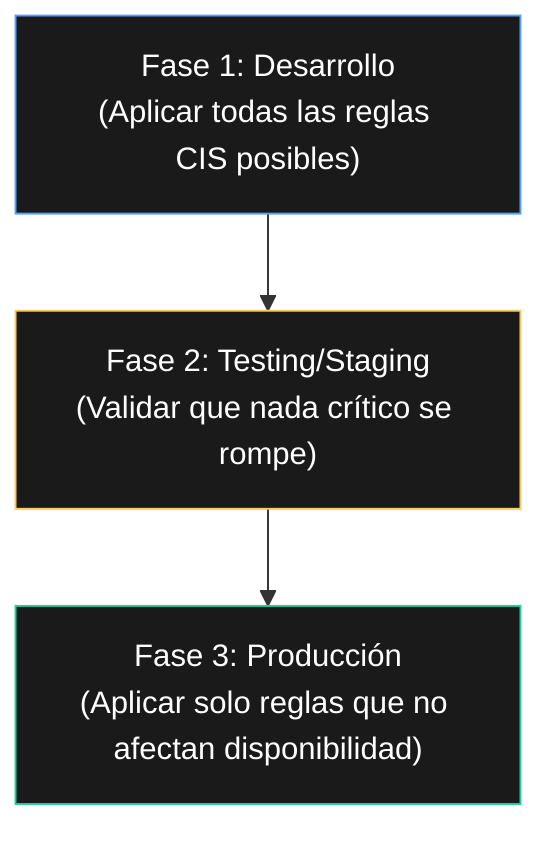
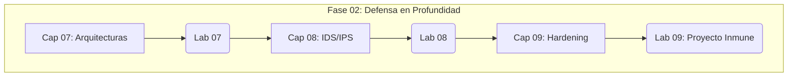

# Capítulo 09: Hardening de Sistemas – La Inmunización Digital

> "Un sistema parcheado evita una vulnerabilidad conocida. Un sistema endurecido evita cien vulnerabilidades desconocidas."

---

## 9.0 Inmersión: El Antídoto que WannaCry Nunca Encontró

Revivamos el caso que ya viste en el Capítulo 00.

Mayo de 2017. El ransomware WannaCry paraliza hospitales en más de 150 países. Se propaga como un virus digital usando una vulnerabilidad en SMBv1, un protocolo de Windows antiguo y frágil.

La pregunta incómoda:

- ¿Por qué un protocolo de los años 80 (SMBv1) seguía activo en sistemas médicos críticos en 2017?

El hardening que faltó:

- Inventario: no sabían que tenían SMBv1 habilitado.
- Remediación: no existía un proceso para deshabilitar servicios innecesarios.
- Segmentación: los dispositivos médicos estaban en la misma red que las estaciones administrativas.
- Parches: los sistemas no se actualizaban por miedo a romper software médico.

La lección:

- WannaCry no explotó una vulnerabilidad "zero-day" super avanzada.
- Explotó malas prácticas de higiene básica que el hardening habría evitado.

Hardening = higiene digital. Es aburrido, no es sexy, pero salva vidas.

---

## 9.1 ¿Qué es realmente el Hardening? Más allá del "parche mágico"

Definición operativa:

- Hardening es el proceso sistemático y continuo de reducir la superficie de ataque de un sistema, eliminando puntos de entrada innecesarios y configurándolo de la forma más segura posible.

### La analogía del submarino

- Sistema "normal": se parece a un barco de pasajeros. Muchas puertas, ventanas, cubiertas. Cómodo, accesible.
- Sistema endurecido: se parece a un submarino nuclear. Cada abertura es crítica, revisada y tiene un propósito. No hay "puertas extra".

Mientras más crítico es el sistema, más se parece a un submarino.

### Basado en estándares, no en corazonadas

Los profesionales no improvisan. Siguen recetas probadas:

- CIS Benchmarks: listas de comprobación específicas por sistema operativo y aplicación.
- STIGs (Security Technical Implementation Guides): estándares técnicos usados en entornos militares y de alta seguridad.
- Políticas internas: adaptadas a los riesgos específicos de tu negocio.

Ejemplo:

- "En MediTech, todos los dispositivos IoT deben usar autenticación mutua y estar en VLAN aislada."

### Hardening mínimo en Windows frente a casos WannaCry

Aunque en el laboratorio trabajaremos con Linux, el principio es universal. Para mitigar casos tipo WannaCry:

- Deshabilitar SMBv1 en servidores y estaciones que no lo necesiten.
- Mantener habilitadas y configuradas las actualizaciones de seguridad.
- Aplicar principio de mínimo privilegio en cuentas de servicio.
- Separar redes de usuario, servidores y equipos médicos sensibles.

El mensaje clave:

- La tecnología cambia, pero el patrón se repite: inventario, reducción de superficie, estándares y disciplina.

---

## 9.2 El Triángulo de Oro del Hardening

Aplicaremos el hardening a tres ejes:

- Sistema operativo.
- Aplicaciones y servicios.
- Red y credenciales.

### 🔴 1. Hardening del sistema operativo

Caso aplicado: TJX – servidor de base de datos comprometido.

Lo que un atacante ve cuando aterriza en un servidor:

```bash
# 1. Usuarios por defecto activos
cat /etc/passwd | grep -E "(oracle|postgres|mysql)"

# 2. Servicios innecesarios escuchando
sudo ss -tulpn | head

# 3. Permisos de archivos débiles
ls -la /var/lib/mysql/
```

Checklist de hardening (post-TJX):

- Cuentas: cambiar contraseñas por defecto y deshabilitar cuentas no usadas.
- Servicios: detener y deshabilitar servicios que no tengan sentido en un servidor (bluetooth, cups, avahi-daemon, etc.).
- SSH: deshabilitar login directo de root, usar autenticación por clave, revisar baners e información expuesta.
- Kernel: ajustar parámetros `sysctl` para bloquear comportamientos innecesarios.

Ejemplos de parámetros:

```bash
sudo nano /etc/sysctl.conf

net.ipv4.ip_forward = 0
net.ipv4.icmp_echo_ignore_all = 1
net.ipv4.conf.all.send_redirects = 0
```

Herramienta clave:

- Lynis: auditor de seguridad automático para sistemas tipo Unix.

```bash
sudo apt update && sudo apt install -y lynis
sudo lynis audit system
```

### 🟡 2. Hardening de aplicaciones y servicios

Caso aplicado: TechSafelock – la API vulnerable que perdió millones.

Posibles fallos:

- Falta de cabeceras de seguridad (X-Content-Type-Options, HSTS, Referrer-Policy).
- Ausencia de limitación de peticiones (rate limiting).
- Logging insuficiente: no se registra qué ocurre en la API.

Ejemplo de hardening de API web en Nginx:

```nginx
server {
    # 1. Cabeceras de seguridad
    add_header X-Frame-Options "SAMEORIGIN" always;
    add_header X-Content-Type-Options "nosniff" always;
    add_header Referrer-Policy "strict-origin-when-cross-origin";

    # 2. Limitar métodos HTTP
    if ($request_method !~ ^(GET|POST|HEAD)$) {
        return 405;
    }

    # 3. Rate limiting básico
    limit_req_zone $binary_remote_addr zone=api_limit:10m rate=10r/s;

    location /api/ {
        limit_req zone=api_limit burst=20 nodelay;
        proxy_pass http://api_backend;
    }

    # 4. Ocultar versión de servidor
    server_tokens off;
}
```

Objetivo:

- Que incluso si una vulnerabilidad lógica aparece, la configuración defensiva reduzca impacto y probabilidad de explotación masiva.

### 🟢 3. Hardening de red y credenciales

Caso aplicado: MediTech – WiFi abierto y contraseñas débiles en dispositivos médicos.

Errores típicos:

- Redes WiFi sin cifrado fuerte o sin segmentación.
- Contraseñas por defecto que nunca se cambiaron.
- Equipos críticos en la misma red que estaciones de usuario.

Checklist para dispositivos IoT y red:

- WiFi: WPA3 (o WPA2 con AES), clave fuerte, VLAN separada para IoT.
- Contraseñas: política de complejidad, rotación y bloqueo tras intentos fallidos.
- Firewall: política por defecto "deny all", abriendo solo lo estrictamente necesario.
- Segmentación: los dispositivos médicos no deben hablar entre sí salvo que sea necesario.

Herramienta para auditar:

```bash
# Desde dentro de la red, analiza un dispositivo IoT
nmap -sS -p- -T4 192.168.1.100
```

Si ves puertos como 23/telnet o 21/ftp abiertos sin necesidad, tienes una alerta roja.

---

## 9.3 La paradoja del Hardening: cuando la seguridad rompe la funcionalidad

Caso crítico: AutoManufact – la línea de producción que no puede parar.

El dilema:

- Endurecer un servidor industrial requiere reinicios y pruebas que detienen la producción.
- ¿Seguridad vs productividad?

Estrategias para entornos OT/industriales:

### Hardening faseado



### Controles compensatorios

Problema:

- No puedes aplicar parches mensuales al controlador de un robot crítico.

Compensación:

- Aislar el robot en red sin salida a internet (air gap).
- Colocar un IPS dedicado que monitoree su tráfico.
- Implementar copias de seguridad frecuentes de su configuración.

### Documentar la excepción

Mal:

- "No aplicamos parches a este sistema porque podría romperse."

Bien:

- "El sistema SCADA en 192.168.10.50 ejecuta Windows 7 sin parches. Riesgo aceptado porque está en red aislada VLAN 50, con reglas de firewall que solo permiten tráfico desde la estación de ingeniería 192.168.10.5. Revisión trimestral."

La regla:

- Toda excepción al hardening debe estar documentada, justificada y con controles compensatorios claros.
- Más adelante, en GRC, verás esto formalizado como "riesgo aceptado" y "plan de tratamiento".

---

## 9.4 Automatización: tu única esperanza de escala

Problema:

- Endurecer 10 servidores a mano puede tomar días.
- Endurecer 1000 servidores manualmente es imposible.

Solución:

- Infrastructure as Code (IaC) y configuración automatizada.

### Introducción a Ansible para hardening

Idea:

- Declarar el estado deseado de seguridad y aplicarlo de forma repetible a muchos hosts.

Fragmento de ejemplo:

```yaml
---
- name: Aplicar hardening básico CIS nivel 1
  hosts: all
  become: yes

  tasks:
    - name: Asegurar actualizaciones de seguridad
      apt:
        upgrade: dist
        update_cache: yes
        autoremove: yes

    - name: Instalar y configurar UFW
      apt:
        name: ufw
        state: present

    - name: Habilitar firewall por defecto
      ufw:
        state: enabled
        policy: deny
        direction: incoming
```

Ventaja:

- Este tipo de playbook se ejecuta en minutos en 1 o 1000 servidores con resultados consistentes.
- Más adelante, cuando entres en automatización (Parte 4), podrás integrar estas recetas en pipelines reales.

---

## 9.5 Hardening para tu carrera

Cómo se ve esto en tu CV o en una entrevista:

- "Implementé hardening básico en servidores Linux basándome en CIS Benchmarks."
- "Automaticé controles de seguridad de sistema operativo usando Ansible y scripts Bash."
- "Documenté riesgos aceptados y controles compensatorios en entornos OT."
- "Conecté hardening (Cap 09) con las detecciones de Cap 08, reduciendo el ruido de alertas y fortaleciendo los sistemas que mis reglas IDS vigilan."

Este capítulo te posiciona como alguien que no solo detecta problemas, sino que deja sistemas mejor de como los encontró.

---

## 🧪 Laboratorio 09: "Proyecto Inmune" – de víctima a fortaleza

Objetivo:

- Transformar una máquina Ubuntu virtual "vírgen" en una fortaleza, aplicando hardening sistemático y midiendo la mejora.

### Parte A: Línea de base – ¿qué tan débil eres?

Prepara tu máquina víctima:

- VM Ubuntu Server nueva.

Ejecuta un escaneo de vulnerabilidades inicial:

```bash
sudo apt update && sudo apt install -y lynis
sudo lynis audit system --quick
sudo cp /var/log/lynis-report.dat ~/lynis-before.dat
```

Desde Kali, mide la superficie de ataque:

```bash
nmap -sS -sV -O -T4 <IP_VICTIMA>
```

Preguntas:

- ¿Qué puertos están abiertos?
- ¿Qué servicios y versiones se exponen?

### Parte B: Aplicación manual de hardening

Nivel 1 (crítico – hazlo ya):

- Cambia la contraseña de root:

```bash
sudo passwd root
```

- Crea un usuario no privilegiado para uso diario.
- Configura el firewall:

```bash
sudo ufw enable
sudo ufw default deny incoming
sudo ufw allow ssh
```

- Deshabilita inicio de sesión root por SSH editando `sshd_config` y ajustando `PermitRootLogin no`.
- Deshabilita servicios innecesarios (`bluetooth`, `cups`, `avahi-daemon`, etc.).

Nivel 2 (importante – hazlo hoy):

- Configura actualizaciones automáticas de seguridad.
- Instala y configura `fail2ban` para proteger SSH.
- Ajusta parámetros del kernel en `/etc/sysctl.conf`.
- Configura política de contraseñas con `libpam-pwquality`.

Nivel 3 (recomendado – planifícalo):

- Configura auditoría con `auditd`.
- Instala un HIDS (osquery, Wazuh u otro equivalente).
- Configura cifrado de disco completo (LUKS) para datos sensibles.

### Parte C: Prueba de resistencia – ataque controlado

Recuerda: estas pruebas solo se realizan sobre tus propias máquinas de laboratorio, nunca sobre sistemas de terceros.

Desde Kali, ataca tu máquina endurecida:

```bash
# 1. Escaneo de nuevo
nmap -sS -sV -O -T4 <IP_VICTIMA>

# 2. Intento de fuerza bruta a SSH (ataque controlado)
hydra -l root -P /usr/share/wordlists/rockyou.txt -t 4 <IP_VICTIMA> ssh

# 3. Verificar información de servicios
nc <IP_VICTIMA> 22
```

Observa:

- ¿Hay menos puertos abiertos que al inicio?
- ¿Fail2ban (u otro control) te bloquea tras varios intentos?
- ¿El banner de SSH revela menos información que antes?

### Parte D: Automatización – tu playbook de supervivencia

Convierte tu checklist en un script Bash básico:

```bash
nano hardening_script.sh
```

Ejemplo mínimo:

```bash
#!/bin/bash
echo "[+] Aplicando hardening básico..."
sudo ufw --force enable
sudo sed -i 's/^PermitRootLogin.*/PermitRootLogin no/' /etc/ssh/sshd_config
echo "[+] Hardening completado. Reinicia SSH con: sudo systemctl restart sshd"
```

O crea un playbook de Ansible tomando como referencia los fragmentos de la sección 9.4.

Prueba tu automatización en una VM nueva:

- ¿Funciona con un solo comando?
- ¿Algo se rompe? ¿Qué aprendiste?

### Entregable del Laboratorio 09

Informe "Antes/Después":

- Resultados de Lynis: compara el "hardening index" inicial y el final.
- Resultados de Nmap: lista de puertos/servicios abiertos antes vs después.
- Lección principal: ¿qué control de hardening fue más efectivo y cuál fue el más complicado de aplicar sin romper nada?
- Adjunta tu script o playbook de automatización.

---

## 📊 CyberSentinel Tracker – Capítulo 09

Autoevalúa tu dominio de las acciones clave. Marca solo lo que realmente hiciste y puedes explicar.

<div class="tracker-container" data-chapter-id="09" data-points-per-row="2">
  <table class="tracker-table">
    <thead>
      <tr>
        <th>Competencia Clave</th>
        <th>Mi Nivel (1-5)</th>
      </tr>
    </thead>
    <tbody>
      <tr>
        <td><strong>Lynis:</strong> Puedo ejecutar una auditoría de hardening y leer el índice de hardening antes/después.</td>
        <td>
          <span class="tracker-option" data-row="lynis_audit" data-val="1">1</span>
          <span class="tracker-option" data-row="lynis_audit" data-val="2">2</span>
          <span class="tracker-option" data-row="lynis_audit" data-val="3">3</span>
          <span class="tracker-option" data-row="lynis_audit" data-val="4">4</span>
          <span class="tracker-option" data-row="lynis_audit" data-val="5">5</span>
        </td>
      </tr>
      <tr>
        <td><strong>Servicios:</strong> Sé identificar y deshabilitar servicios innecesarios en un servidor Linux.</td>
        <td>
          <span class="tracker-option" data-row="disable_services" data-val="1">1</span>
          <span class="tracker-option" data-row="disable_services" data-val="2">2</span>
          <span class="tracker-option" data-row="disable_services" data-val="3">3</span>
          <span class="tracker-option" data-row="disable_services" data-val="4">4</span>
          <span class="tracker-option" data-row="disable_services" data-val="5">5</span>
        </td>
      </tr>
      <tr>
        <td><strong>Firewall:</strong> Puedo configurar un firewall básico con política "deny all" y reglas mínimas.</td>
        <td>
          <span class="tracker-option" data-row="ufw_firewall" data-val="1">1</span>
          <span class="tracker-option" data-row="ufw_firewall" data-val="2">2</span>
          <span class="tracker-option" data-row="ufw_firewall" data-val="3">3</span>
          <span class="tracker-option" data-row="ufw_firewall" data-val="4">4</span>
          <span class="tracker-option" data-row="ufw_firewall" data-val="5">5</span>
        </td>
      </tr>
      <tr>
        <td><strong>Paradoja OT:</strong> Entiendo la tensión entre seguridad y disponibilidad en entornos industriales y sé documentar una excepción.</td>
        <td>
          <span class="tracker-option" data-row="ot_paradox" data-val="1">1</span>
          <span class="tracker-option" data-row="ot_paradox" data-val="2">2</span>
          <span class="tracker-option" data-row="ot_paradox" data-val="3">3</span>
          <span class="tracker-option" data-row="ot_paradox" data-val="4">4</span>
          <span class="tracker-option" data-row="ot_paradox" data-val="5">5</span>
        </td>
      </tr>
      <tr>
        <td><strong>Automatización:</strong> Puedo automatizar al menos una tarea de hardening usando scripts o Ansible.</td>
        <td>
          <span class="tracker-option" data-row="automation_task" data-val="1">1</span>
          <span class="tracker-option" data-row="automation_task" data-val="2">2</span>
          <span class="tracker-option" data-row="automation_task" data-val="3">3</span>
          <span class="tracker-option" data-row="automation_task" data-val="4">4</span>
          <span class="tracker-option" data-row="automation_task" data-val="5">5</span>
        </td>
      </tr>
    </tbody>
  </table>

  <div class="tracker-score-display">
    PUNTUACIÓN: <span class="score-value">0 / 10</span>
  </div>
  
  <div class="tracker-feedback">
    Mayoría en 4-5: estás listo para aplicar hardening real con supervisión. Mezcla de 2-3: buen fundamento, repite el laboratorio en otra VM. Mayoría en 1-2: vuelve a las secciones 9.2 y 9.4 y prioriza automatizar al menos un control.
  </div>
</div>

---

## ✅ Resumen del capítulo

Has pasado de ser un detective reactivo (Capítulo 08) a un preventor proactivo.

El hardening es el trabajo menos glamuroso pero más impactante en ciberseguridad:

- Un sistema bien endurecido se parece a un sistema inmunológico fuerte.
- Resiste infecciones que ni siquiera conocías y reduce el daño cuando algo logra entrar.

La seguridad no es un estado ("estamos seguros"), es un proceso ("estamos endureciendo"):

- Debe ser sistemático, documentado y, siempre que puedas, automatizado.

Próxima estación:

- **Capítulo 10: Machine Learning para Detección de Anomalías – La Intuición Artificial.**
- Verás cómo la IA puede detectar aquello que ni el hardening ni las reglas estáticas alcanzan a ver.

---

## 9.6 Informe de Estado de Misión: Fin de Fase 02 – Defensa en Profundidad

Has completado la fase clásica de defensa:

- Cap 07: Aprendiste a diseñar arquitecturas en capas.
- Cap 08: Dominas la detección basada en reglas (IDS/IPS).
- Cap 09: Sabes endurecer sistemas y automatizar controles.

🛑 Checkpoint Estratégico: ¿Tus defensas son algo más que parches sueltos?

En CyberSentinel no avanzas por haber “leído” tres capítulos, avanzas cuando tu sistema defensivo tiene coherencia:

- Si tus arquitecturas (Cap 07) no están claras, tus controles se solapan o dejan huecos.
- Si tus detecciones (Cap 08) no están bien afinadas, ahogas al SOC con ruido.
- Si tu hardening (Cap 09) es débil, cualquier regla o alerta llega tarde.

Antes de pasar a detección avanzada (ML y hunting), revisa tu estado operativo.

### 📊 Tablero de Disponibilidad Operativa – Fase 02



<div class="part-progress-container" data-part-id="02">
  <div class="part-progress-grid">
    <div class="part-progress-row" data-key="cap07" data-max="10">
      <div class="part-progress-label">Cap 07</div>
      <div class="part-progress-bar">
        <div class="part-progress-fill"></div>
      </div>
      <div class="part-progress-value">0 / 10</div>
    </div>
    <div class="part-progress-row" data-key="lab07" data-max="12">
      <div class="part-progress-label">Lab 07</div>
      <div class="part-progress-bar">
        <div class="part-progress-fill"></div>
      </div>
      <div class="part-progress-value">0 / 12</div>
    </div>
    <div class="part-progress-row" data-key="cap08" data-max="10">
      <div class="part-progress-label">Cap 08</div>
      <div class="part-progress-bar">
        <div class="part-progress-fill"></div>
      </div>
      <div class="part-progress-value">0 / 10</div>
    </div>
    <div class="part-progress-row" data-key="lab08" data-max="12">
      <div class="part-progress-label">Lab 08</div>
      <div class="part-progress-bar">
        <div class="part-progress-fill"></div>
      </div>
      <div class="part-progress-value">0 / 12</div>
    </div>
    <div class="part-progress-row" data-key="cap09" data-max="10">
      <div class="part-progress-label">Cap 09</div>
      <div class="part-progress-bar">
        <div class="part-progress-fill"></div>
      </div>
      <div class="part-progress-value">0 / 10</div>
    </div>
    <div class="part-progress-row" data-key="lab09" data-max="12">
      <div class="part-progress-label">Lab 09</div>
      <div class="part-progress-bar">
        <div class="part-progress-fill"></div>
      </div>
      <div class="part-progress-value">0 / 12</div>
    </div>
  </div>
</div>

> Semáforo de acceso a detección avanzada:
> - Verde (>80% acumulado): estás listo para entrar a ML y hunting.
> - Amarillo (50–80%): avanza, pero lleva una lista de refuerzos pendientes.
> - Rojo (<50%): vuelve al capítulo o laboratorio más débil y refuerza antes de seguir.
