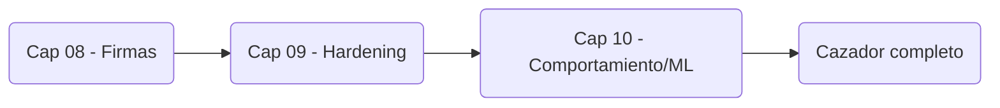
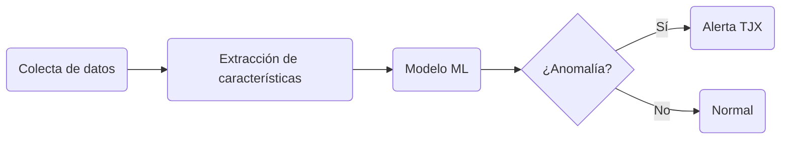
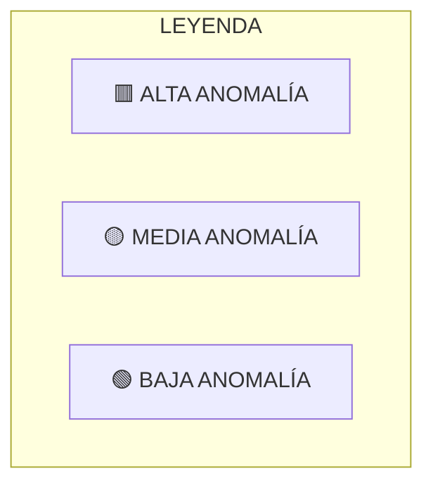
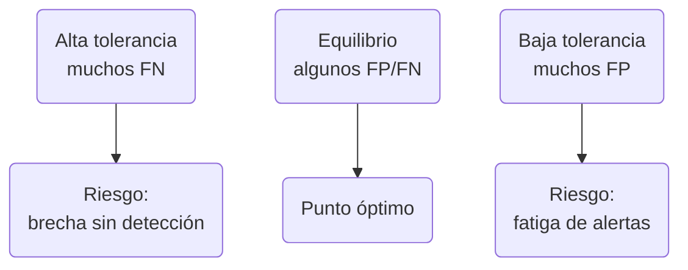

# Capítulo 10: Machine Learning para Detección de Anomalías

> "Una regla detecta el cuchillo que ya conoces.  
> El ML huele la sangre antes de que se desenvaine."

🎯 **Objetivos de la misión**

- Diferenciar detección basada en firmas vs. basada en comportamiento.
- Entender el pipeline básico de ML para seguridad: datos → features → modelo → alerta.
- Aplicar detección de anomalías a los casos emblemáticos del libro.
- Implementar un detector simple de comportamiento anómalo en Python.

---

## 10.0 Inmersión: Lo Que las Reglas de TJX Nunca Vieron

Revisitemos el caso TJX (Capítulos 00 y 08): más de 45 millones de tarjetas robadas y un atacante viviendo dentro de la red durante meses.

Lo que las reglas de un IDS como Suricata (Capítulo 08) habrían visto:

- `SELECT card_number FROM dbo.credit_cards` desde una IP sospechosa → **ALERTA**.
- Tráfico HTTP con payload claramente malicioso hacia un dominio conocido de C2 → **ALERTA**.

Lo que probablemente pasó en TJX:

- Movimiento lateral sutil: el servidor SQL (192.168.10.100) empieza a hablar con el servidor de backup (192.168.10.50) a las 2:17 AM, aunque normalmente solo hable con tres servidores internos muy concretos.
- Exfiltración camuflada: los datos se comprimen y se envían en pequeños fragmentos dentro de tráfico HTTP aparentemente legítimo hacia un dominio comprometido.
- Tiempo de residencia: el atacante se mueve a baja velocidad durante ~4 meses, sin activar reglas basadas en patrones conocidos.

Limitación de las reglas tradicionales:

- Son binarias: o se cumple el patrón exacto, o no se dispara nada.
- No entienden contexto, frecuencia ni el historial de comportamiento de cada host o usuario.

La pregunta central de este capítulo:

> ¿Cómo detectamos al atacante que **no** dispara ninguna regla obvia, pero cuyo comportamiento es radicalmente distinto a su línea base histórica?

---

## 10.1 De Firmas a Comportamiento: La Evolución del Cazador

### Nivel 1: Firmas (Capítulo 08 – El Cazador con Lupa)

- Qué detecta: patrones conocidos (`' OR '1'='1`, `SELECT card_number`, payloads específicos).
- Fortaleza: alta precisión frente a amenazas conocidas y bien documentadas.
- Debilidad: ceguera casi total ante variantes nuevas, ataques personalizados o actividades “raras pero válidas”.
- Analogía: buscar a alguien con una foto fija en la mano.

### Nivel 2: Comportamiento (Capítulo 10 – El Psicólogo de la Red)

- Qué detecta: desviaciones respecto al patrón normal de un usuario, host o servicio.
- Fortaleza: permite detectar amenazas desconocidas (zero-days, ataques a medida, abuso de credenciales).
- Debilidad: si se calibra mal, puede disparar muchos falsos positivos.
- Analogía: no sabes exactamente **quién** es peligroso, pero sí detectas a quien actúa de forma anómala en un aeropuerto.

### Tabla comparativa aplicada a nuestros casos

| Caso Emblemático | Lo que detectan las reglas (Cap. 08) | Lo que detecta el ML (Cap. 10) |
| ---------------- | ------------------------------------- | --------------------------------|
| TechSafelock     | 100 peticiones `POST /api/convert` en 10 segundos desde la misma IP. | Un usuario que normalmente convierte 50 USD intenta convertir 50.000 USD a las 3 AM. |
| MediTech         | Comando `SET_PARAM` con dosis ≥ 70 (regla específica de dosis). | La bomba de insulina, que reporta cada 5 minutos, deja de enviar telemetría durante 1 hora. |
| AutoManufact     | Cambio en el registro de calibración fuera de ventana permitida. | Un robot que suele ensamblar 20 piezas/hora pasa a 35 (sobrecalentamiento inducido) o baja a 5 (sabotaje por lentitud). |
| TJX              | Exfiltración masiva > 1GB en un único flujo claro. | El servidor SQL, que solo habla con 3 IPs internas, empieza a generar tráfico HTTP hacia un dominio externo nunca visto. |

Regla de oro de CyberSentinel:

- Las reglas son tu **ejército regular**.
- El ML es tu **servicio de inteligencia**.
- En entornos críticos, necesitas ambos.

### Diagrama: Evolución del Cazador CyberSentinel



---

## 10.2 El Pipeline del Cazador Inteligente: De Datos a Decisión

No es magia, es ingeniería. Un sistema básico de detección de anomalías sigue este flujo:

1. Colecta → 2. Características → 3. Modelo → 4. Decisión

En formato texto:

`[1. COLECTA] → [2. CARACTERÍSTICAS] → [3. MODELO] → [4. DECISIÓN]`

### Diagrama: Pipeline de Detección de Anomalías – Caso TJX



Ejemplo aplicado al servidor SQL de TJX:

1. Colecta  
   - Tráfico de red, logs de sistema y de base de datos de los últimos 30 días.
2. Características (features) normales aprendidas en 30 días  
   - Conexiones salientes promedio: 50/día.  
   - Destinos típicos: 3 IPs internas (192.168.10.5, .10, .15).  
   - Volumen máximo diario: 100 MB.  
3. Día del ataque: se extraen las mismas características  
   - Conexiones salientes: 1500 (**↑ 3000%**).  
   - Destinos nuevos: 45.33.22.11 (dominio nunca visto).  
   - Volumen: 2.1 GB en 4 horas (**↑ 2000%**).  
   - Hora: pico a las 2:17 AM (fuera de horario laboral).  
4. Decisión  
   - Se calcula un puntaje de anomalía, por ejemplo 98/100.  
   - Si el puntaje supera un umbral crítico → **ALERTA** y posible acción automática.

Las tres features más poderosas para seguridad (KPI del cazador):

- Novedad (Novelty): ¿es la primera vez que ves esta IP, dominio, usuario o tipo de comando?
- Volumen (Volume): ¿el volumen de tráfico, peticiones o registros es órdenes de magnitud superior al habitual?
- Horario (Temporal): ¿la actividad ocurre fuera del horario normal del usuario, turno o ventana de mantenimiento?

---

## 10.3 Tu Primer Detector de Anomalías en Python

La idea mínima: aprender una línea base simple y marcar como anómalos los puntos que se alejan demasiado de ella.

Ejemplo simplificado con una única feature: número de conexiones salientes por hora de un servidor.

```python
historico = [12, 15, 9, 11, 14, 10, 13, 16, 12, 11]

media = sum(historico) / len(historico)
varianza = sum((x - media) ** 2 for x in historico) / len(historico)
desviacion = varianza ** 0.5

def es_anomalo(valor, k=3):
    if desviacion == 0:
        return False
    return abs(valor - media) > k * desviacion

observaciones = [14, 13, 12, 60, 11, 10]

for v in observaciones:
    if es_anomalo(v):
        print(v, "ANOMALIA")
    else:
        print(v, "normal")
```

Este tipo de detector naive no reemplaza un sistema de ML real, pero te permite:

- Pensar en términos de línea base y desviación.
- Conectar los conceptos de volumen, novedad y horario a números concretos.
- Prepararte para modelos más avanzados (Isolation Forest, One-Class SVM, autoencoders) sin perder la intuición.

---

## 10.4 Laboratorio 10: El Psicólogo de la Red - Detectando lo Invisible

**Objetivo:** Implementar un detector de anomalías básico para tráfico HTTP que hubiera detectado la exfiltración de TJX.

### Parte A: Generar datos de entrenamiento (tráfico "normal")

```python
# generate_normal_traffic.py
import pandas as pd
import numpy as np
from datetime import datetime, timedelta

# Simular 30 días de tráfico normal del servidor SQL
np.random.seed(42)
dates = pd.date_range(start='2024-01-01', end='2024-01-30', freq='H')

data = []
for date in dates:
    # Comportamiento NORMAL:
    # - Horario laboral (9 AM - 6 PM) más tráfico
    # - Solo 3 destinos internos
    # - Volumen moderado

    is_work_hour = 9 <= date.hour <= 18
    base_connections = np.random.randint(1, 5)
    base_volume = np.random.randint(10, 100)  # MB

    if is_work_hour:
        connections = base_connections * 3
        volume = base_volume * 2
    else:
        connections = base_connections
        volume = base_volume

    # Solo 3 destinos internos
    destinations = ['192.168.10.5', '192.168.10.10', '192.168.10.15']

    data.append({
        'timestamp': date,
        'connections': connections,
        'unique_destinations': 1,  # Solo 1 destino por hora (normal)
        'total_volume_mb': volume,
        'is_work_hour': int(is_work_hour),
        'label': 'normal'  # Etiqueta para entrenamiento
    })

df_normal = pd.DataFrame(data)
df_normal.to_csv('trafico_normal.csv', index=False)
print(f"[+] Generados {len(df_normal)} registros de tráfico NORMAL")
```

### Parte B: Generar datos de ataque (exfiltración TJX)

```python
# generate_attack_traffic.py
import pandas as pd
import numpy as np
from datetime import datetime, timedelta

from generate_normal_traffic import df_normal

attack_data = []

# El día del ataque: 2024-01-31
attack_date = datetime(2024, 1, 31, 2, 0, 0)  # 2:00 AM

# Características del ATAQUE (basado en TJX):
# 1. Hora no laboral (2:17 AM)
# 2. Destino nuevo externo
# 3. Volumen masivo en poco tiempo

for hour in range(4):  # 4 horas de exfiltración
    timestamp = attack_date + timedelta(hours=hour)

    attack_data.append({
        'timestamp': timestamp,
        'connections': np.random.randint(100, 200),  # ↑ 3000%
        'unique_destinations': 5,  # ↑ 500% (incluye dominio malicioso)
        'total_volume_mb': np.random.randint(500, 600),  # ↑ 1000%
        'is_work_hour': 0,
        'label': 'attack'
    })

df_attack = pd.DataFrame(attack_data)

# Combinar con datos normales
df_combined = pd.concat([df_normal, df_attack], ignore_index=True)
df_combined.to_csv('trafico_completo.csv', index=False)
print(f"[+] Datos combinados: {len(df_normal)} normales + {len(df_attack)} de ataque")
```

### Parte C: Implementar detector de anomalías simple

```python
# anomaly_detector.py
import pandas as pd
import numpy as np
from sklearn.ensemble import IsolationForest
import warnings
warnings.filterwarnings('ignore')


class CyberSentinelAnomalyDetector:
    def __init__(self):
        """Inicializa el detector de CyberSentinel"""
        self.model = IsolationForest(
            contamination=0.01,  # Esperamos ~1% de anomalías
            random_state=42,
            n_estimators=100
        )
        self.features = ['connections', 'unique_destinations', 'total_volume_mb']

    def train(self, normal_data_path):
        """Entrena con datos normales"""
        print("[+] Entrenando detector con tráfico normal...")
        df = pd.read_csv(normal_data_path)

        # Solo usar datos normales para entrenar
        df_normal = df[df['label'] == 'normal']
        X_train = df_normal[self.features]

        self.model.fit(X_train)
        print(f"[+] Modelo entrenado con {len(X_train)} muestras normales")

    def detect(self, traffic_data_path):
        """Detecta anomalías en tráfico nuevo"""
        print("\n[+] Analizando tráfico en busca de anomalías...")
        df = pd.read_csv(traffic_data_path)

        # Predecir anomalías (-1 = anomalía, 1 = normal)
        predictions = self.model.predict(df[self.features])
        df['anomaly_score'] = self.model.decision_function(df[self.features])
        df['is_anomaly'] = predictions == -1

        # Mostrar resultados
        normal_count = (df['is_anomaly'] == False).sum()
        anomaly_count = (df['is_anomaly'] == True).sum()

        print(f"\n📊 RESULTADOS DEL ANÁLISIS:")
        print(f"   Tráfico normal: {normal_count} registros")
        print(f"   ANOMALÍAS detectadas: {anomaly_count} registros")

        if anomaly_count > 0:
            print(f"\n🚨 ALERTA CYBERSENTINEL - POSIBLE EXFILTRACIÓN DETECTADA")
            anomalies = df[df['is_anomaly'] == True]

            for idx, row in anomalies.iterrows():
                print(f"\n   ⚠️  Registro {idx}:")
                print(f"      Hora: {row['timestamp']}")
                print(f"      Conexiones: {row['connections']} (inusualmente alto)")
                print(f"      Destinos únicos: {row['unique_destinations']}")
                print(f"      Volumen: {row['total_volume_mb']} MB")
                print(f"      Puntaje de anomalía: {row['anomaly_score']:.3f}")

                # Regla de decisión simple
                if row['total_volume_mb'] > 400 and row['is_work_hour'] == 0:
                    print(f"      🚨 CRÍTICO: Posible exfiltración masiva fuera de horario!")

        return df


if __name__ == "__main__":
    print("=" * 60)
    print("CYBERSENTINEL - DETECTOR DE ANOMALÍAS (CAPÍTULO 10)")
    print("Caso TJX: Detectando Exfiltración Silenciosa")
    print("=" * 60)

    detector = CyberSentinelAnomalyDetector()
    detector.train('trafico_normal.csv')
    results = detector.detect('trafico_completo.csv')
    results.to_csv('resultados_deteccion.csv', index=False)
    print(f"\n[+] Reporte guardado en 'resultados_deteccion.csv'")
```

### Parte D: Análisis de resultados - La Intuición Artificial en Acción

```python
# analyze_results.py
import pandas as pd
import matplotlib.pyplot as plt

# Cargar resultados
df = pd.read_csv('resultados_deteccion.csv')

plt.figure(figsize=(12, 6))

df['timestamp'] = pd.to_datetime(df['timestamp'])

plt.subplot(2, 1, 1)
plt.plot(df['timestamp'], df['total_volume_mb'], 'b-', alpha=0.6, label='Tráfico Normal')
anomalies = df[df['is_anomaly'] == True]
plt.scatter(
    anomalies['timestamp'],
    anomalies['total_volume_mb'],
    color='red',
    s=100,
    zorder=5,
    label='ANOMALÍA (Posible Ataque)',
)
plt.axhline(y=400, color='orange', linestyle='--', label='Umbral Crítico (400MB)')
plt.ylabel('Volumen (MB)')
plt.title('CYBERSENTINEL - Detección de Exfiltración TJX')
plt.legend()
plt.grid(True, alpha=0.3)

plt.subplot(2, 1, 2)
plt.plot(df['timestamp'], df['anomaly_score'], 'g-', alpha=0.6)
plt.scatter(
    anomalies['timestamp'],
    anomalies['anomaly_score'],
    color='red',
    s=100,
    zorder=5,
)
plt.axhline(y=0, color='black', linestyle='-', linewidth=0.5)
plt.fill_between(
    df['timestamp'],
    0,
    df['anomaly_score'],
    where=(df['anomaly_score'] < 0),
    color='red',
    alpha=0.3,
)
plt.ylabel('Puntaje de Anomalía')
plt.xlabel('Fecha y Hora')
plt.grid(True, alpha=0.3)

plt.tight_layout()
plt.savefig('detection_tjx_anomalies.png', dpi=300)
print("[+] Gráfico generado: 'detection_tjx_anomalies.png'")

print("\n🔍 ANÁLISIS DEL CAZADOR:")
print("-" * 40)

attack_rows = df[df['label'] == 'attack']
detected_attacks = attack_rows[attack_rows['is_anomaly'] == True]

print(f"ATAQUES simulados: {len(attack_rows)}")
print(f"ATAQUES detectados: {len(detected_attacks)}")
print(f"Tasa de detección: {len(detected_attacks)/len(attack_rows)*100:.1f}%")

false_positives = df[(df['label'] == 'normal') & (df['is_anomaly'] == True)]
print(f"\nFalsos positivos: {len(false_positives)}")
print(f"Tasa de falsos positivos: {len(false_positives)/len(df)*100:.2f}%")

if len(false_positives) > 0:
    print("\n⚠️  FALSOS POSITIVOS a investigar:")
    for _, fp in false_positives.iterrows():
        print(f"   • {fp['timestamp']}: {fp['connections']} conexiones, {fp['total_volume_mb']}MB")
```

Ejecución propuesta del laboratorio:

```bash
python generate_normal_traffic.py
python generate_attack_traffic.py
python anomaly_detector.py
python analyze_results.py
```

### ✅ Checklist de misión cumplida (Laboratorio 10)

<div class="lab-tracker-container" data-lab-id="10">
  <table class="lab-tracker-table">
    <thead>
      <tr>
        <th>Objetivo de la Misión</th>
        <th>Completado</th>
      </tr>
    </thead>
    <tbody>
      <tr>
        <td>Generé <code>trafico_normal.csv</code> y confirmé que refleja el comportamiento normal del servidor.</td>
        <td style="text-align: center;"><input type="checkbox" class="lab-checkbox" data-row="gen_normal" data-points="2"></td>
      </tr>
      <tr>
        <td>Simulé el ataque estilo TJX y obtuve <code>trafico_completo.csv</code> con tráfico normal más tráfico de ataque.</td>
        <td style="text-align: center;"><input type="checkbox" class="lab-checkbox" data-row="sim_attack" data-points="2"></td>
      </tr>
      <tr>
        <td>Ejecuté el detector de anomalías e identifiqué qué registros u horas fueron marcados como ataque.</td>
        <td style="text-align: center;"><input type="checkbox" class="lab-checkbox" data-row="run_detector" data-points="2"></td>
      </tr>
      <tr>
        <td>Calculé la tasa de detección y de falsos positivos y probé cómo cambian al ajustar parámetros o umbrales.</td>
        <td style="text-align: center;"><input type="checkbox" class="lab-checkbox" data-row="calc_metrics" data-points="2"></td>
      </tr>
      <tr>
        <td>Puedo explicar con mis palabras el dilema falsos positivos vs falsos negativos aplicado a este laboratorio.</td>
        <td style="text-align: center;"><input type="checkbox" class="lab-checkbox" data-row="explain_dilemma" data-points="2"></td>
      </tr>
    </tbody>
  </table>
  <div class="lab-score-display">
    PUNTUACIÓN: <span class="lab-score-value">0 / 10</span>
  </div>
  <div class="lab-feedback">
    Marca los objetivos completados para validar tu misión.
  </div>
</div>

## Sección 1: Por qué esto importa para tu carrera

- La seguridad con IA se está volviendo estándar en SOC, AppSec y detección de fraude
- Entender IA ofensiva y defensiva te permite anticipar tácticas y diseñar controles modernos
- En salud (IoMT), la detección de anomalías puede ser una diferencia de seguridad física

## Sección 2: Ejemplos de industria real

- **Salud (IoMT):** detección de comportamientos anómalos en dispositivos y accesos clínicos
- **Banca/Fintech:** modelos para detectar fraude y abuso de credenciales en tiempo real
- **Gobierno:** campañas de desinformación y deepfakes; análisis de patrones para atribución

## Sección 3: Habilidades para tu CV/LinkedIn

**Frases exactas (ejemplos):**
- "Detección de anomalías aplicada a seguridad (conceptos, pipeline y casos reales)"
- "Análisis de riesgos de IA (amenazas ofensivas y mitigaciones defensivas)"

**Keywords para ATS (ejemplos):**
- Machine learning security, anomaly detection, behavioral analytics, SOAR, SOC automation, adversarial ML, LLM security

**Cómo cuantificar tus logros (plantillas):**
- "Aumenté la tasa de detección de eventos anómalos de X% a Y% ajustando señales y umbrales"
- "Reduje alert fatigue en X% priorizando señales y automatizando triage"

## Sección 4: Oportunidades concretas

**Puestos específicos (ejemplos):**
- SOC Engineer / Security Automation Engineer
- ML Engineer (Fraud/Security)
- Security Data Analyst
- AI Security / LLM Security (emergente)

**Ejemplos de empresas que suelen publicar vacantes relacionadas:**
- Healthtech e integradores de tecnología médica
- Equipos antifraude de banca/fintech
- Proveedores EDR/SIEM/SOAR

**Cómo preparar la entrevista (guía corta):**
- Explica una señal (feature), un riesgo y una mitigación en lenguaje claro
- Lleva 1 ejemplo de “falso positivo” y cómo lo reducirías

## Sección 5: Para emprendedores

- Consultoría de “detección de anomalías” aplicada a logs (MVP en 2–4 semanas)
- Auditoría de riesgos de IA/LLM para empresas que usan chatbots internos
- Formación de equipos: uso seguro de IA y prevención de abuso (políticas + controles)

---

## 10.5 Aplicando el Framework a Nuestros Casos

### Diagrama: Matriz CyberSentinel – Features vs Casos de Ataque



| FEATURE CLAVE     | TJX (Exfiltración)                         | TechSafelock (Fraude $2M)                 | MediTech (Bomba Insulina)                      |
| ----------------- | ------------------------------------------ | ----------------------------------------- | ---------------------------------------------- |
| Novedad           | 🟥 Dominio nuevo `cdn-updates.com`         | 🟡 IP nueva de transacción                | 🟢 Dispositivo no registrado                   |
| Volumen           | 🟥 2GB en 4h (↑2000%)                      | 🟥 100 transacciones en 10 segundos        | 🟢 Cambio drástico en dosis (70u)              |
| Temporal          | 🟥 2:17 AM (fuera de horario laboral)      | 🟥 3:00 AM (fuera de horario habitual)     | 🟡 Noche (habitual) pero dosis anómalamente alta |
| Comportamiento    | 🟥 SQL → HTTP (nuevo patrón de exfiltración)| 🟥 $50 → $50K (ratio 1000x)               | 🟥 Parámetros fuera de rango clínico           |

### Caso TechSafelock – Detectando fraude por comportamiento

```python
features_fintech = [
    'monto_promedio_usuario',
    'hora_habitual',
    'frecuencia_diaria',
    'ratio_monto_anomalo',
    'velocidad_transacciones',
]
```

La alerta saltaría, por ejemplo, si:

- `ratio_monto_anomalo > 100` y `velocidad_transacciones > 10/min`.

### Caso MediTech – Anomalías en dispositivos médicos

```python
features_medical = [
    'intervalo_telemetria',
    'rango_dosis_historico',
    'patron_horario',
    'latencia_respuesta',
]
```

Ejemplos de condiciones:

- `intervalo_telemetria > 30` minutos y dosis fuera del rango histórico.

### Caso AutoManufact – Sabotaje sutil en robots

```python
features_robot = [
    'eficiencia_promedio',
    'temperatura_operacion',
    'consumo_energia',
    'variabilidad_ciclo',
]
```

Ejemplo de alerta:

- Eficiencia cae ~50% y temperatura sube ~20% respecto a la línea base.

---

## 10.6 El Futuro: Limitaciones y Ética del ML en Seguridad

La paradoja del ML en CyberSentinel:

- Ventaja: detecta lo que no tiene firma, lo desconocido.
- Desventaja: puede convertirse en una caja negra que discrimina sin que lo notes.

Caso real simplificado:

- Un banco entrena un modelo de fraude y este aprende que ciertos códigos postales implican 95% probabilidad de fraude.
- Esos códigos postales corresponden a zonas de bajos ingresos.
- Resultado: usuarios legítimos bloqueados por su ubicación, no por su comportamiento.

Principios éticos de CyberSentinel para ML:

- Auditabilidad: debes poder explicar por qué una alerta se generó.
- Equidad: el modelo no debe replicar ni amplificar sesgos humanos.
- Privacidad: los datos de entrenamiento deben anonimizarse siempre que sea posible.
- Control humano: evita automatizar completamente la respuesta; mantén a un humano en el loop en decisiones críticas.

### Diagrama: Falsos Positivos vs Falsos Negativos – El Dilema del ML



---

## 📊 Autoevaluación: El Radar Cognitivo

¿Tu radar está calibrado para detectar lo invisible?

<div class="tracker-container" data-chapter-id="10" data-points-per-row="2">
  <table class="tracker-table">
    <thead>
      <tr>
        <th>Competencia Clave</th>
        <th>Mi Nivel (1-5)</th>
      </tr>
    </thead>
    <tbody>
      <tr>
        <td><strong>Firmas vs Comportamiento:</strong> Puedo explicar las diferencias y cuándo usar cada enfoque de detección.</td>
        <td>
          <span class="tracker-option" data-row="signatures_vs_behavior" data-val="1">1</span>
          <span class="tracker-option" data-row="signatures_vs_behavior" data-val="2">2</span>
          <span class="tracker-option" data-row="signatures_vs_behavior" data-val="3">3</span>
          <span class="tracker-option" data-row="signatures_vs_behavior" data-val="4">4</span>
          <span class="tracker-option" data-row="signatures_vs_behavior" data-val="5">5</span>
        </td>
      </tr>
      <tr>
        <td><strong>Pipeline ML de Seguridad:</strong> Entiendo el flujo datos → features → modelo → alerta.</td>
        <td>
          <span class="tracker-option" data-row="ml_pipeline" data-val="1">1</span>
          <span class="tracker-option" data-row="ml_pipeline" data-val="2">2</span>
          <span class="tracker-option" data-row="ml_pipeline" data-val="3">3</span>
          <span class="tracker-option" data-row="ml_pipeline" data-val="4">4</span>
          <span class="tracker-option" data-row="ml_pipeline" data-val="5">5</span>
        </td>
      </tr>
      <tr>
        <td><strong>Features Clave (TJX):</strong> Sé diseñar señales de novedad, volumen y horario para detectar exfiltración.</td>
        <td>
          <span class="tracker-option" data-row="tjx_features" data-val="1">1</span>
          <span class="tracker-option" data-row="tjx_features" data-val="2">2</span>
          <span class="tracker-option" data-row="tjx_features" data-val="3">3</span>
          <span class="tracker-option" data-row="tjx_features" data-val="4">4</span>
          <span class="tracker-option" data-row="tjx_features" data-val="5">5</span>
        </td>
      </tr>
      <tr>
        <td><strong>Aplicación a Casos:</strong> Puedo describir cómo aplicar detección de anomalías a TechSafelock, MediTech, AutoManufact y TJX.</td>
        <td>
          <span class="tracker-option" data-row="case_application" data-val="1">1</span>
          <span class="tracker-option" data-row="case_application" data-val="2">2</span>
          <span class="tracker-option" data-row="case_application" data-val="3">3</span>
          <span class="tracker-option" data-row="case_application" data-val="4">4</span>
          <span class="tracker-option" data-row="case_application" data-val="5">5</span>
        </td>
      </tr>
      <tr>
        <td><strong>Dilema FP/FN y Ética:</strong> Entiendo el equilibrio entre falsos positivos, falsos negativos y fatiga de alertas, y sus implicaciones éticas.</td>
        <td>
          <span class="tracker-option" data-row="ethics_fp_fn" data-val="1">1</span>
          <span class="tracker-option" data-row="ethics_fp_fn" data-val="2">2</span>
          <span class="tracker-option" data-row="ethics_fp_fn" data-val="3">3</span>
          <span class="tracker-option" data-row="ethics_fp_fn" data-val="4">4</span>
          <span class="tracker-option" data-row="ethics_fp_fn" data-val="5">5</span>
        </td>
      </tr>
    </tbody>
  </table>
  <div class="tracker-score-display">
    PUNTUACIÓN: <span class="score-value">0 / 10</span>
  </div>
  <div class="tracker-feedback">
    Selecciona tu nivel de confianza en cada competencia.
  </div>
</div>
