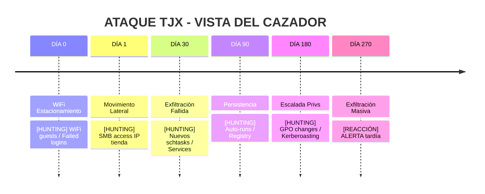
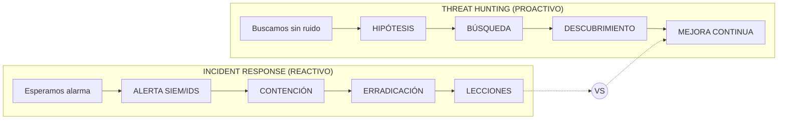
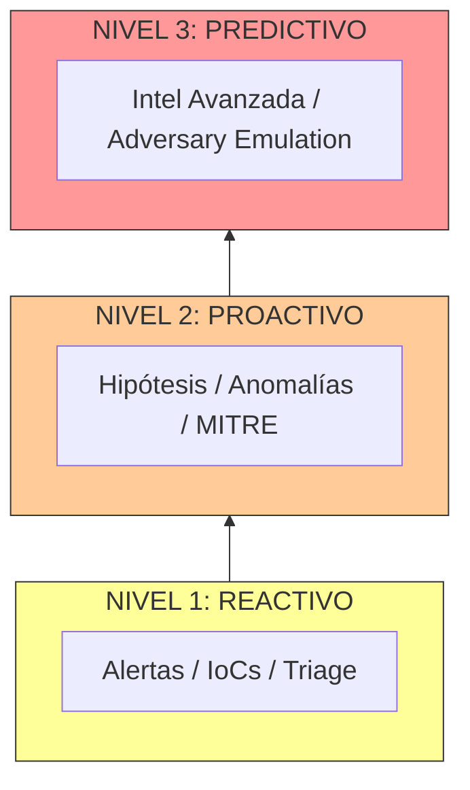
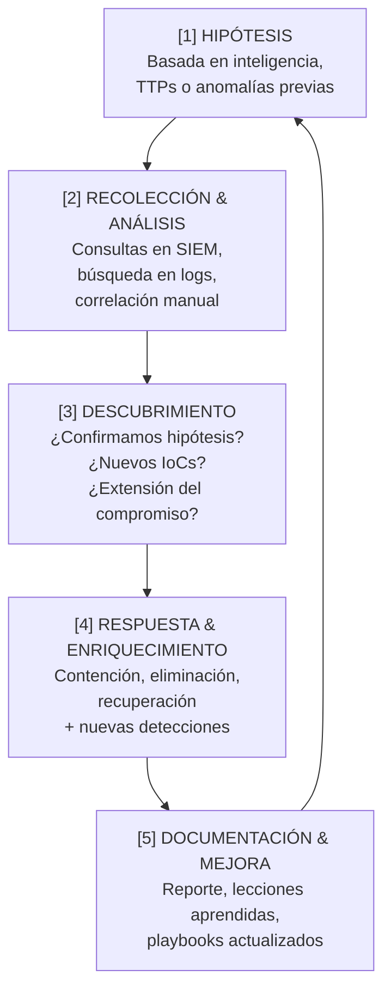
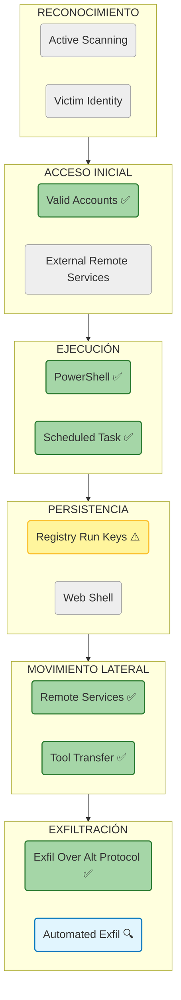
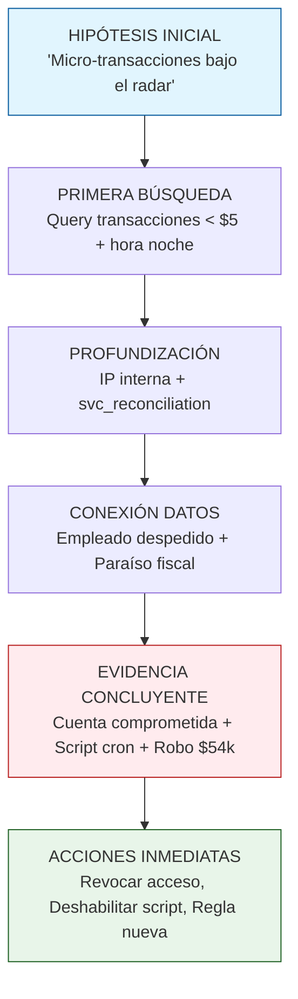
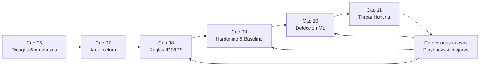
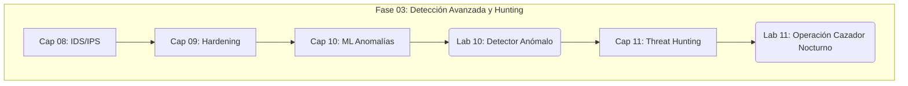

# Capítulo 11: Threat Hunting Proactivo – El Cazador en Acción

> "Las alarmas te avisan cuando suena la puerta. El hunting busca al intruso que ya está dentro y no hizo ruido."

El Threat Hunting es el cambio de mentalidad más importante del curso. Dejamos de esperar a que suene la alarma (reactivo) y salimos a buscar al intruso (proactivo).

---

## 🎯 Objetivos de la misión

- Diferenciar entre respuesta a incidentes (reactiva) y threat hunting (proactiva).
- Aplicar el ciclo de hunting a nuestros casos emblemáticos (TJX, TechSafelock, MediTech, AutoManufact).
- Dominar herramientas clave: Sysmon, queries en SIEM/ELK, MITRE ATT&CK.
- Realizar una cacería completa desde hipótesis hasta remediación.

---

## 11.0 Inmersión: El intruso que llevaba 9 meses en TJX

Revivamos TJX por última vez, pero con nueva perspectiva.

Mientras el firewall mostraba "todo normal" y las reglas de IDS estaban silenciosas, alguien ya estaba dentro.

```text
[LINEA DE TIEMPO DEL ATAQUE TJX - Perspectiva del Cazador]

DÍA 0   : Conexión WiFi estacionamiento → Credenciales débiles
DÍA 1   : Movimiento lateral a servidor de backup
DÍA 30  : Primer intento de exfiltración (fallido - 50MB)
DÍA 90  : Instalación de herramienta de persistencia
DÍA 180 : Escalada de privilegios a dominio admin
DÍA 240 : Descubrimiento de base de datos de tarjetas
DÍA 270 : Exfiltración masiva exitosa (2GB)
```



La pregunta incómoda del capítulo:

- ¿Cuántos de estos 270 días habrían sido detectados por tus herramientas actuales?
- ¿Y si el atacante nunca hubiera ejecutado explícitamente un `SELECT card_number`?

La verdad: la mayor parte de este ataque fue "ruido normal" para sistemas automáticos. Solo un cazador humano conectando puntos dispersos lo hubiera detectado.

---

## 11.1 Mentalidad del cazador: de SOC Analyst a Cyber Sentinel

Pasar de reaccionar a alertas a buscar amenazas cambia todo: métricas, herramientas, lenguaje y prioridades.

| Dimensión   | SOC Analyst (Reactivo)                              | Threat Hunter (Proactivo)                                             |
| ----------- | --------------------------------------------------- | ---------------------------------------------------------------------- |
| Origen      | Espera alertas del SIEM/IDS                         | Genera sus propias hipótesis basadas en inteligencia y TTPs           |
| Tiempo      | Responde a lo que acaba de ocurrir                 | Busca lo que ya lleva tiempo ocurriendo                               |
| Herramientas| Consola SIEM, tickets, dashboards predefinidos      | Sysmon, EDR, logs crudos, inteligencia, scripting                     |
| Métrica     | MTTR (Mean Time to Respond)                         | MTTD (Mean Time to Detect)                                            |
| En TJX      | Actúa en el DÍA 270 (cuando salta la regla)         | Podría detectar ya en el DÍA 30 (primer patrón anómalo de exfiltración) |

### Comparativa Visual: Reactivo vs Proactivo



### La Pirámide de Madurez del Cazador



El Threat Hunting no sustituye al SOC tradicional: lo complementa. Uno apaga incendios; el otro sale a buscar brasas antes de que aparezca el fuego.

---

## 11.2 El ciclo del cazador CyberSentinel

En CyberSentinel formalizamos la caza como un ciclo repetible.



Traducido al terreno:

1. **Hipótesis:** una suposición educada basada en inteligencia.
   - Ejemplo: "Creo que el grupo APT29 está usando PowerShell ofuscado para moverse lateralmente en nuestra red."
2. **Recolección y análisis:** buscar en los datos.
   - Herramientas: ELK Stack, Splunk, consultas a endpoints, EDR, Zeek.
3. **Descubrimiento:** confirmar o refutar la hipótesis.
   - Hallazgo típico: scripts en horarios inusuales, usuarios de servicio haciendo cosas humanas, robots con comportamiento “demasiado perfecto”.
4. **Respuesta y enriquecimiento:**
   - Aislar el host, bloquear dominios, rotar credenciales, crear detecciones nuevas para que el próximo intento dispare alerta.
5. **Documentación y mejora:**
   - Escribir el informe, actualizar playbooks y alimentar la próxima hipótesis.

---

## 11.3 La caja de herramientas del cazador

### 1. Sysmon – los ojos dentro del endpoint

Sysmon amplifica los logs de Windows para que puedas ver procesos, conexiones de red y cambios en archivos que el visor de eventos estándar ignora.

```xml
<!-- Configuración mínima para caza - sysmon-config.xml -->
<Sysmon schemaversion="4.81">
  <EventFiltering>
    <!-- Evento 1: Creación de proceso -->
    <ProcessCreate onmatch="exclude">
      <Image condition="end with">chrome.exe</Image>
      <Image condition="end with">notepad.exe</Image>
    </ProcessCreate>
    
    <!-- Evento 3: Conexión de red -->
    <NetworkConnect onmatch="include">
      <Image condition="end with">powershell.exe</Image>
      <DestinationPort condition="less than">1024</DestinationPort>
    </NetworkConnect>
    
    <!-- Evento 11: Creación/cambio de archivo -->
    <FileCreateTime onmatch="include">
      <TargetFilename condition="contains">temp</TargetFilename>
      <TargetFilename condition="end with">.exe</TargetFilename>
    </FileCreateTime>
  </EventFiltering>
</Sysmon>
```

Lectura rápida de esta configuración:

- `ProcessCreate onmatch="exclude"` con `chrome.exe` y `notepad.exe`: quitamos ruido de procesos normales para que no llenen tus logs.
- `NetworkConnect onmatch="include"` con `powershell.exe` y puertos `< 1024`: enfocamos conexiones de PowerShell hacia servicios críticos, típicas de movimientos laterales o scripts sospechosos.
- `FileCreateTime onmatch="include"` con archivos que contienen `temp` y terminan en `.exe`: cazamos ejecutables que aparecen en carpetas temporales, un patrón clásico de malware y persistencia.

Idea clave: en hunting, usas mucho `include` selectivo para centrarte en comportamientos sospechosos (ej. PowerShell hablando hacia puertos privilegiados), no en todo el ruido.

### 2. MITRE ATT&CK – el mapa del terreno enemigo

MITRE ATT&CK traduce el caos de logs a un idioma común: tácticas, técnicas y procedimientos (TTPs).

```text
TÁCTICA: Exfiltración (TA0010)
└── TÉCNICA: Exfiltración sobre protocolo alternativo (T1048)
    ├── SUB-TÉCNICA: Exfiltración sobre DNS (T1048.001)
    ├── SUB-TÉCNICA: Exfiltración sobre HTTPS (T1048.003) ← TJX usó esta
    └── DETECCIÓN: Buscar conexiones HTTPS a dominios nunca vistos + volumen anómalo
```

Cada hipótesis de hunting idealmente referencia al menos una táctica/técnica de ATT&CK.

#### Mapeo Visual MITRE ATT&CK - Grupo APT29 (Nuestro Caso)



### 3. Elastic Stack (ELK) – el cerebro del cazador

Un ejemplo de query en Elasticsearch para cazar exfiltración tipo TJX:

```json
// Query para buscar movimiento lateral/exfiltración anómala (Caso TJX)
GET /winlogbeat-*/_search
{
  "query": {
    "bool": {
      "must": [
        { "match": { "event.code": "3" } },          // Conexión de red
        { "match": { "process.name": "sqlservr.exe" } },
        { "range": { "destination.port": { "gte": 80, "lte": 443 } } },
        { "exists": { "field": "dns.question.name" } }
      ],
      "must_not": [
        { "wildcard": { "dns.question.name": "*.internal.tjx.com" } }
      ]
    }
  },
  "aggs": {
    "unusual_domains": {
      "terms": { "field": "dns.question.name", "size": 10 }
    }
  }
}
```

Lectura operativa:

- Cazamos conexiones HTTP/HTTPS iniciadas por `sqlservr.exe`.
- Filtramos los dominios internos conocidos.
- Agregamos por dominios inusuales para detectar destinos de exfiltración.

---

## 11.4 Aplicando el hunting a nuestros casos

### Caso 1: TechSafelock – El cajero fantasma

Hipótesis: un atacante interno o un conjunto de credenciales robadas está realizando micro-transacciones fraudulentas que pasan bajo el radar de las reglas clásicas de fraude.

#### Flujo de Investigación: Cajero Fantasma



```sql
-- Buscar patrones de micro-fraude
SELECT usuario,
       COUNT(*)          AS transacciones,
       SUM(monto)        AS total_dia,
       AVG(monto)        AS promedio_transaccion,
       STDDEV(monto)     AS variabilidad
FROM transacciones_fintech
WHERE fecha = CURRENT_DATE - 1
  AND monto BETWEEN 0.10 AND 5.00   -- Montos bajos que no alertan
  AND resultado = 'EXITOSO'
GROUP BY usuario
HAVING COUNT(*) > 50                -- Más de 50 transacciones pequeñas/día
   AND variabilidad < 1.00          -- Patrón muy consistente (automático)
ORDER BY transacciones DESC;
```

Hallazgo típico: usuarios de servicio (por ejemplo, `svc_reconciliation`) con decenas de micro-transacciones diarias por importes muy parecidos, que suman miles de dólares al mes sin disparar reglas de “alto valor”.

### Caso 2: MediTech – El paciente digital zombie

Hipótesis: dispositivos médicos comprometidos están enviando datos falsos o recibiendo comandos maliciosos desde la red interna.

```bash
# Analizar tráfico médico en busca de anomalías
zeek -C -r captura_medical.pcap medical_protocols.zeek
```

```zeek
module MEDICAL_HUNT;

event medical::device_telemetry(c: connection, device_id: string,
                                heartbeat: bool,
                                values: table[string] of double)
{
    # Regla de hunting: dispositivo que reporta telemetría PERO no latido cardíaco
    if ("blood_pressure" in values && "heart_rate" in values) {
        if (values["heart_rate"] == 0.0 && values["blood_pressure"] > 0.0) {
            NOTICE([$note=Medical_Anomaly,
                    $msg=fmt("Dispositivo %s reporta presión sanguínea sin latido cardíaco",
                             device_id),
                    $conn=c]);
        }
    }
}
```

Hallazgo esperado: bombas de insulina o monitores que reportan “paciente estable 24/7” en patrones fisiológicamente imposibles. Señal de datos falsificados o interferencia maliciosa.

### Caso 3: AutoManufact – Sabotaje por degradación

Hipótesis: un actor avanzado está degradando gradualmente la calidad de producción para causar fallas futuras sin detección inmediata.

```python
# hunting_robot_degradation.py
import pandas as pd
from scipy import stats

def detect_gradual_degradation(log_file):
    df = pd.read_csv(log_file)
    alerts = []

    for robot_id in df['robot_id'].unique():
        robot_data = df[df['robot_id'] == robot_id].sort_values('timestamp')

        # Métrica clave: precisión de soldadura (debería ser ~99.8% estable)
        precision = robot_data['weld_precision']

        # Test de tendencia (¿va empeorando con el tiempo?)
        slope, intercept, r_value, p_value, std_err = stats.linregress(
            range(len(precision)), precision
        )

        # Si la precisión cae >0.5% por semana (slope negativo significativo)
        if slope < -0.05 and p_value < 0.01:  # 99% confianza
            degradation_rate = slope * 7 * 24  # % por semana
            alerts.append({
                'robot_id': robot_id,
                'degradation_rate_weekly': round(degradation_rate, 3),
                'current_precision': round(precision.iloc[-1], 3),
                'confidence': 1 - p_value
            })

    return alerts

alerts = detect_gradual_degradation('robot_production_logs.csv')
for alert in alerts:
    print(f"🚨 ROBOT {alert['robot_id']}: Degradación de {alert['degradation_rate_weekly']}%/semana")
    print(f"   Precisión actual: {alert['current_precision']}% (Confianza: {alert['confidence']:.1%})")
```

Conclusión clave: el hunting no se limita a “logs de seguridad”; también aplica a datos de negocio, telemetría médica y logs OT/industriales.

---

## 11.5 Laboratorio 11: Operación Cazador Nocturno

Objetivo: realizar una cacería completa en un entorno simulado comprometido.

Escenario: el SOC ha recibido inteligencia de que el grupo APT29 está activo en tu región. No tienes alertas claras, pero debes buscar indicios de compromiso.

### Parte A: Configurar el entorno de caza

```bash
# 1. Instalar y configurar Sysmon para logging mejorado
curl -L -o sysmon.zip "https://download.sysinternals.com/files/Sysmon.zip"
unzip sysmon.zip
sysmon.exe -accepteula -i sysmon-config-hunting.xml

# 2. Configurar Elastic Stack para ingesta de logs
docker-compose -f elk-hunting-lab.yml up -d

# 3. Descargar dataset de ataque simulado (APT29)
wget "https://github.com/OTRF/Security-Datasets/raw/master/datasets/compound/apt29/day1.zip"
unzip day1.zip
```

### Parte B: Diseñar y ejecutar hunts

- Hipótesis 1: hay movimiento lateral usando PowerShell ofuscado.
- Hipótesis 2: existen conexiones sospechosas desde procesos que normalmente no hablan hacia Internet.
- Hipótesis 3: cuentas de servicio realizan acciones interactivas.

Ejecuta queries en ELK similares a las vistas antes (event.code 1 y 3, procesos anómalos, destinos poco frecuentes) y documenta:

- Qué señal te llevó a sospechar.
- Qué query ejecutaste.
- Qué hallazgo obtuviste.
- Qué contención aplicarías.

### Tracker de misión – Lab 11

Marca los hitos clave de tu operación de caza. Si no puedes marcar uno de ellos con honestidad, vuelve sobre ese paso antes de dar la misión por completada.

<div class="lab-tracker-container" data-lab-id="lab11">
  <table class="lab-tracker-table">
    <thead>
      <tr>
        <th>Objetivo de la misión</th>
        <th>Completado</th>
      </tr>
    </thead>
    <tbody>
      <tr>
        <td>Desplegué Sysmon y el stack ELK y confirmé que los eventos de Windows se ingieren correctamente.</td>
        <td style="text-align: center;"><input type="checkbox" class="lab-checkbox" data-row="env_ready" data-points="2"></td>
      </tr>
      <tr>
        <td>Formulé al menos una hipótesis concreta de hunting (ej. PowerShell ofuscado, conexiones inusuales, cuentas de servicio activas).</td>
        <td style="text-align: center;"><input type="checkbox" class="lab-checkbox" data-row="hypothesis" data-points="2"></td>
      </tr>
      <tr>
        <td>Ejecuté queries de hunting en ELK y encontré señales que apoyan o refutan mis hipótesis.</td>
        <td style="text-align: center;"><input type="checkbox" class="lab-checkbox" data-row="queries_run" data-points="2"></td>
      </tr>
      <tr>
        <td>Documenté al menos un hallazgo significativo (host, usuario, TTP) y propuse acciones de contención.</td>
        <td style="text-align: center;"><input type="checkbox" class="lab-checkbox" data-row="finding_documented" data-points="2"></td>
      </tr>
      <tr>
        <td>Convertí mis hallazgos en al menos una detección reusable (regla, alerta o playbook) para reducir el MTTD futuro.</td>
        <td style="text-align: center;"><input type="checkbox" class="lab-checkbox" data-row="detection_created" data-points="2"></td>
      </tr>
    </tbody>
  </table>
  <div class="lab-score-display">
    PUNTUACIÓN: <span class="lab-score-value">0 / 10</span>
  </div>
  <div class="lab-feedback">
    Marca los objetivos completados para validar tu misión de caza nocturna.
  </div>
</div>

---

## 11.6 Hunting en profundidad: APT29 en tus logs

### Parte B: Hipótesis y búsqueda

Un ejemplo de “playbook de hunting” codificado en Python:

```python
# hunting_queries.py
import pandas as pd
from datetime import datetime

class APT29Hunter:
    def __init__(self, log_data):
        self.df = pd.read_csv(log_data)
        self.apt29_ttps = {
            'T1059.001': 'PowerShell',           # Command and Scripting Interpreter
            'T1071.001': 'Web Protocols',        # Application Layer Protocol
            'T1573': 'Encrypted Channel',        # Encrypted Tunneling
            'T1027': 'Obfuscated Files'          # Obfuscated Files or Information
        }
    
    def hunt_powershell_obfuscation(self):
        """Busca PowerShell ofuscado (T1059.001 + T1027)"""
        print("\n[+] Cazando PowerShell ofuscado...")
        
        ps_events = self.df[self.df['Process'] == 'powershell.exe']
        suspicious = []
        
        for _, event in ps_events.iterrows():
            cmdline = str(event['CommandLine'])
            
            indicators = [
                ('-EncodedCommand', 'Uso de comandos encoded'),
                ('-e', 'Flag corta de encoded command'),
                ('FromBase64String', 'Decodificación Base64'),
                ('-WindowStyle Hidden', 'Ejecución oculta'),
                ('IEX', 'Invoke-Expression (often malicious)'),
                ('.Replace(', 'Reemplazo de strings (obfuscation)'),
                ('-bypass', 'Bypass de políticas')
            ]
            
            for indicator, reason in indicators:
                if indicator.lower() in cmdline.lower():
                    suspicious.append({
                        'Time': event['Time'],
                        'User': event['User'],
                        'Command': cmdline[:100] + '...' if len(cmdline) > 100 else cmdline,
                        'Indicator': indicator,
                        'Reason': reason
                    })
        
        return suspicious
    
    def hunt_lateral_movement(self):
        """Busca movimiento lateral (T1021)"""
        print("\n[+] Cazando movimiento lateral...")
        
        patterns = [
            ('psexec', 'Uso de PsExec para movimiento lateral'),
            ('wmic', 'WMIC para ejecución remota'),
            ('schtasks', 'Tareas programadas remotas'),
            ('smbexec', 'Ejecución via SMB')
        ]
        
        findings = []
        for _, event in self.df.iterrows():
            for pattern, description in patterns:
                if pattern in str(event['CommandLine']).lower():
                    if '\\\\' in str(event['CommandLine']):
                        findings.append({
                            'Time': event['Time'],
                            'Source': event['SourceHost'],
                            'Destination': event['CommandLine'].split('\\\\')[1].split('\\')[0],
                            'Tool': pattern,
                            'Command': event['CommandLine'][:150]
                        })
        
        return findings
    
    def generate_hunting_report(self):
        """Genera reporte de cacería completo"""
        print("="*60)
        print("CYBERSENTINEL - REPORTE DE THREAT HUNTING")
        print("Cazando APT29 - " + datetime.now().strftime("%Y-%m-%d"))
        print("="*60)
        
        findings = []
        
        ps_findings = self.hunt_powershell_obfuscation()
        if ps_findings:
            print(f"\n🔍 PowerShell Ofuscado: {len(ps_findings)} hallazgos")
            for finding in ps_findings[:3]:
                print(f"   • {finding['Time']} - {finding['User']}")
                print(f"     {finding['Reason']}: {finding['Command']}")
            findings.extend(ps_findings)
        
        lateral_findings = self.hunt_lateral_movement()
        if lateral_findings:
            print(f"\n🔍 Movimiento Lateral: {len(lateral_findings)} hallazgos")
            for finding in lateral_findings[:3]:
                print(f"   • {finding['Time']} - {finding['Source']} → {finding['Destination']}")
                print(f"     Herramienta: {finding['Tool']}")
            findings.extend(lateral_findings)
        
        print("\n" + "="*60)
        print("📊 RESUMEN EJECUTIVO")
        print("="*60)
        print(f"Total hallazgos: {len(findings)}")
        print(f"TTPs identificadas: {set([f.get('Tool', 'PowerShell') for f in findings])}")
        
        print("\n🎯 RECOMENDACIONES INMEDIATAS:")
        if ps_findings:
            print("1. Revisar políticas de ejecución de PowerShell")
            print("2. Implementar logging mejorado de PowerShell (Module logging)")
        if lateral_findings:
            print("3. Segmentar red para limitar movimiento lateral")
            print("4. Revisar cuentas de servicio con privilegios excesivos")
        
        return findings

if __name__ == "__main__":
    hunter = APT29Hunter('apt29_simulated_logs.csv')
    findings = hunter.generate_hunting_report()
```

### Parte C: Análisis y respuesta

Una vez identificados IoCs en tus hunts:

```bash
# 1. Extraer IoCs (Indicators of Compromise) de los hallazgos
python extract_iocs.py findings.json

# 2. Crear reglas de detección para el futuro (ejemplo conceptual)
echo 'alert tcp $HOME_NET any -> $EXTERNAL_NET any \
 (msg:"CYBERSENTINEL - Hunting - PowerShell Encoded Command"; \
  content:"-EncodedCommand"; nocase; \
  content:"powershell.exe"; nocase; \
 )' >> cybersentinel.rules
```

### Parte D: Medición de efectividad del hunting

No basta con “cazar mucho”; hay que medir impacto.

```python
# hunting_metrics.py
class HuntingMetrics:
    def __init__(self):
        self.metrics = {
            'hypotheses_tested': 0,
            'hypotheses_confirmed': 0,
            'ttps_identified': [],
            'hosts_affected': set(),
            'time_to_detect': None,
            'new_detections_created': 0
        }
    
    def calculate_mttd_improvement(self, old_mttd_hours, hunting_findings):
        """Calcula mejora en MTTD gracias al hunting"""
        early_detection = any(f.get('confidence', 0) > 0.8 for f in hunting_findings)
        
        if early_detection:
            improvement = old_mttd_hours * 0.7
            return improvement
        return 0
    
    def generate_roi_report(self, hourly_cost_breach=10000):
        """Genera ROI del programa de hunting"""
        hunting_hours_per_week = 10
        analyst_hourly_rate = 50
        
        weekly_cost = hunting_hours_per_week * analyst_hourly_rate
        weekly_benefit = self.calculate_mttd_improvement(24, []) * hourly_cost_breach
        
        roi = (weekly_benefit - weekly_cost) / weekly_cost * 100 if weekly_cost else 0
        
        return {
            'weekly_cost': weekly_cost,
            'weekly_benefit': weekly_benefit,
            'roi_percentage': roi,
            'breaches_prevented': len(self.metrics['ttps_identified'])
        }
```

---

## 11.7 Del hunting a la ingeniería de detección

El siguiente nivel es convertir hallazgos de hunting en detección automatizada portable.

Ejemplo: de hallazgo manual de DNS tunneling a reglas reutilizables.

```yaml
# Hallazgo manual: APT29 usando DNS tunneling para C2
# Patrón: queries DNS a subdominios aleatorios de dominio legítimo

# Transformación a regla YARA-L (Google Chronicle)
rule apt29_dns_tunneling {
  meta:
    author = "CyberSentinel Hunting Team"
    description = "Detects DNS tunneling via random subdomains"
    
  events:
    $dns_event.metadata.event_type = "NETWORK_DNS"
    $dns_event.network.dns.question.name = /[a-z0-9]{16,}\.cdn-updates\.com/
    
  condition:
    $dns_event
}

# Transformación a regla Sigma (portable)
title: DNS Tunneling via Random Subdomains
id: 123e4567-e89b-12d3-a456-426614174000
status: experimental
description: Detects DNS queries with random subdomains
author: CyberSentinel
logsource:
  category: dns
detection:
  selection:
    query:
      - '*.cdn-updates.com'
  condition: selection
falsepositives:
  - Legitimate CDN traffic (raro)
level: high
```

Mensaje clave: el valor máximo del hunting no es el hallazgo en sí, sino la capacidad de codificarlo en detecciones repetibles que reduzcan el MTTD de toda la organización.

---

## 11.8 Encajando el hunting en tu pipeline 06–10

Hasta ahora has construido un pipeline completo:

- Cap 06: modelaste amenazas y riesgos (AutoManufact, MediTech, TechSafelock).
- Cap 07: diseñaste arquitecturas defensivas y exportaste `mi_arquitectura.json`.
- Cap 08: generaste reglas IDS/IPS (`cybersentinel.rules`) a partir de tu arquitectura.
- Cap 09: endureciste sistemas y definiste un baseline “sano”.
- Cap 10: entrenaste modelos de anomalías para ver comportamientos raros.

En Cap 11, el Threat Hunting es el **pegamento humano** que recorre todo ese pipeline buscando lo que se escapa.

### De Cap 06 a hipótesis de hunting

- Toma tus amenazas de alto riesgo (Cap 06) y reescríbelas como hipótesis explícitas:
  - "Si un atacante explota X, debería ver Y patrón en los logs."
- Ejemplo AutoManufact:
  - Amenaza: sabotaje de robots por credenciales robadas.
  - Hipótesis de hunting: "Veré sesiones RDP inusuales hacia HMI + cambios sutiles en `weld_precision`."

### De Cap 07–08 a señales iniciales

- Tu archivo `mi_arquitectura.json` (Cap 07) define:
  - Qué segmentos de red importan más.
  - Qué activos son críticos.
  - Dónde pusiste sensores (IDS/IPS, gateways, proxies).
- Tus reglas `cybersentinel.rules` (Cap 08) son los primeros "tripwires":
  - Aunque no disparen alertas críticas, sus **casi aciertos** (intentos raros) son oro para hunting.

Ejemplo de flujo diario:

```bash
# 1. Revisar eventos vinculados a tus reglas de Cap 08
grep "CYBERSENTINEL" /var/log/suricata/fast.log > hits_semana.log

# 2. Usar esos hits como punto de partida para tus hunts
python hunting_queries.py --source hits_semana.log
```

Aquí no esperas a que el SIEM te grite; tú decides navegar alrededor de las señales débiles de tus propias reglas.

### De Cap 09–10 a contexto y anomalías

- Cap 09 (hardening) te da un **baseline explícito**:
  - Usuarios permitidos, servicios activos, puertos abiertos, configuraciones esperadas.
  - En hunting, buscas todo lo que **rompe ese baseline**.
- Cap 10 (ML/anomalías) actúa como radar:
  - Señala hosts/usuarios con comportamiento raro.
  - Tus hunts convierten esas señales borrosas en historias concretas ("esta cuenta de servicio se comporta como humano").

### Diagrama: pipeline 06–10 al servicio del cazador



Checklist rápido de integración:

- ¿Tus hipótesis de hunting referencian amenazas concretas del Cap 06?

- ¿Usas tu arquitectura (Cap 07) para decidir **dónde** cazar primero?

- ¿Revisas periódicamente eventos alrededor de tus reglas de Cap 08?

- ¿Comparas hallazgos con tu baseline de hardening (Cap 09)?

- ¿Investigas las anomalías del Cap 10 con mentalidad de cazador, no solo como "alertas raras"?

---

## Sección 1: Por qué esto importa para tu carrera

- El Threat Hunting es una habilidad puente entre SOC, DFIR y detección avanzada
- Mejora tu perfil para roles con mayor autonomía y salario (detección, respuesta, ingeniería)
- Te entrena en hipótesis, evidencia y comunicación: lo que piden equipos senior

## Sección 2: Ejemplos de industria real

- **Banca:** caza proactiva de abuso de PowerShell, lateral movement y exfiltración silenciosa
- **Energéticas:** búsqueda de persistencia en endpoints y saltos entre segmentos críticos
- **Gobierno:** campañas APT donde la detección por firmas es insuficiente

## Sección 3: Habilidades para tu CV/LinkedIn

**Frases exactas (ejemplos):**
- "Threat hunting basado en hipótesis con Sysmon y SIEM"
- "Detección de movimiento lateral e IoCs mediante correlación de eventos"

**Keywords para ATS (ejemplos):**
- Threat hunting, SIEM, Sysmon, ELK, Splunk, IoC, EDR, detection engineering, MITRE ATT&CK

**Cómo cuantificar tus logros (plantillas):**
- "Reduje el MTTD de X horas a Y minutos con hunts semanales y nuevas reglas"
- "Generé N detecciones nuevas y disminuí falsos positivos en X%"

## Sección 4: Oportunidades concretas

**Puestos específicos (ejemplos):**
- Threat Hunter / Detection Engineer
- SOC Analyst (Tier 2/3)
- Incident Responder (DFIR)
- Security Engineer (detección y monitoreo)

**Ejemplos de empresas que suelen publicar vacantes relacionadas:**
- MSSP/SOC gestionados
- Bancos y aseguradoras
- Equipos internos de seguridad en SaaS y cloud

**Cómo preparar la entrevista (guía corta):**
- Presenta 1 hipótesis completa: señales, datos, query y resultado
- Explica qué harías si la hipótesis falla (nueva hipótesis, nuevos datos)

## Sección 5: Para emprendedores

- Servicio mensual de “hunting + hardening” para pymes (retainer)
- Implementación y ajuste de Sysmon + tablero básico en SIEM
- Formación corporativa en detección basada en MITRE ATT&CK

---

## ✅ Resumen del capítulo

Has completado la transformación fundamental: de consumidor de alertas a generador de inteligencia.

Lo más valioso que llevas del Capítulo 11:

- El hunting no es magia: es metodología aplicada + herramientas adecuadas + persistencia.
- El ciclo es iterativo: cada hallazgo mejora tu próximo hunting.
- La documentación es poder: sin reportes ni playbooks actualizados, el hunting muere en el primer hallazgo.
- El valor está en el MTTD: medir cuánto antes detectas es tu métrica de éxito.

Ahora eres un CyberSentinel más completo:

- Cap 8: ves lo obvio (reglas).
- Cap 9: previenes lo prevenible (hardening).
- Cap 10: intuyes lo invisible (ML).
- Cap 11: cazas lo escondido (hunting).

Próxima estación:

- Capítulo 12: Visión Computacional en Seguridad Física, donde llevarás estas habilidades al mundo físico, protegiendo no solo datos, sino personas y lugares.

---

## 11.8 Informe de Estado de Misión: Fin de Fase 03 – Detección Avanzada y Hunting

Has cerrado la fase moderna de detección:

- Cap 08: Aprendiste a ver lo obvio con IDS/IPS.
- Cap 09: Endureciste sistemas para reducir superficie de ataque.
- Cap 10: Entrenaste la intuición artificial para detectar anomalías.
- Cap 11: Te convertiste en cazador proactivo dentro de los datos.

🛑 Checkpoint Estratégico: ¿Detectas antes de que duela?

No tiene sentido entrar en visión computacional y seguridad física si aún:

- No sabes medir tu MTTD.
- No conviertes hallazgos de hunting en detecciones repetibles.
- No sabes explicar qué TTPs estás cubriendo y cuáles quedan abiertas.

Antes de proteger cámaras, accesos físicos y personas, asegura que tu “radar digital” ya es confiable.

### 📊 Tablero de Readiness – Fase 03



<div class="part-progress-container" data-part-id="03">
  <div class="part-progress-grid">
    <div class="part-progress-row" data-key="cap08" data-max="10">
      <div class="part-progress-label">Cap 08</div>
      <div class="part-progress-bar">
        <div class="part-progress-fill"></div>
      </div>
      <div class="part-progress-value">0 / 10</div>
    </div>
    <div class="part-progress-row" data-key="cap09" data-max="10">
      <div class="part-progress-label">Cap 09</div>
      <div class="part-progress-bar">
        <div class="part-progress-fill"></div>
      </div>
      <div class="part-progress-value">0 / 10</div>
    </div>
    <div class="part-progress-row" data-key="cap10" data-max="10">
      <div class="part-progress-label">Cap 10</div>
      <div class="part-progress-bar">
        <div class="part-progress-fill"></div>
      </div>
      <div class="part-progress-value">0 / 10</div>
    </div>
    <div class="part-progress-row" data-key="lab10" data-max="10">
      <div class="part-progress-label">Lab 10</div>
      <div class="part-progress-bar">
        <div class="part-progress-fill"></div>
      </div>
      <div class="part-progress-value">0 / 10</div>
    </div>
    <div class="part-progress-row" data-key="cap11" data-max="10">
      <div class="part-progress-label">Cap 11</div>
      <div class="part-progress-bar">
        <div class="part-progress-fill"></div>
      </div>
      <div class="part-progress-value">0 / 10</div>
    </div>
    <div class="part-progress-row" data-key="lab11" data-max="10">
      <div class="part-progress-label">Lab 11</div>
      <div class="part-progress-bar">
        <div class="part-progress-fill"></div>
      </div>
      <div class="part-progress-value">0 / 10</div>
    </div>
  </div>
</div>

> Semáforo de acceso a Cap 12: Visión Computacional:
> - Verde (>80% acumulado): listo para entrar a Cap 12 y llevar la detección al mundo físico.
> - Amarillo (50–80%): avanza, pero marca qué hunts o labs repetirás luego.
> - Rojo (<50%): vuelve al capítulo o laboratorio más débil y fortalece tu radar primero.

---

## 📊 CYBERSENTINEL TRACKER – CAPÍTULO 11

¿Estás listo para salir de caza?

<div class="tracker-container" data-chapter-id="11" data-points-per-row="2">
  <table class="tracker-table">
    <thead>
      <tr>
        <th>Competencia Clave</th>
        <th>Mi Nivel (1-5)</th>
      </tr>
    </thead>
    <tbody>
      <tr>
        <td><strong>Mentalidad Hunting:</strong> Diferencio claramente entre respuesta reactiva y caza proactiva.</td>
        <td>
          <span class="tracker-option" data-row="hunter_mindset" data-val="1">1</span>
          <span class="tracker-option" data-row="hunter_mindset" data-val="2">2</span>
          <span class="tracker-option" data-row="hunter_mindset" data-val="3">3</span>
          <span class="tracker-option" data-row="hunter_mindset" data-val="4">4</span>
          <span class="tracker-option" data-row="hunter_mindset" data-val="5">5</span>
        </td>
      </tr>
      <tr>
        <td><strong>Ciclo del Cazador:</strong> Puedo ejecutar las 5 fases del ciclo de hunting.</td>
        <td>
          <span class="tracker-option" data-row="hunter_cycle" data-val="1">1</span>
          <span class="tracker-option" data-row="hunter_cycle" data-val="2">2</span>
          <span class="tracker-option" data-row="hunter_cycle" data-val="3">3</span>
          <span class="tracker-option" data-row="hunter_cycle" data-val="4">4</span>
          <span class="tracker-option" data-row="hunter_cycle" data-val="5">5</span>
        </td>
      </tr>
      <tr>
        <td><strong>Herramientas:</strong> Sé usar Sysmon configs y escribir queries de hunting en SIEM.</td>
        <td>
          <span class="tracker-option" data-row="tools_hunting" data-val="1">1</span>
          <span class="tracker-option" data-row="tools_hunting" data-val="2">2</span>
          <span class="tracker-option" data-row="tools_hunting" data-val="3">3</span>
          <span class="tracker-option" data-row="tools_hunting" data-val="4">4</span>
          <span class="tracker-option" data-row="tools_hunting" data-val="5">5</span>
        </td>
      </tr>
      <tr>
        <td><strong>MITRE ATT&CK:</strong> Mapeo hallazgos a TTPs específicas del framework.</td>
        <td>
          <span class="tracker-option" data-row="mitre_mapping" data-val="1">1</span>
          <span class="tracker-option" data-row="mitre_mapping" data-val="2">2</span>
          <span class="tracker-option" data-row="mitre_mapping" data-val="3">3</span>
          <span class="tracker-option" data-row="mitre_mapping" data-val="4">4</span>
          <span class="tracker-option" data-row="mitre_mapping" data-val="5">5</span>
        </td>
      </tr>
      <tr>
        <td><strong>ROI del Hunting:</strong> Puedo justificar el valor del hunting con métricas de negocio.</td>
        <td>
          <span class="tracker-option" data-row="hunting_roi" data-val="1">1</span>
          <span class="tracker-option" data-row="hunting_roi" data-val="2">2</span>
          <span class="tracker-option" data-row="hunting_roi" data-val="3">3</span>
          <span class="tracker-option" data-row="hunting_roi" data-val="4">4</span>
          <span class="tracker-option" data-row="hunting_roi" data-val="5">5</span>
        </td>
      </tr>
    </tbody>
  </table>
  <div class="tracker-score-display">
    PUNTUACIÓN: <span class="score-value">0 / 10</span>
  </div>
  <div class="tracker-feedback">
    Selecciona tu nivel de confianza en cada competencia.
  </div>
</div>
