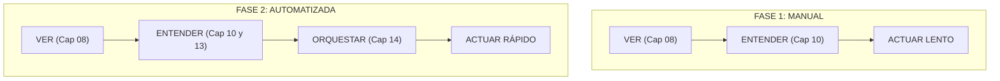
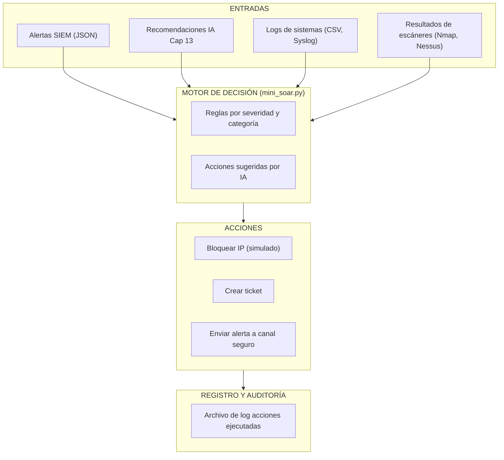
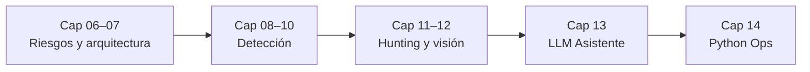

# Capítulo 14: Scripting con Python – De Analista a Orquestador

> "Un comando a tiempo vale más que mil alertas no atendidas."

---

## 14.0 Inmersión: Cuando el Volumen te Gana la Batalla

Imagina que estás al final de un turno de 12 horas en el SOC.

En las pantallas:

- 327 alertas de intento de fuerza bruta
- 58 detecciones de malware por el antivirus
- 12 alertas de comportamiento anómalo del Cap 10
- Un asistente IA del Cap 13 resumiendo todo en un bonito reporte

Todo está claro, pero hay un problema:  
Nadie ha ejecutado ni una sola acción de respuesta.

Sin automatización, sigues atrapado en "ver" y "entender", pero no en "actuar a escala".

### Caso Real: Equifax 2017 – Cuando un Ticket Perdido Cuesta 1.4B

```python
equifax_2017 = {
    "registros_afectados": 147_000_000,
    "multa_usd": 1_400_000_000,
    "vulnerabilidad": "CVE-2017-5638 (Apache Struts)",
    "linea_de_tiempo": [
        "2017-03-07: Apache publica vulnerabilidad crítica",
        "2017-03-08: Llega alerta automatizada al equipo",
        "2017-03-09: Scanner interno detecta servidores vulnerables",
        "2017-03-10 a 2017-05-13: El reporte queda en un ticket sin dueño",
        "2017-05-14: Atacantes explotan la vulnerabilidad",
        "2017-07-29: Se descubre la brecha (79 días después)"
    ]
}
```

En Equifax no falló la detección técnica, falló la orquestación:

1. La vulnerabilidad fue detectada por herramientas automatizadas.
2. El reporte se convirtió en un ticket más en una cola saturada.
3. Nadie priorizó ni ejecutó la remediación a tiempo.

Un script de automatización razonable podría haber:

- Leído el output del escáner de vulnerabilidades.
- Marcado automáticamente los sistemas con CVE crítica como prioridad máxima.
- Creado tickets con plazos claros y responsables asignados.
- Escalado por correo o chat seguro si en 48 horas no había cambios de estado.
- Aplicado controles compensatorios (segmentar o aislar) si el parche no se aplicaba en 72 horas.

La lección es directa:

> La detección sin automatización de respuesta es como tener alarmas de incendio sin bomberos.

Este capítulo es el puente entre:

- Lo que ves (Cap 08, 10, 11, 12)
- Lo que entiendes (Cap 13)
- Lo que haces de forma repetible, segura y rápida (Cap 14 y 15)

Aquí dejas de ser solo analista y te conviertes en orquestador.

---

## 🎯 Objetivos de la Misión

1. Diseñar scripts en Python para automatizar tareas de seguridad repetitivas.
2. Traducir un playbook manual a un flujo programable.
3. Conectar análisis de IA (Cap 13) con acciones concretas (bloquear, notificar, registrar).
4. Aplicar buenas prácticas de scripting seguro para no romper producción.

---

## 14.1 Evolución del Analista CyberSentinel



En Fase 1 dependes solo de tu energía y tiempo.  
En Fase 2 usas scripts para convertir tus decisiones en acciones reproducibles: pasas de apagar incendios a diseñar el sistema de respuesta.

---

## 14.2 De Playbook en Papel a Script Ejecutable

En capítulos anteriores ya has visto playbooks:

- "Si detecto X, hago Y"
- "Si un comportamiento es anómalo, investigo Z"

En este capítulo tomas ese mismo pensamiento, pero lo conviertes en código.

Un script de seguridad bien diseñado debería:

- Ser idempotente: si lo ejecutas dos veces, no causa caos.
- Registrar lo que hace: logs claros de acciones ejecutadas.
- Ser seguro por defecto: evitar borrar cosas o tocar producción sin controles.

---

## 14.3 Arquitectura de un Mini-SOAR en Python

Conceptualmente, tu script de automatización sigue esta arquitectura:



En tu laboratorio te centrarás en un caso concreto y acotado:

1. Entrada de datos:
   - Alertas del SIEM o de un escáner previo.
2. Lógica de decisión:
   - Reglas simples como `if severity == "alta"`.
3. Acciones:
   - Bloquear una IP en un firewall simulado.
   - Registrar la acción en un log legible.

En el Capítulo 15 escalarás este patrón hacia un SOAR más completo; aquí dominas la base: leer, decidir y actuar de forma confiable.

---

## 14.4 Laboratorio 14 – Playbook Automatizado de Bloqueo de IP

### Escenario

Como resultado del Cap 11 y 13, ya tienes:

- Alertas priorizadas con severidad.
- Contexto de IPs sospechosas.

Tu misión ahora:

- Crear un script en Python que lea un archivo de alertas
- Decidir qué IPs deben ser "bloqueadas"
- Registrar las acciones en un archivo de log

No bloquearás nada real. Simularás las acciones de forma controlada.

### Archivos del laboratorio

- `mini_soar.py`: script principal que procesa alertas y decide acciones.
- `alerts_example.json`: archivo de ejemplo con alertas simuladas que tú mismo construirás.

Ejemplo de estructura de alerta:

```json
[
  {
    "id": "alert-001",
    "source_ip": "192.168.10.50",
    "severity": "alta",
    "category": "fuerza_bruta_ssh"
  },
  {
    "id": "alert-002",
    "source_ip": "10.0.0.15",
    "severity": "media",
    "category": "scan"
  }
]
```

### Flujo del script

1. Cargar el archivo JSON de alertas.
2. Filtrar solo las alertas de severidad alta.
3. Tomar la lista de IPs a bloquear.
4. Registrar en un archivo de log una acción simulada de bloqueo por cada IP.

Base mínima de `mini_soar.py`:

```python
from dataclasses import dataclass
from pathlib import Path
import json

@dataclass
class Alert:
    id: str
    source_ip: str
    severity: str
    category: str

class MiniSoar:
    def __init__(self, alerts_path: Path, actions_log_path: Path):
        self.alerts_path = alerts_path
        self.actions_log_path = actions_log_path

    def load_alerts(self):
        with self.alerts_path.open("r", encoding="utf-8") as f:
            data = json.load(f)
        return [Alert(**item) for item in data]

    def select_high_severity(self, alerts):
        return [a for a in alerts if a.severity.lower() == "alta"]

    def simulate_block_ip(self, alert):
        return f"BLOCK_IP {alert.source_ip} from alert {alert.id} ({alert.category})"

    def run(self):
        alerts = self.load_alerts()
        high = self.select_high_severity(alerts)
        self.actions_log_path.parent.mkdir(parents=True, exist_ok=True)
        with self.actions_log_path.open("a", encoding="utf-8") as log_file:
            for alert in high:
                log_file.write(self.simulate_block_ip(alert) + "\n")
```

Tu misión es entender este flujo y adaptarlo a tus propios criterios de severidad y acción.

### Variante Avanzada: Caso Equifax 2017

Además del flujo de bloqueo de IP, puedes trabajar un laboratorio avanzado basado en el caso real de Equifax.

- Script recomendado: `equifax_lesson_automator.py`
- Entrada esperada: un archivo `equifax_vuln_report.json` con vulnerabilidades detectadas por un escáner.

Ejemplo simplificado de entrada:

```json
[
  {
    "cve_id": "CVE-2017-5638",
    "name": "Apache Struts RCE",
    "host": "web-01.internal",
    "cvss_score": 10.0,
    "description": "Remote Code Execution en Apache Struts..."
  }
]
```

Cuando ejecutes:

```bash
python equifax_lesson_automator.py
```

El script:

1. Lee el reporte del escáner.
2. Detecta vulnerabilidades críticas (CVSS ≥ 9.0).
3. Registra acciones automatizadas simuladas (tickets, notificaciones, aislamiento).
4. Genera un pequeño reporte ejecutivo en consola y en los logs.

---

## 14.5 Extensión: Conectando con el Asistente IA (Cap 13)

Si quieres ir un paso más allá:

- Imagina que tu asistente IA del Cap 13 devuelve un JSON con:
  - Resumen
  - Lista de IPs prioritarias
  - Recomendaciones de acción
- Tu script de Cap 14 puede:
  - Leer ese JSON
  - Ejecutar automáticamente solo las acciones marcadas como recomendadas
  - Registrar tanto la recomendación como la acción ejecutada

Esto crea un pipeline:

Cap 11 y 12 → Generan señales  
Cap 13 → Las sintetiza y prioriza  
Cap 14 → Ejecuta acciones de forma reproducible

---

## 14.6 Buenas Prácticas de Scripting Seguro

Antes de empezar a automatizar, ten en mente:

- Nunca ejecutes comandos destructivos sin protección.
- Usa siempre rutas explícitas y evita eliminar archivos sin copia de seguridad.
- Separa claramente entorno de laboratorio y entorno real.
- Registra todas las acciones en un log legible.

Estas mismas prácticas se volverán críticas en Cap 15 cuando escales a SOAR en serio.

---

## 14.7 Laboratorio Avanzado: Orquestación en el Emulador CyberSentinel

> **Nota:** Esta sección te introduce a la metodología del futuro "Emulador CyberSentinel", un entorno unificado donde ejecutarás tus scripts. Aunque el appliance completo está en desarrollo, aquí simularás sus flujos de trabajo.

### Ejercicio 1: Respuesta a Ransomware (Patient Zero)

Hemos preparado un script completo que simula la contención de un ataque de ransomware.

- **Archivo:** [ransomware_response.py](../assets/scripts/ransomware_response.py)
- **Misión:** Identificar el "paciente cero" y aislarlo de la red.

### Ejercicio 2: Mapeo de Activos (Network Mapper)

Desafío de código: Crear un script que escanee la red del emulador (`10.0.0.0/16`) y genere un mapa de activos.

- **Script de referencia:** `network_mapper.py`
- **Uso recomendado en el emulador:**

```bash
python3 network_mapper.py \
  --network 10.0.0.0/16 \
  --max-hosts 256 \
  --ports 22,80,443
```

El script genera un archivo JSON con el mapa de activos en `/cybersentinel/logs/` (o en una carpeta local `logs/` si esa ruta no existe) y un resumen legible en consola.

### Ejercicio 3: Playbook Automatizado para Credential Stuffing

Desafío de código: Responder automáticamente a ataques de validación masiva de credenciales.

```python
# Desafío: Responder automáticamente a ataques de credential stuffing

class CredentialStuffingResponder:
    def handle_attack(self, attack_log):
        """Procesa log de ataque de credential stuffing"""
        # 1. Identificar cuentas atacadas
        # 2. Forzar cambio de contraseña
        # 3. Habilitar MFA temporal
        # 4. Bloquear IPs de origen
        # 5. Notificar a usuarios afectados
        pass

Extensión práctica en el emulador:

- **Script de referencia:** `credential_stuffing_responder.py`
- **Misión:** Leer un log de intentos fallidos de inicio de sesión, identificar cuentas bajo ataque, aplicar protecciones (reset de contraseña y MFA temporal) y, si el entorno lo permite, bloquear IPs de origen mediante reglas `iptables`.

Ejecución de ejemplo en el emulador:

```bash
python3 credential_stuffing_responder.py
```

Si el log esperado no existe, el script utiliza eventos simulados para que puedas practicar igualmente la lógica del playbook.

# Extensión práctica: Integración con Suricata en el emulador

- **Script de referencia:** `suricata_automator.py`
- **Misión:** Leer eventos de Suricata (por ejemplo desde `/var/log/suricata/eve.json` en el emulador) y bloquear automáticamente IPs maliciosas mediante reglas `iptables`, registrando siempre lo que se ejecuta en los logs de CyberSentinel.

Ejemplo de ejecución en el emulador:

```bash
python3 suricata_automator.py
```

Si el archivo `eve.json` no existe (entorno de laboratorio puro), el script utiliza eventos simulados para que puedas practicar igualmente la lógica de automatización.
```

---

## 14.8 Reglas de Oro para Scripting en el Emulador

**PRIMERO en el emulador, LUEGO en producción:**

```bash
# MAL: Ejecutar directamente en producción
# python3 firewall_block.py --ip 10.0.1.15 --production

# BIEN: Probar en el emulador primero
# 1. ./cybersentinel-emulator load-scenario production-like
# 2. python3 firewall_block.py --ip 10.0.1.15 --test
# 3. Verificar resultados
# 4. Solo entonces ejecutar en producción
```

**VERSIONAR tus scripts:**

```bash
cd /cybersentinel/scripts/
git init
git add ransomware_response.py
git commit -m "v1.0: Respuesta básica a ransomware"
```

**CREAR TESTS automatizados:**

```python
# test_ransomware_response.py
def test_patient_zero_identification():
    """Test en el emulador que verifica identificación correcta"""
    responder = RansomwareResponder()
    test_alerts = [...]  # Datos de prueba
    result = responder.identify_patient_zero(test_alerts)
    assert result == "win-server-01"
```

---

## 14.9 Integración con el Tracker del Emulador

El futuro emulador CyberSentinel incluirá su propio sistema de tracking CLI. Así es como visualizarás tu progreso:

```bash
# Ver tu progreso en el emulador
./cybersentinel-emulator tracker --chapter 14
```

**Output esperado:**

```text
🎮 CYBERSENTINEL EMULATOR TRACKER - CAPÍTULO 14
=============================================
✅ Script ransomware_response.py ejecutado
✅ 247 alertas procesadas automáticamente 
✅ Paciente cero identificado: win-server-01
✅ 3 IPs maliciosas bloqueadas
✅ Reporte generado: /cybersentinel/logs/incident_...
⏳ Pendiente: Ejercicios 2 y 3
📊 Puntuación actual: 85/100

📊 CYBERSENTINEL TRACKER - CAPÍTULO 14 (VERSIÓN EMULADOR)
Competencia          Comando en Emulador                               Puntos
Ejecutar script      python3 ransomware_response.py                    20
Verificar logs       tail -f /cybersentinel/logs/automation.log        15
Crear scanner        Completar NetworkMapper.scan_emulator_network()   25
Integrar Suricata    Completar SuricataAutomator.monitor_and_block()   25
Versionar con Git    git commit -m "mi script"                         15
TOTAL | 100 puntos
```

---

## 14.10 Encajando Python Ops en tu pipeline 06–13

Con todo lo anterior, tu pipeline luce así:

- Cap 06–07: amenazas y arquitecturas.
- Cap 08–10: detección (reglas, hardening, anomalías).
- Cap 11–12: hunting e inteligencia físico-digital.
- Cap 13: asistente IA que resume y prioriza.
- Cap 14: scripts que convierten decisiones en acciones repetibles.

En otras palabras:

- Lo que ves (08–10).
- Lo que entiendes (11–13).
- Lo que haces a escala (14 y, en grande, 15).

### Dónde se engancha Cap 14

- Desde Cap 11:
  - Toma tus hipótesis y hallazgos de hunting y conviértelos en scripts:
    - “Si vuelvo a ver este patrón, ejecuta automáticamente X, Y, Z.”
- Desde Cap 12:
  - Responde ante señales físico-digitales:
    - Alerta de visión + logs de red → script que aísla host o zona.
- Desde Cap 13:
  - Tu asistente IA sugiere acciones, Cap 14 las implementa de forma controlada.

### Vista del pipeline con Python Ops antes de SOAR



Checklist rápido:

- ¿Tienes al menos un hallazgo de hunting (Cap 11) traducido a script (Cap 14)?

- ¿Puedes ejecutar en tu cabeza un flujo: señal (08–12) → resumen IA (13) → acción script (14)?

- ¿Qué acciones nunca automatizarías sin revisión humana, incluso teniendo scripts listos?

---

## ✅ Resumen del Capítulo 14 (Versión Emulador)

Ahora tienes poder real en tus manos:

- **EMULADOR ACTIVO:** Un laboratorio completo donde practicar sin miedo.
- **SCRIPTS EJECUTABLES:** Código que realmente funciona en el entorno.
- **ESCENARIOS REALISTAS:** Ransomware, credential stuffing, escaneos.
- **FEEDBACK INMEDIATO:** Ver resultados de tus scripts al instante.
- **PROGRESIÓN MEDIBLE:** Tracker integrado que muestra tu avance.

Lo más importante:

> **En el emulador, romper cosas es aprender.**  
> **Cada error te hace mejor.**  
> **Cada script que escribes es una herramienta para tu arsenal real.**

Próxima estación en el emulador:

**Capítulo 15: SOAR y Automatización** → Donde conectarás múltiples scripts en orquestaciones complejas dentro del emulador.

---

## 🤔 Reflexión CyberSentinel

| Desafío Ético / Técnico | Pregunta Crítica para el Ingeniero |
| :--- | :--- |
| **1. Ética de la Automatización** | ¿En qué casos sería irresponsable dejar que un script aísle sistemas sin revisión humana previa? |
| **2. Riesgo de Contexto** | ¿Qué riesgo tiene automatizar un bloqueo de IP sin revisar el contexto completo de la alerta? |
| **3. Límite Manual vs. Automático** | ¿Qué indicadores usarías para decidir que una acción debe seguir siendo manual, incluso si podrías automatizarla? |
| **4. Idempotencia y Seguridad** | ¿Cómo comprobarías que tu script de automatización no ejecuta dos veces la misma acción de forma peligrosa? |
| **5. Supervisión de IA** | Si tu asistente IA se equivoca en la priorización, ¿qué controles pondrías antes de ejecutar acciones automatizadas basadas en sus recomendaciones? |

---

## 📊 CyberSentinel Tracker – Capítulo 14

<div class="tracker-container" data-chapter-id="cap14">
  <div class="tracker-header">
    <h2>🛡️ CyberSentinel Tracker: Capítulo 14</h2>
    <p>Autoevaluación de Automatización con Scripting</p>
  </div>
  
  <div class="tracker-progress-bar">
    <div class="progress-fill" style="width: 0%"></div>
  </div>
  
  <div class="tracker-competencies">
    <div class="competency-item">
      <input type="checkbox" id="c14-comp1" class="tracker-checkbox">
      <label for="c14-comp1">
        <strong>1. Playbook a Código:</strong>
        <span class="tooltip">Fui capaz de tomar un playbook en texto y escribir un flujo equivalente en Python.</span>
      </label>
    </div>
    
    <div class="competency-item">
      <input type="checkbox" id="c14-comp2" class="tracker-checkbox">
      <label for="c14-comp2">
        <strong>2. Procesamiento de Alertas:</strong>
        <span class="tooltip">Cargué un archivo JSON de alertas y filtré eventos según severidad o categoría.</span>
      </label>
    </div>
    
    <div class="competency-item">
      <input type="checkbox" id="c14-comp3" class="tracker-checkbox">
      <label for="c14-comp3">
        <strong>3. Registro de Acciones:</strong>
        <span class="tooltip">Diseñé un log de acciones donde queda claro qué se ejecutó y sobre qué IP u objeto.</span>
      </label>
    </div>
    
    <div class="competency-item">
      <input type="checkbox" id="c14-comp4" class="tracker-checkbox">
        <label for="c14-comp4">
        <strong>4. Scripting Seguro:</strong>
        <span class="tooltip">Reconozco los riesgos de automatizar acciones y apliqué medidas básicas de seguridad en mis scripts.</span>
      </label>
    </div>
    
    <div class="competency-item">
      <input type="checkbox" id="c14-comp5" class="tracker-checkbox">
      <label for="c14-comp5">
        <strong>5. Integración con IA:</strong>
        <span class="tooltip">Entiendo cómo los resultados del asistente IA del Cap 13 podrían alimentar mis scripts de automatización.</span>
      </label>
    </div>
  </div>
  
  <div class="tracker-summary">
    <p><strong>Nivel Actual:</strong> <span id="c14-level">Aprendiz de Scripting</span></p>
    <p><em>"Automatizar sin pensar es peligroso. Automatizar con criterio te hace imparable."</em></p>
  </div>
</div>

<script>
document.addEventListener('DOMContentLoaded', () => {
  const container = document.querySelector('.tracker-container[data-chapter-id="cap14"]');
  if (!container) return;
  
  const checkboxes = container.querySelectorAll('.tracker-checkbox');
  const progressFill = container.querySelector('.progress-fill');
  const levelText = document.getElementById('c14-level');
  
  function updateTracker14() {
    const checked = Array.from(checkboxes).filter(cb => cb.checked).length;
    const percent = (checked / checkboxes.length) * 100;
    progressFill.style.width = percent + '%';
    
    if (percent === 0) levelText.textContent = "Aprendiz de Scripting";
    else if (percent <= 40) levelText.textContent = "Automatizador en Práctica";
    else if (percent <= 80) levelText.textContent = "Orquestador de Playbooks";
    else levelText.textContent = "Arquitecto de Automatización";
    
    const state = Array.from(checkboxes).map(cb => cb.checked);
    localStorage.setItem('tracker_cap14', JSON.stringify(state));
  }
  
  const saved = JSON.parse(localStorage.getItem('tracker_cap14'));
  if (saved) {
    checkboxes.forEach((cb, i) => cb.checked = saved[i]);
    updateTracker14();
  }
  
  checkboxes.forEach(cb => cb.addEventListener('change', updateTracker14));
});
</script>

---
