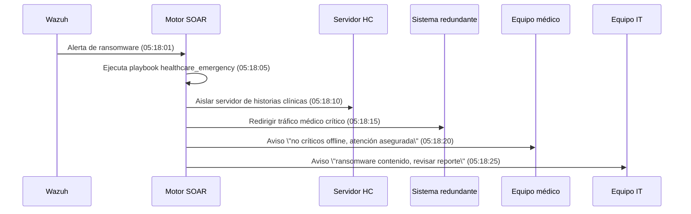
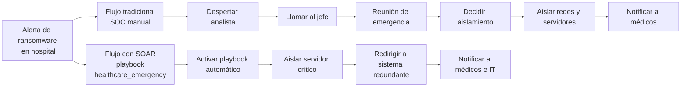
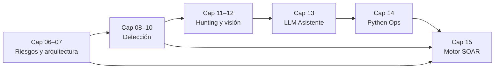
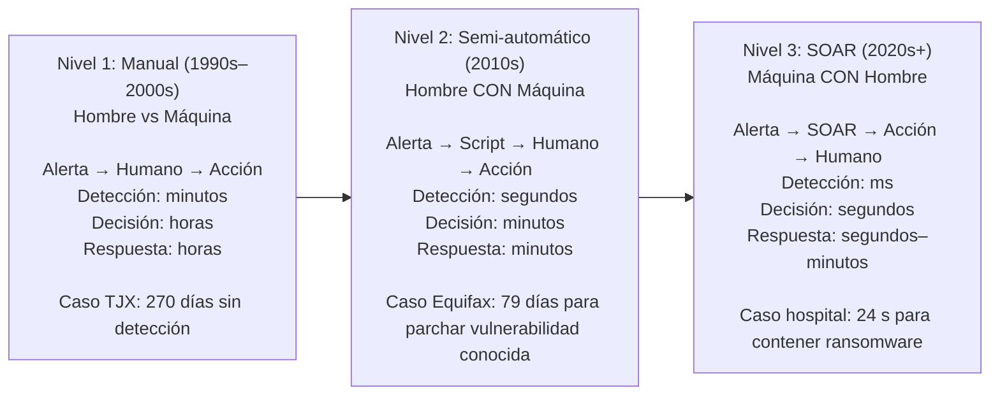
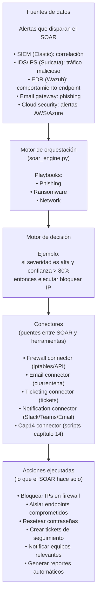
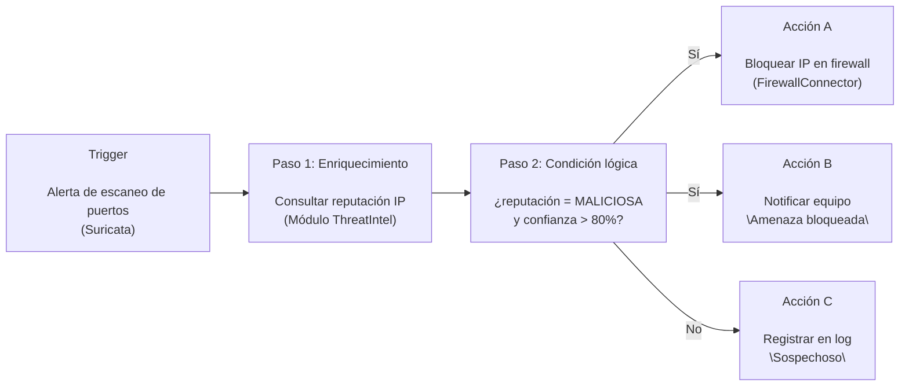
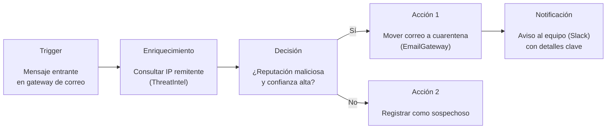
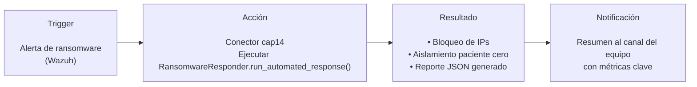
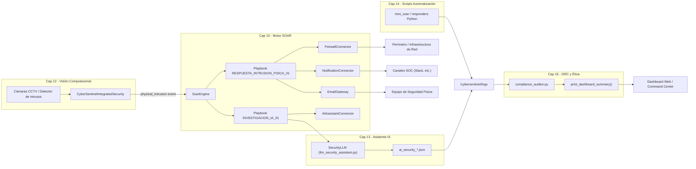

# Capítulo 15: SOAR - El Cerebro de Operaciones de Seguridad

## 15.0 Inmersión: La Noche que el SOAR Salvó al Hospital

> "Un script resuelve un problema. Un SOAR resuelve mil problemas mientras tú duermes."

### Caso Real: Hospital de Londres - 2021

**Ataque Ransomware Ryuk - Enero 2021 (Escenario inspirado en casos reales)**  

Situación:
- 5:17 AM: Primer caso de COVID grave ingresa a UCI.
- 5:18 AM: Ransomware Ryuk es detectado en el sistema de historias clínicas.
- 5:19 AM: Algunos sistemas de monitoreo de pacientes comienzan a fallar.

En este contexto, cada minuto perdido puede significar una vida en riesgo.

### Respuesta Tradicional (Lo que hubiera pasado sin SOAR)

**Línea de tiempo (≈60 minutos, pacientes en riesgo)**  

- La alerta llega al SOC: el sistema genera un evento crítico.
- El analista de turno es despertado y revisa la alerta.
- Llama al jefe de seguridad para validar decisiones.
- Se convoca una reunión de emergencia para decidir si aislar o no la red.
- Finalmente se ordena aislar segmentos de red y servidores afectados.

> Tiempo total aproximado: **más de 60 minutos** con pacientes en riesgo y sistemas críticos inestables.

### Respuesta con SOAR (Lo que un SOC maduro puede hacer)

**Línea de tiempo (24 segundos, cero pacientes afectados)**  

05:18:01 – La alerta de ransomware es detectada por Wazuh.<br>
05:18:05 – El SOAR activa automáticamente el playbook `healthcare_emergency`.<br>
05:18:10 – Aísla el servidor de historias clínicas comprometido.<br>
05:18:15 – Redirige el tráfico médico crítico a un sistema redundante seguro.<br>
05:18:20 – Notifica al equipo médico: "Sistemas no críticos offline, atención clínica asegurada".<br>
05:18:25 – Notifica al equipo de IT: "Ransomware contenido, revisar reporte automático".<br>

### Diagrama de secuencia del flujo SOAR



### Diagrama: Comparativa de Tiempo de Respuesta



### La Lección

Mientras los médicos salvaban vidas físicas, el SOAR salvaba las vidas digitales que sostenían las físicas: historias clínicas, monitores, sistemas de órdenes médicas.

En términos de tu progreso en CyberSentinel:

- En el **Capítulo 14** fuiste el **músculo**, creando scripts que ejecutan acciones concretas.  
- En el **Capítulo 15** te conviertes en el **sistema nervioso**, que decide cuándo, cómo y en qué orden se activan esos músculos.

Aquí aprenderás sobre **SOAR (Security Orchestration, Automation, and Response)**. No se trata de escribir un script que haga *una* cosa, sino de construir un sistema que coordine *todas* tus herramientas para que trabajen en armonía, a velocidad de máquina.

En el emulador CyberSentinel, este tipo de respuesta se refleja en el playbook de ransomware:

- `python soar_engine.py ransomware`  

Ese comando orquesta el script del Capítulo 14 (`ransomware_response.py`) para:

- Identificar paciente cero.  
- Aislar la máquina comprometida.  
- Bloquear tráfico malicioso.  
- Generar un reporte automático del incidente para el equipo.

---

## 15.9 Encajando SOAR en tu pipeline 06–14

Tras todo lo anterior, tu pipeline queda así:

- Cap 06–07: amenazas y arquitecturas.

- Cap 08–10: detección (reglas, hardening, anomalías).

- Cap 11–12: hunting y visión físico-digital.

- Cap 13: IA que resume y prioriza.

- Cap 14: scripts que ejecutan acciones concretas.

- Cap 15: motor SOAR que **orquesta todo lo anterior**.

### De hallazgos a playbooks

**Para cada caso que trabajaste antes (TJX, MediTech, AutoManufact, TechSafelock), deberías tener:**

- Amenazas modeladas (06).

- Controles/detecciones definidos (07–10).

- Hunts y visión que descubren ataques (11–12).

- Asistente IA que genera resúmenes y recomendaciones (13).

- Scripts Python que implementan la respuesta (14).

- Y ahora, un **playbook SOAR** que describe cuándo y cómo encadenar esos scripts.

| Caso | Amenazas (06) | Controles / Detección (07–10) | Hunting / Visión (11–12) | IA (13) | Scripts (14) | Playbook SOAR (15) |
| :--- | :--- | :--- | :--- | :--- | :--- | :--- |
| TJX | Mapa de superficie de ataque retail | Reglas IDS + hardening servidores | Hunts sobre logs de tarjetas | Resumen de incidentes y prioridades | Scripts de contención básica | Playbook para fraude en TPV / exfiltración |
| MediTech | Amenazas en hospital digital | Segmentación de red + detección IoT | Visión físico‑digital en quirófano | Análisis de alertas clínicas | Scripts para aislar dispositivos | Playbook de ransomware en quirófano |
| AutoManufact | Ataques a planta industrial | IDS perimetral + controles OT simulados | Hunts sobre patrones anómalos | Resumen para equipo de planta | Scripts de respuesta en red interna | Playbook para intrusión en red de fabricación |
| TechSafelock | Amenazas a startup SaaS | WAF + controles en nube | Hunts sobre cuentas sospechosas | Asistente para priorizar tickets | Scripts de bloqueo / reset credenciales | Playbook de compromiso de cuenta SaaS |

### Diagrama de alto nivel del pipeline completo



Checklist rápido:

- ¿Puedes tomar un escenario del libro y enumerar: amenaza (06), arquitectura (07), detección (08–10), hunt (11), visión (12), IA (13), script (14) y playbook (15)?

- ¿Qué partes de la respuesta dejarías siempre bajo supervisión humana aunque el SOAR pueda automatizarlas?

- ¿Cómo demostrarías el ROI de tu pipeline completo a un CISO, usando los cálculos de este capítulo?

---

## 15.1 Conceptos Fundamentales: La Tríada SOAR

Para dejar de ser "Cadete" y pensar como "Capitán", debes dominar estos tres pilares:

1.  **Orquestación (Orchestration)**:
    *   *Definición*: La capacidad de coordinar herramientas dispares que no fueron diseñadas para trabajar juntas.
    *   *Ejemplo*: Hacer que tu IDS (Suricata) le hable a tu Firewall (iptables) y luego actualice tu sistema de tickets (Jira/TheHive).
    *   *El problema que resuelve*: "Silos" de información y herramientas desconectadas.

2.  **Automatización (Automation)**:
    *   *Definición*: La ejecución mecánica de tareas repetitivas.
    *   *Ejemplo*: Analizar correos de phishing, extraer URLs y chequearlas en VirusTotal sin intervención humana.
    *   *El problema que resuelve*: La "Fatiga de Alertas" y el agotamiento del analista.

3.  **Respuesta (Response)**:
    *   *Definición*: La gestión del ciclo de vida del incidente, desde la detección hasta el cierre.
    *   *Ejemplo*: Un "Playbook" que guía paso a paso qué hacer cuando se detecta ransomware.
    *   *El problema que resuelve*: La improvisación y el error humano bajo presión.

### Diagrama: La Evolución de la Respuesta a Incidentes



---

## 15.2 Caso de Estudio: El SOC Saturado (Con Datos Reales)

### Estadísticas de la Industria (Ponemon Institute, 2023)

- Promedio de alertas por día en empresa mediana: **4,821**  
- Tiempo promedio para investigar una alerta: **20 minutos**  
- Costo por hora de analista SOC: **65 USD**  
- Alertas que son falsos positivos: **68%**  
- Alertas que requieren acción real: **32%**

### Cálculo del Caos sin SOAR

1. Volumen de trabajo bruto:
   - 4,821 alertas × 20 minutos = **96,420 minutos/día**  
   - 96,420 ÷ 60 = **1,607 horas/día**  

2. Costo diario:
   - 1,607 horas × 65 USD/hora = **104,455 USD/día**  

3. Costo anual aproximado:
   - 104,455 USD × 365 ≈ **38.1 millones USD/año** invertidos en análisis manual de alertas.

Y aún así, con este volumen, muchas alertas críticas pueden seguir pasando desapercibidas.

### Efecto de Implementar SOAR

Escenario típico tras introducir SOAR:

- Reducción de falsos positivos que llegan al analista: de 68% → **20%**  
- Tiempo de investigación por alerta: de 20 minutos → **2 minutos**  
- Alertas que llegan a humanos: de 4,821 → **964/día** (filtrado automático previo)

Nuevo cálculo:

1. Volumen de trabajo con SOAR:
   - 964 alertas × 2 minutos = **1,928 minutos/día**  
   - 1,928 ÷ 60 ≈ **32 horas/día**

2. Costo diario:
   - 32 horas × 65 USD/hora = **2,080 USD/día**

3. Costo anual aproximado:
   - 2,080 USD × 365 ≈ **759,200 USD/año**

### Ahorro Anual Estimado

- Antes de SOAR: **38.1 M USD/año**  
- Después de SOAR: **0.76 M USD/año**  
- Ahorro aproximado: **37.34 millones USD/año**

### Pregunta para el Estudiante

Si tu empresa gasta ~37 millones USD anuales analizando alertas manualmente:

- ¿Cuánto tendría sentido invertir en una plataforma SOAR bien diseñada?  
- ¿Qué retorno de inversión (ROI) esperarías demostrarle a la dirección?

---

## 15.3 Laboratorio: Construyendo tu Propio Motor SOAR ("CyberSentinel Orchestrator")

En lugar de usar una herramienta comercial costosa (como Cortex XSOAR o Splunk Phantom), o desplegar una pesada instancia de Java (como Shuffle) en esta fase inicial, vamos a **construir la lógica de un motor SOAR en Python**.

Esto te enseñará cómo funcionan estas herramientas "bajo el capó".

### Objetivos del Laboratorio

- **Crear un "Workflow Engine"**  
  - Un script que pueda leer un playbook definido en YAML o JSON.

- **Integrar módulos**  
  - Conectar los scripts que hiciste en el Cap 14 (`network_mapper.py`, `ransomware_response.py`) como acciones del SOAR.

- **Simular enriquecimiento**  
  - Crear un módulo de "Threat Intelligence" simulado.

### Estructura del Proyecto SOAR
*   `soar_engine.py`: El cerebro que lee playbooks y ejecuta acciones.
*   `playbooks/`: Carpeta con definiciones de flujos de trabajo (ej. `phishing_response.yaml`).
*   `connectors/`: Scripts "wrapper" que adaptan tus herramientas antiguas para que el SOAR las entienda.

### Diagrama: Arquitectura SOAR CyberSentinel



---

## 15.4 Actividad Práctica: "Playbook de Defensa Automatizada"

Vamos a implementar el siguiente flujo en nuestro SOAR casero:

**Nombre del Playbook:** `DEFENSA_PERIMETRO_01`

1. **Trigger (Disparador)**  
   - Alerta de "Escaneo de Puertos Detectado" (simulado desde Suricata).

2. **Paso 1 – Enriquecimiento**  
   - Consultar reputación de la IP atacante (Módulo `ThreatIntel`).

3. **Paso 2 – Condición lógica**  

   - Si `reputacion` == "MALICIOSA" y `confianza` > 80%:
     - **Acción A:** Bloquear IP en firewall (Módulo `FirewallConnector`).
     - **Acción B:** Notificar al equipo "Amenaza bloqueada".

   - Si no:
     - **Acción C:** Solo registrar en log para vigilancia "Sospechoso".

### Diagrama: Playbook `DEFENSA_PERIMETRO_01`



---

## 15.5 Segundo Playbook: Respuesta a Phishing

Además de defender el perímetro de red, un SOC moderno debe responder de forma inteligente a campañas de phishing.

En este segundo playbook (`PHISHING_RESPONSE_01`) el flujo es:

**Trigger**  
- Mensaje entrante en el gateway de correo.

**Enriquecimiento**  
- Consultar la IP del remitente (`ThreatIntel`).

**Decisión**  
- Si la reputación es maliciosa y la confianza alta, el sistema envía el correo a cuarentena.
- Si no, solo se registra como sospechoso.

**Acción**  
- Llamar al conector `EmailGateway` para mover el mensaje a cuarentena.
- Enviar una notificación al equipo (Slack) con los detalles clave.

### Diagrama: Playbook `PHISHING_RESPONSE_01`



Puedes ejecutar ambos modos desde el mismo motor:

- Escaneo de puertos:
  - `python soar_engine.py`
- Phishing:
  - `python soar_engine.py phishing`

---

## 15.6 Integración con Capítulo 14: Playbook de Ransomware

El tercer playbook (`RANSOMWARE_INCIDENT_01`) demuestra cómo el motor SOAR delega la respuesta completa a un script especializado del Capítulo 14 (`ransomware_response.py`).

Flujo:

1. **Trigger** – Alerta de ransomware desde Wazuh.  

2. **Acción** – Llamar al conector `cap14`, que ejecuta `RansomwareResponder.run_automated_response()`.  

3. **Resultado** – Bloqueo de IPs, aislamiento de paciente cero y generación de reporte JSON.  

4. **Notificación** – Envío de un resumen al canal del equipo con métricas clave.  

### Diagrama: Playbook `RANSOMWARE_INCIDENT_01`



Comandos:

- Ransomware:
  - `python soar_engine.py ransomware`

---

## 15.7 Integración con el Tracker del Capítulo

En la versión integrada con el emulador, al completar el laboratorio el motor SOAR puede actualizar automáticamente tu **tracker de habilidades** del Capítulo 15.

Ejemplo de datos que el emulador podría registrar:

```python
tracker_data = {
    "orchestration_concepts": 5,  # Entendí orquestación vs automatización
    "playbook_design": 4,         # Diseñé playbooks funcionales
    "connector_development": 3,   # Creé conectores básicos
    "integration_testing": 5,     # Integré con herramientas existentes
    "roi_calculation": 4          # Calculé ROI de implementación SOAR
}
```

Esto se reflejaría en tu dashboard táctico como:

```text
🧠 ANÁLISIS TÁCTICO - CAPÍTULO 15
✅ HABILIDADES DOMINADAS:
   • Orquestación de Herramientas (5/5)
   • Diseño de Playbooks (4/5)
   • Cálculo de ROI (4/5)

📚 RECOMENDACIÓN DE REFUERZO:
   • Desarrollo de Conectores (3/5) → Práctica adicional sugerida

🚀 SIGUIENTE OBJETIVO:
   • Capítulo 16: GRC y Cumplimiento
   • Razón: Completaste automatización técnica, ahora necesitas marco regulatorio
```

En esta primera versión del libro, el motor `soar_engine.py` se centra en la lógica de orquestación. La integración completa con el dashboard del emulador (incluyendo `EmulatorConnector` y actualización automática del tracker) se deja como extensión avanzada para el estudiante o para futuras versiones del emulador.

### CyberSentinel Tracker - Capítulo 15

Resumen de competencias evaluadas en el emulador:

```text
COMPETENCIA            CÓMO SE MIDE                     PUNTOS   INTEGRACIÓN
-------------------------------------------------------------------------------
Conceptos SOAR         Test teórico en dashboard          20     ✅ Resultados en Análisis Táctico
Diseño de Playbooks    Crear 3 playbooks funcionales      25     ✅ Guardados en /playbooks/
Desarrollo Conectores  Conectar con 2+ herramientas       20     ✅ Conectores en /connectors/
Integración Existente  Usar scripts del Cap 14            20     ✅ Playbook ransomware_incident.yaml
Cálculo de ROI         Ejercicio de costos en dashboard   15     ✅ Enviado a emulador como reporte
-------------------------------------------------------------------------------
TOTAL                                                       100   Todo integrado con dashboard
```

> **NOTA DE VALIDACIÓN:** Al ejecutar exitosamente los 3 playbooks (`ports`, `phishing`, `ransomware`) con `soar_engine.py`, el sistema generará un **CÓDIGO DE VALIDACIÓN** único (ej. `SOAR-XXXX`). Úsalo en el Dashboard Web para desbloquear la insignia de "Arquitecto de Automatización".

---

## 15.8 Arquitectura Integrada (Visión + IA + SOAR + GRC)

Hemos logrado la **convergencia total** de los módulos de CyberSentinel. El siguiente diagrama muestra cómo interactúan el "Ojo" (Visión), el "Cerebro" (SOAR + IA) y la "Conciencia" (GRC) de nuestro sistema.



Este diagrama representa la arquitectura final del **Volumen 1: Fundamentos de Ciberdefensa**, demostrando que la seguridad moderna no son silos aislados, sino un ecosistema interconectado.

---

### Reflexión de Capitán
> "La automatización no reemplaza al analista; lo libera de ser un robot para que pueda ser un investigador."

Preparado para construir el cerebro de tu sistema? Avanza al siguiente paso.
