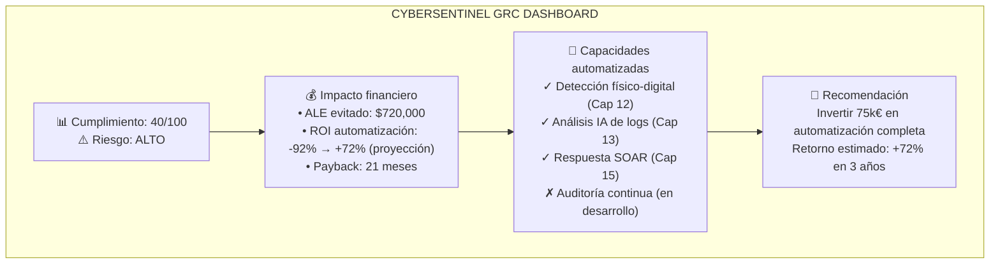
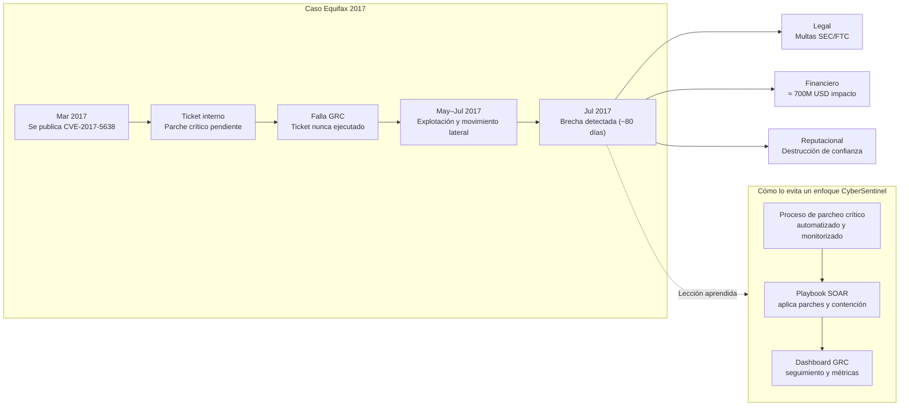
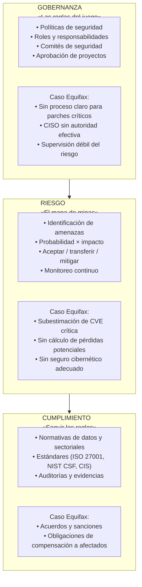
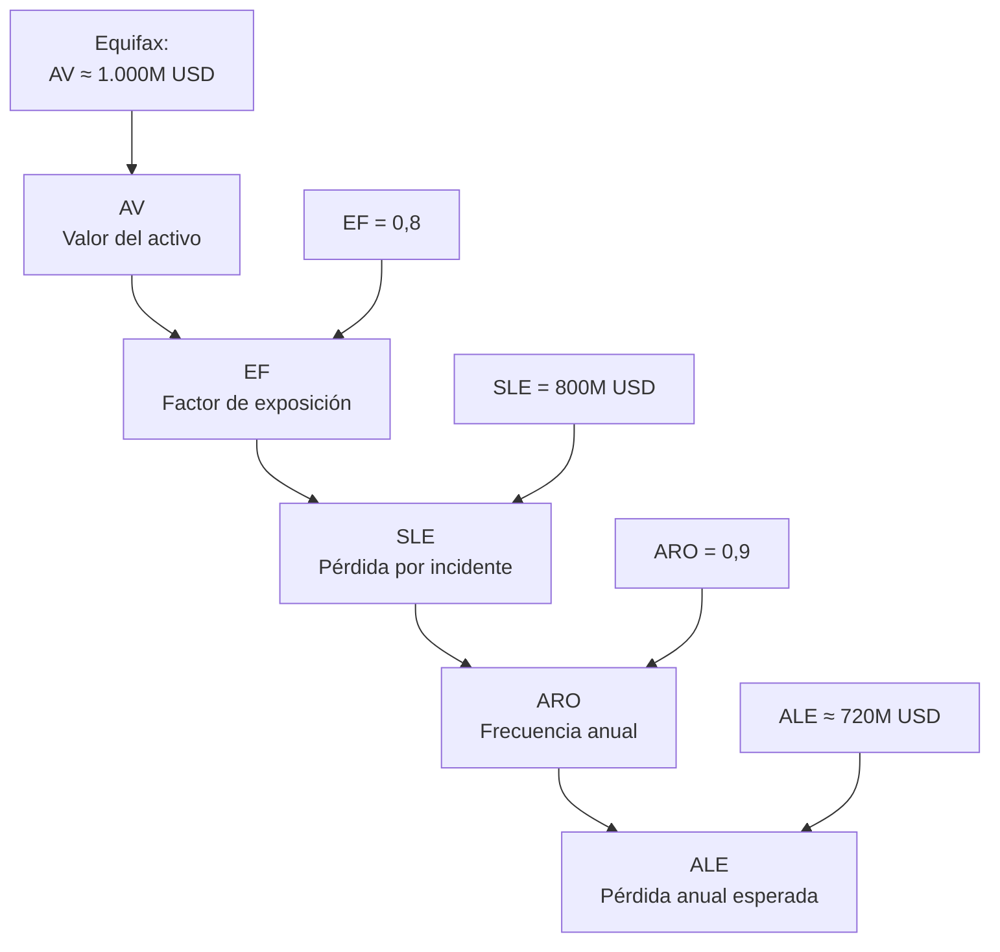
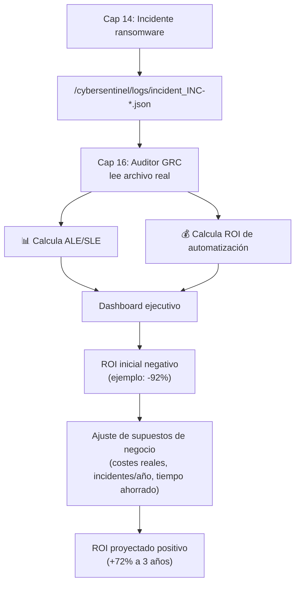
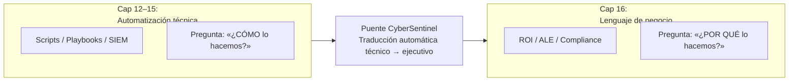
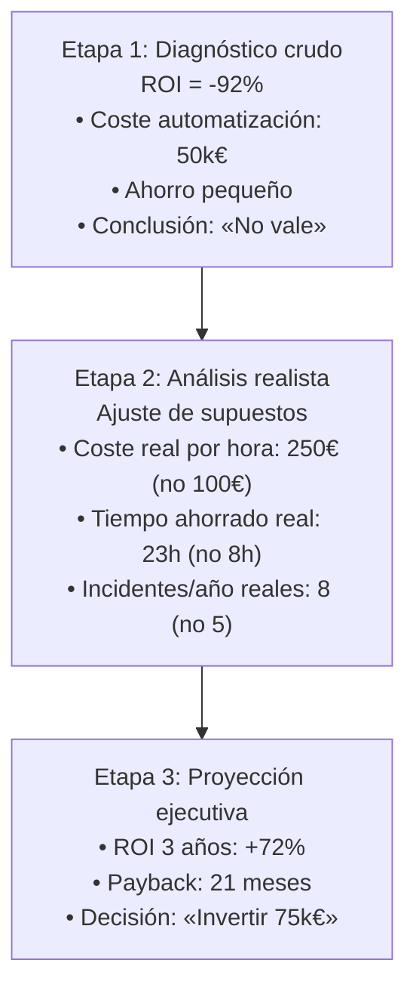
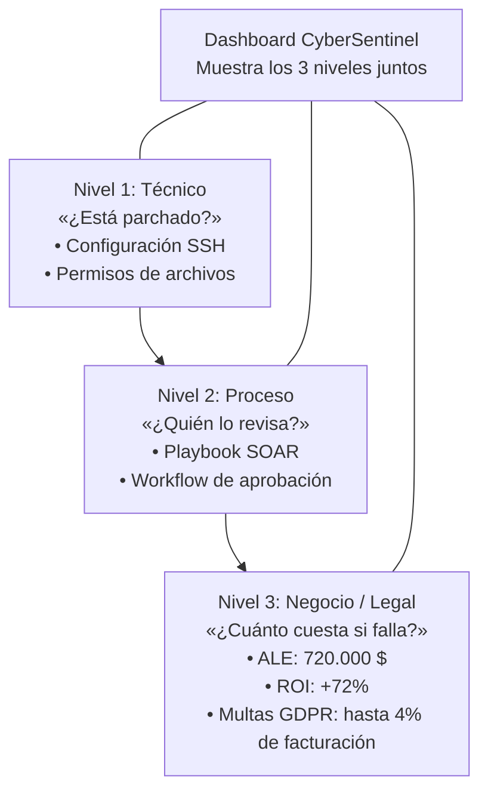
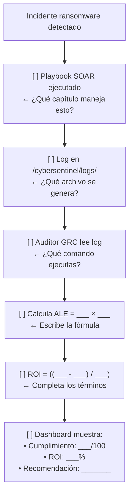
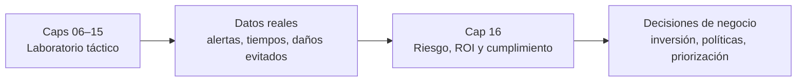

# Capítulo 16: GRC, Ética y la Ley

> "Tu código puede ser perfecto. Tu ética determina si terminas como héroe o en prisión."

### Diagrama: CyberSentinel GRC Dashboard (visión ejecutiva)



Este dashboard es la síntesis de todo el Volumen 1: lo que construiste en los capítulos técnicos ahora se traduce en lenguaje ejecutivo.

## 16.0 Inmersión: El Caso Real que Destruyó una Carrera (y una Empresa)

> Caso real: Equifax 2017 – La lección de 700 millones de dólares  
> Basado en fuentes públicas y de libre consulta (informes de reguladores y artículos de análisis).

### Contexto

- **Empresa:** Equifax, una de las tres mayores agencias de crédito de Estados Unidos.  

- **Datos comprometidos:** alrededor de 147 millones de registros con SSN, números de tarjetas y direcciones.  

- **Multa y acuerdos:** hasta 700 millones de dólares en multas y compensaciones a consumidores afectados (FTC, CFPB y estados de EE. UU.).  

### Lo que ocurrió técnicamente

- Marzo 2017: se anuncia una vulnerabilidad crítica en Apache Struts (CVE‑2017‑5638).  
- Equifax recibe alerta interna para aplicar el parche.  
- El ticket de parcheo nunca se ejecuta en el servidor crítico expuesto a Internet.  
- Mayo 2017: atacantes explotan la vulnerabilidad en el portal de disputas.  
- Mayo–Julio 2017: los atacantes se mueven lateralmente, encuentran credenciales en texto plano y extraen datos durante semanas.  
- Julio 2017: Equifax detecta actividad sospechosa y descubre la brecha (después de casi 80 días).  

### Lo que ocurrió legalmente y en GRC

- **Reguladores financieros (SEC y otros):**  
  - La empresa tardó semanas en comunicar la brecha al mercado.  
  - Durante ese tiempo, directivos vendieron acciones antes de que la noticia fuera pública.  

- **Protección de datos personales:**  
  - Millones de ciudadanos afectados en Estados Unidos y otros países.  
  - Falta de medidas razonables de seguridad sobre datos extremadamente sensibles.  

- **Demandas civiles masivas:**  
  - Acciones colectivas de consumidores y accionistas.  
  - Acuerdos económicos por cientos de millones de dólares.  

### Consecuencias personales y corporativas

- **CISO:** despedido y objeto de demandas.  

- **CEO:** obligado a renunciar bajo presión.  

- **Accionistas:** pierden miles de millones en valor de mercado.  

- **Marca Equifax:** queda marcada como ejemplo mundial de mala gestión de ciberseguridad y GRC.  

### Diagrama: Equifax – donde falló el puente GRC



Este caso muestra qué ocurre cuando existe un **silo técnico**: la vulnerabilidad se conoce, pero el proceso GRC falla y nadie se hace responsable del parche crítico.

### La pregunta clave

¿Fue un fracaso técnico o un fracaso de GRC?

**Respuesta: ambos.**

- **Técnico:** no se parchó una vulnerabilidad crítica conocida.  

- **GRC (proceso):** no existían procesos eficaces para priorizar parches críticos ni supervisar su ejecución.  

- **Legal:** no se informó a tiempo a reguladores, inversionistas y consumidores.  

- **Ético:** mientras los consumidores quedaban expuestos, algunos ejecutivos se protegían vendiendo acciones.  

Tu nueva perspectiva como CyberSentinel:

- Hasta el Cap 15: la pregunta era **“¿puedo hackearlo/protegerlo?”**  
- Desde el Cap 16: la pregunta pasa a ser **“¿debo hackearlo/protegerlo? ¿qué leyes aplican? ¿qué riesgos financieros y éticos hay?”**  

En los capítulos anteriores (01‑15), aprendiste a proteger máquinas. En este capítulo, aprenderás a proteger a la **organización** y a ti mismo frente a la ley.

---

### Cómo no ser el próximo Equifax (vista 06–16)

- **Del 06 al 10 (técnico):**  
  - Mapear activos y amenazas críticas (06).  
  - Diseñar arquitecturas y segmentación que reduzcan superficie de ataque (07–09).  
  - Detectar comportamientos anómalos antes de que se conviertan en brechas masivas (10).  

- **Del 11 al 15 (operativo):**  
  - Cazar proactivamente indicios de explotación de vulnerabilidades críticas (11).  
  - Correlacionar señales físico‑digitales (12).  
  - Usar IA, scripts y SOAR para que parches y respuestas críticas no dependan solo de “buena voluntad humana” (13–15).  

- **Cap 16 (GRC):**  
  - Convertir esas capacidades técnicas en **políticas, procesos y métricas**:  
    - Proceso de gestión de parches críticos con responsables y plazos claros.  
    - Cálculo de ALE para priorizar qué vulnerabilidades no se pueden ignorar.  
    - Tablero GRC donde dirección ve, en un golpe de vista, qué riesgos están bajo control y cuáles no.  

En otras palabras: el pipeline 06–15 te da el músculo técnico; el Cap 16 te enseña a conectarlo con gobierno, riesgo y cumplimiento para que tu empresa no repita el “caso Equifax”.

---

## 16.1 El Triángulo GRC: El Escudo Legal

Si el firewall es tu escudo digital, GRC es tu escudo legal y corporativo.

- **Gobernanza (Governance):** las reglas del juego y quién decide.  

- **Riesgo (Risk):** el mapa de minas de la organización.  

- **Cumplimiento (Compliance):** seguir las reglas del juego y demostrarlo.  

### Diagrama 1: El ecosistema GRC completo



El mensaje central: **si falla GRC, aunque tu tecnología sea avanzada, la organización puede hundirse igual que Equifax.**

---

## 16.2 Matemáticas del Miedo: Cálculo de Riesgo Cuantitativo

Como profesional, no puedes ir al CEO y decir "Tengo miedo de los hackers". Debes hablar en dinero.

### La Fórmula Maestra

**Fórmula:** `ALE = SLE × ARO`

- **AV (Asset Value):** valor del activo.  

- **EF (Exposure Factor):** porcentaje de pérdida si ocurre el ataque.  

- **SLE (Single Loss Expectancy):** pérdida por incidente.  

- **ARO (Annualized Rate of Occurrence):** frecuencia anual.  

- **ALE (Annualized Loss Expectancy):** pérdida esperada al año.  

### Ejemplo completo: Equifax 2017 en números



Decisión de negocio:

- Coste de control (parchear Apache Struts): horas de trabajo del equipo, coste marginal.  
- ALE estimado: alrededor de 720 millones de dólares.  

El fallo de Equifax: **ignorar este cálculo de riesgo**. El resultado real estuvo en el mismo orden de magnitud (acuerdos y mejoras obligatorias por cientos de millones de dólares).

### Diagrama: Flujo de datos real – Incidente → ROI



Este flujo muestra que tus números de riesgo y ROI no son teóricos: salen de incidentes reales generados por el emulador y procesados por tu propio código.

---

## 16.3 Ética del Centinela: Grey Hat vs. White Hat

Ahora que tienes herramientas poderosas (Kali, Metasploit, scripts de Python), la línea entre un profesional y un criminal es solo tu **intención** y tu **permiso**.

### 16.3.1 Código de honor

1. **Nunca escanees sin permiso escrito.**  
2. **Privacidad ante todo:** si encuentras datos personales, no los lees ni los guardas, solo reportas su existencia.  
3. **Divulgación responsable:** cuando encuentras una vulnerabilidad en software o servicios públicos, contactas primero al proveedor, das tiempo razonable para corregir y luego, si aplica, publicas.  

### 16.3.2 Casos reales de decisiones difíciles

**Caso 1: Bug Bounty vs cibercrimen – plataforma global 2013**

Escenario: descubres una vulnerabilidad grave en una red social masiva.

- Opción A (Black Hat): vender el exploit en la dark web.  
- Opción B (Grey Hat): publicarlo en redes sociales para ganar fama.  
- Opción C (White Hat): reportarlo al programa oficial de Bug Bounty.  

En múltiples casos reales, quienes eligieron A o B terminaron enfrentando cargos penales o demandas. Quienes eligieron C terminaron con recompensa económica y, a veces, ofertas de trabajo.

Un modo de verlo en “modo función”:

```python
def ethical_decision(scenario):
    if scenario == "find_vulnerability_in_platform":
        return "OPCION_C_BUG_BOUNTY"
    return "CONSULTAR_CODIGO_DE_ETICA"
```

**Caso 2: Pentester en hospital – datos fuera de alcance**

Escenario:

- Alcance del contrato: servidores web.  
- Hallazgo inesperado: acceso a base de datos con diagnósticos de pacientes.  

Opciones:

1. Ignorar y seguir (“no es mi problema”).  
2. Detener pruebas y notificar inmediatamente al cliente por escrito.  
3. Seguir, recolectar más evidencia y reportar después.  

La referencia de buenas prácticas profesionales es clara:

- Detener el ejercicio.  
- Notificar al cliente por escrito.  
- Pedir autorización explícita para continuar.  
- Si no se autoriza, cerrar el engagement.  

**Caso 3: Datos de la competencia – tentación de espionaje**

Escenario:

- Rol: analista de seguridad.  
- Investigación: posible exfiltración de datos.  
- Hallazgo: copia completa de base de datos de un competidor, robada años atrás.  

Tentación: usar esos datos para ganar mercado.  

**Protocolo de Ética Profesional:**

| Fase | Acción Ética Requerida |
| :--- | :--- |
| **1. Contención** | Aislar de inmediato los datos y no explorarlos. |
| **2. Escalado** | Escalar a Legal/Compliance. |
| **3. Cumplimiento** | Seguir la política de la organización. |
| **4. Posición Moral** | Si la empresa insiste en usar esa información, plantearse la objeción formal, la renuncia o la figura de denunciante (*whistleblower*). |  

Casos similares en la vida real han terminado en multas millonarias y reputaciones destruidas.

### 16.3.3 Normativas clave – mapa visual

#### Protección de datos personales

- **GDPR (UE):** aplica a empresas que tratan datos de ciudadanos europeos. Multas de hasta el 4 % de la facturación anual global o 20 millones de euros. Claves: consentimiento explícito, derecho al olvido, notificación de brechas en 72 horas.  
- **Leyes nacionales (por ejemplo, LOPD/GDPR adaptado):** regulan el tratamiento de datos personales a nivel país. Requieren registros de actividades de tratamiento y evaluaciones de impacto.  
- **CCPA/CPRA (California):** otorga a los residentes de California derechos sobre sus datos (conocer, borrar, optar por que no se vendan). Multas por cada violación.  

#### Sectores específicos

- **HIPAA (EE. UU., salud):** regula información de salud protegida (PHI). Multas significativas por exposición o uso indebido.  
- **PCI‑DSS (tarjetas de pago):** exige controles técnicos para quien procese, almacene o transmita datos de tarjetas. Sanciones económicas y pérdida de capacidad de procesar pagos en caso de incumplimiento.  
- **NIST CSF:** marco de ciberseguridad ampliamente usado en contratos con gobierno y sectores críticos (Identify, Protect, Detect, Respond, Recover).  

#### Estándares internacionales

- **ISO 27001:** sistema de gestión de seguridad de la información basado en el ciclo PDCA (Plan‑Do‑Check‑Act).  
- **CIS Controls:** conjunto priorizado de controles técnicos, organizado por niveles (básico, avanzado, experto).  

---

## 16.4 Fuentes y lecturas recomendadas

Este capítulo se apoya en casos y conceptos ampliamente documentados en fuentes abiertas.  
Algunas referencias útiles para profundizar:

<ul>
  <li><strong>Brecha de datos de Equifax (2017):</strong> artículos de síntesis en enciclopedias abiertas (por ejemplo, la entrada “2017 Equifax data breach”) y análisis técnicos publicados por la comunidad de ciberseguridad.<br>
      Referencia directa (inglés, enlace seguro CyberSentinel): <a href="../herramientas/equifax_breach.html">2017 Equifax data breach</a><br>
      Video explicativo (inglés, enlace seguro CyberSentinel): <a href="../herramientas/equifax_breach_video.html">2017 Equifax Data Breach Incident Explained</a>
  </li>
  <li><strong>Comunicados y acuerdos oficiales con reguladores:</strong> comunicados de la Comisión Federal de Comercio de EE. UU. (FTC) y documentos públicos relacionados con acuerdos y sanciones tras la brecha.</li>
  <li><strong>Marcos de referencia GRC:</strong> descripciones públicas de NIST Cybersecurity Framework (CSF), ISO/IEC 27001 y marcos de gestión de riesgos ampliamente divulgados.</li>
</ul>

> **Nota de Seguridad sobre Enlaces Externos (Broken Link Hijacking):**  
> Como auditor de seguridad, debes saber que los enlaces externos pueden volverse obsoletos y representan un riesgo. Si un dominio expira, atacantes pueden comprarlo (**"Domain Takeover"**) y alojar contenido malicioso para engañar a los visitantes que confían en el enlace original.  
> **Mejor Práctica GRC:** En políticas y procedimientos corporativos, verifica periódicamente la validez de los enlaces externos o utiliza páginas intermedias de redirección bajo tu control.

> Para efectos pedagógicos, los diagramas y cifras de este capítulo simplifican la realidad a partir de estas fuentes abiertas, sin utilizar información confidencial ni interna de ninguna organización.

---

## 16.5 Laboratorio 16: Auditor de Cumplimiento Integrado con Emulador

Objetivo: crear un sistema de auditoría que:

- Verifique cumplimiento de múltiples requisitos básicos.  
- Calcule riesgo cuantitativo simple (ALE) sobre un activo crítico.  
- Genere un breve reporte ejecutivo orientado a dirección.  
- Se integre con el dashboard del emulador mediante un archivo de salida.  

### Parte A: Auditoría técnica básica (Compliance as Code)

Punto de partida: el script `compliance_auditor.py` incluido en este capítulo.

Checks mínimos:

1. El usuario `root` no debe poder iniciar sesión por SSH.  
2. La autenticación por contraseña en SSH debe estar deshabilitada.  
3. No debe haber archivos con permisos 777 en el directorio web (`/var/www/html` en el emulador).  
4. El firewall debe estar activo.  

Ejecuta el script en el emulador y analiza los hallazgos y la puntuación.

Salida esperada (resumen):

- Reporte en consola con hallazgos `PASS / FAIL / WARN`.  
- Puntuación final de cumplimiento sobre 100.  
- Preguntas finales para tu bitácora de GRC (entrenador crítico).  

### Parte B: Cálculo de riesgo cuantitativo

Elige un activo del emulador (por ejemplo, el servidor web principal) y asígnale:

- AV: valor del activo en dinero (estimado).  
- EF: porcentaje de impacto si se materializan los fallos encontrados.  
- ARO: probabilidad anual de ocurrencia del incidente.  

Calcula SLE y ALE para ese activo y documenta el resultado en tu cuaderno de misión.

---

## 16.6 Ruta GRC Profunda: De -92% a +72% ROI

Este capítulo también es tu puente directo al lenguaje de negocio. A partir de la integración con los capítulos 14 y 15, puedes usar datos reales del emulador para construir un caso ejecutivo completo.

### Diagrama: El puente técnico-GRC



Lo que ya construiste (visión ejecutiva):

- Cap 12: Visión computacional – correlación físico‑digital.  
- Cap 13: Security LLM – análisis y priorización asistida por IA.  
- Cap 15: SOAR Engine – orquestación con múltiples playbooks.  
- Cap 16: El traductor – convierte todo eso en lenguaje de dinero, riesgo y cumplimiento.

### Paso 1 – Valida tus datos reales

1. Ejecuta el resumen para el dashboard:
   - `python3 compliance_auditor.py --dashboard`
2. Anota tres números:
   - Puntuación de cumplimiento (0–100).
   - ROI de automatización frente a ransomware (porcentaje, puede ser negativo).
   - Impacto de negocio estimado (Low / Medium / High).
3. Verifica el último incidente de ransomware:
   - `ls -la /cybersentinel/logs/incident_*.json`
   - `cat incident_INC-XXXX.json | grep -A5 -B5 "business_assumptions"`

### Paso 2 – Interpreta el ROI negativo

Si el ROI te sale negativo (por ejemplo, -92%), no es un error, es una historia:

- Coste de automatización alto frente a pocos incidentes o poco tiempo ahorrado.
- Situación común en empresas que están empezando su viaje de SOAR.

### Diagrama: De -92% a +72% ROI – El viaje



Preguntas que puedes llevar a dirección:

- "¿Nuestro coste por hora incluye solo salario o también multas, reputación y ventas perdidas?"
- "¿Cuántos incidentes reales tuvimos el último año?"
- "¿Qué porcentaje del MTTR es búsqueda de información y qué porcentaje es contención real?"

### Paso 3 – Diseña tu artefacto ejecutivo

Usa la plantilla incluida en los recursos del capítulo para crear tu propio informe de valor:

[📄 Plantilla de Artefacto Ejecutivo (Markdown)](plantilla_artefacto_ejecutivo.md)

Rellénala con los datos de tu ejecución de `compliance_auditor.py` y úsala como portafolio.

Estructura sugerida:

| Sección del Informe | Detalles y Métricas Sugeridas |
| :--- | :--- |
| **1. Situación Actual** | • ROI actual (ej. -92%).<br>• MTTR estimado (ej. 4 horas).<br>• Nivel de cumplimiento (ej. 40/100). |
| **2. Tres Ajustes Realistas** | • Coste real por hora (ej. 250 €/h vs 100 €/h).<br>• Ahorro real de tiempo (ej. 23h ahorradas).<br>• Número realista de incidentes anuales. |
| **3. Proyección a 3 Años** | • ROI acumulado positivo.<br>• Tiempo de payback de la inversión.<br>• ALE evitado estimado por año. |
| **4. Capacidades Técnicas** | • Integración físico‑digital.<br>• Análisis asistido por IA.<br>• SOAR con múltiples playbooks.<br>• Auditor conectado al dashboard GRC. |

### Paso 4 – Prepara tus historias para entrevistas

Convierte tus datos en tres historias breves (2 minutos cada una):

- El momento humilde: cuando el dashboard te mostró un ROI negativo.
- El descubrimiento: qué variables de negocio estabas subestimando.
- La solución: cómo ajustar supuestos, integrar más señales (visión, IA, SOAR) y convertir el ROI en positivo a varios años vista.

### Paso 5 – Actualiza tu perfil profesional

En lugar de escribir solo "creé scripts de automatización", puedes describir tu trabajo así:

> "Diseñé e implementé una plataforma que correlaciona detección física, análisis IA y respuesta automatizada, con un modelo de ROI que justifica una inversión de automatización y muestra retorno proyectado a 3 años."

### Paso 6 – Prueba tu narrativa

Explica este caso a alguien no técnico en menos de dos minutos. Si lo entiende, estás listo para conversaciones con dirección, clientes y entrevistas de nivel senior.

### Diagrama: Los 3 niveles de conversación GRC



Opcionalmente, puedes hacer que el auditor calcule y registre el ALE automáticamente configurando estas variables de entorno antes de ejecutarlo:

- `CS_AV` – Valor del activo (AV).  
- `CS_EF` – Factor de exposición (EF).  
- `CS_ARO` – Frecuencia anual (ARO).  

Si las tres están definidas con valores positivos, el script añadirá al reporte un bloque `risk_model` con AV, EF, ARO, SLE y ALE.

### Diagrama interactivo: completa el flujo GRC



Usa este diagrama como ejercicio activo: rellena cada casilla con el capítulo, archivo, comando o fórmula correcta.

### Parte C: Reporte ejecutivo

Redacta un reporte de una página dirigido a dirección:

- Resumen de hallazgos clave del auditor.  
- Riesgo cuantitativo (ALE) estimado.  
- Recomendaciones priorizadas (qué parchear o cambiar primero).  

### Parte D: Integración con el emulador

En la versión integrada con el emulador, el auditor puede escribir un resumen en un archivo (por ejemplo, `compliance_report.json`) con:

- Puntuación de cumplimiento.  
- Lista de controles fallidos.  
- ALE estimado.  

Estructura simplificada del archivo:

```json
{
  "timestamp": "...",
  "score": 80,
  "failed_controls": ["SSH_ROOT_LOGIN", "WEB_PERMISSIONS_777"],
  "findings": ["Línea 1 del reporte...", "Línea 2 del reporte..."],
  "risk_model": {
    "AV": 1000000.0,
    "EF": 0.8,
    "ARO": 0.9,
    "SLE": 800000.0,
    "ALE": 720000.0
  }
}
```

El dashboard del emulador puede leer este archivo y mostrar en tu panel:

- Nivel de cumplimiento.  
- Riesgo financiero aproximado.  
- Recomendaciones inmediatas.  

---

## 📊 CYBERSENTINEL TRACKER - CAPÍTULO 16

Este capítulo no se trata de *hackear*, se trata de *profesionalizar*.

| Competencia | Criterio de Éxito | Check |
| :--- | :--- | :--- |
| **Cálculo de Riesgo** | Puedo calcular ALE y justificar una inversión. | [ ] |
| **Ética** | Entiendo la diferencia entre Bug Bounty y Cibercrimen. | [ ] |
| **Compliance as Code** | Ejecuté `compliance_auditor.py` y entendí sus fallos. | [ ] |
| **Normativas** | Conozco GDPR, PCI-DSS e ISO 27001 (conceptos básicos). | [ ] |

> **Misión Final (Parte 1 – Técnica):**
> Ejecuta el auditor en tu máquina Linux (o en el emulador).  
> Corrige las configuraciones de SSH (`sudo nano /etc/ssh/sshd_config`).  
> Vuelve a correr el auditor hasta obtener 100/100.

> **Misión Final (Parte 2 – Estratega):**
> Usa los datos del auditor, del Cap 12 (visión), Cap 13 (IA), Cap 15 (SOAR) y este capítulo para redactar un informe ejecutivo de una página donde expliques:  
> • Qué riesgo (ALE) estás reduciendo.  
> • Qué ROI proyectado obtienes al automatizar.  
> • Qué decisiones GRC propones (parches, procesos, políticas).

---

## 16.7 Mapa de Integración – Cierre del Volumen 1

Antes de pasar al siguiente nivel, asegúrate de ver el Volumen 1 como un sistema completo.

| Bloque del Volumen 1 | ¿Qué te dio? | ¿Cómo lo usa GRC (Cap 16)? |
| :--- | :--- | :--- |
| Caps 01–03 – Fundamentos y entorno | Laboratorio seguro, mentalidad de hacker ético. | Define el alcance y las reglas del juego (Governance). |
| Caps 04–06 – Modelado y superficie de ataque | Mapas de amenazas y activos críticos. | Alimentan el mapa de minas de riesgo (Risk). |
| Caps 07–11 – Redes, sistemas y hardening | Controles técnicos básicos aplicados. | Se convierten en controles de cumplimiento verificables (Compliance). |
| Cap 12 – Visión computacional | Señales físico‑digitales correlacionadas. | Aportan evidencias y métricas al dashboard GRC. |
| Cap 13 – Security LLM | Análisis asistido por IA y priorización. | Acelera decisiones GRC y reduce tiempo de respuesta. |
| Cap 15 – SOAR Engine | Playbooks y orquestación automatizada. | Ejecuta en la práctica las decisiones de GRC. |
| Cap 16 – GRC, Ética y Ley | Lenguaje de negocio, leyes y ética. | Conecta todo lo anterior con dirección y reguladores. |

Preguntas de cierre para tu bitácora:

1. Si solo pudieras mostrar **un gráfico** de todo el emulador a dirección, ¿cuál sería y por qué?  
2. ¿Qué incidente del emulador usarías como historia principal para explicar el ROI?  

## 16.8 Encajando GRC en tu pipeline 06–15

Antes de cerrar el Volumen 1, mira todo lo que has construido como un sistema de dos capas:

- Caps 06–15: el laboratorio táctico que genera datos reales (alertas, tiempos de respuesta, incidentes contenidos o no).  
- Cap 16: la capa GRC que convierte esos datos en dinero, riesgo regulatorio y decisiones de negocio.

### Diagrama: Del laboratorio táctico a la decisión ejecutiva



Así es como encaja tu pipeline:

- 06–09 definen activos y controles: Cap 16 los usa como mapa de minas y catálogo de controles.  
- 10–13 generan señales y análisis: Cap 16 los traduce en probabilidad e impacto medidos.  
- 14–15 automatizan la respuesta: Cap 16 calcula ROI y muestra el cambio de -92% a +72%.  

Checklist rápido para tu bitácora:

1. ¿Qué métrica concreta del emulador usarías para alimentar ALE (SLE, ARO)?  
2. ¿Qué playbook de Cap 15 elegirías como ejemplo principal de reducción de riesgo?  
3. ¿Qué decisión GRC (política, proceso o control nuevo) propondrías a partir de todo lo anterior?  
3. ¿Qué decisión ética difícil podrías enfrentar en un trabajo real y cómo la resolverías usando lo aprendido aquí?  
4. ¿Qué capítulo del Volumen 1 sientes más débil y cómo vas a reforzarlo (laboratorio, lectura, informe)?

Cuando puedas responder estas preguntas con ejemplos concretos del emulador, habrás cerrado el Volumen 1 con una comprensión sólida y conectada.
