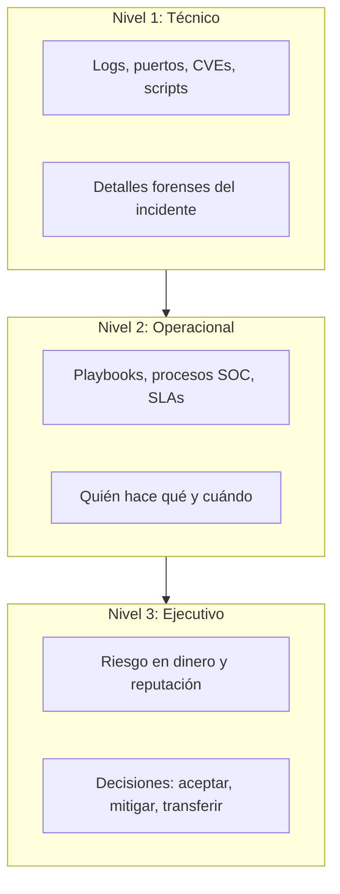

# Capítulo 17: Comunicación Profesional y Storytelling Ejecutivo

> "No basta con tener la razón técnicamente. Tienes que lograr que te escuchen."

En este capítulo das un salto clave: pasas de **resolver problemas técnicos** a **convencer a personas**.  
Tu trabajo ya no termina cuando arreglas la brecha; termina cuando:

- El CEO entiende el riesgo en 5 líneas.
- El equipo técnico sabe exactamente qué hacer el lunes a las 9:00.
- El cliente, la junta directiva o el regulador confían en tu criterio.

Aquí aprenderás a comunicar como un **CyberSentinel profesional**: claro, calmado y accionable, incluso bajo presión.

---

## 17.0 Escena Inicial: El Informe que Nadie Entendió

Imagina este escenario (basado en casos reales):

- Empresa: TechSafeBank, entidad financiera mediana.  
- Incidente: cuenta corporativa comprometida, transferencia fraudulenta internacional.  
- Equipo SOC: detecta actividad rara, bloquea a tiempo y evita una pérdida mayor.  

El analista junior (tú, hace unos meses) envía este correo al CEO:

> "Se detectó tráfico sospechoso en el puerto 443 con múltiples intentos de login fallidos.  
> Se observó un pico en los eventos de tipo 4625 y 4624, con hash de NTLM reutilizado.  
> Posible ataque de contraseña rociada mitigado con política de bloqueo y reseteo forzado."

El CEO responde:

> "¿Debo preocuparme? ¿Perdimos dinero? ¿Qué tengo que decirle al directorio?"

Mensaje clave:

- **Comunicación técnica ≠ comunicación profesional.**  
- Un buen informe no es el que impresiona a otros técnicos, sino el que ayuda a tomar decisiones correctas.

En Cap 17 aprenderás a traducir todo lo que ya sabes (Cap 01‑16) a lenguaje:

- Comprensible para negocio.
- Resumido para ejecutivos.
- Preciso para legal y GRC.
- Motivador para tu propio equipo técnico.

---

## 17.1 Los Tres Niveles de Comunicación en Ciberseguridad

Podemos ver la comunicación profesional como una red con tres capas:

Preguntas clave en cada nivel:

- **Técnico:**  
  - ¿Qué pasó exactamente?  
  - ¿Qué evidencia tenemos?  
  - ¿Qué controles fallaron?

- **Operacional:**  
  - ¿Quién lidera la respuesta?  
  - ¿Qué hacemos en los próximos 30–90 minutos?  
  - ¿Qué impacto operativo habrá (paradas, degradaciones)?

- **Ejecutivo:**  
  - ¿Cuál es el impacto económico y reputacional?  
  - ¿Es necesario notificar a clientes, prensa o reguladores?  
  - ¿Qué decisiones estratégicas tomar en las próximas horas/días?

Tu rol como CyberSentinel es **construir el puente** entre estos niveles.

---

## 17.2 Anatomía de un Informe Ejecutivo de 1 Página

En organizaciones reales, los directivos no leen PDFs de 30 páginas.  
Leen **1 página** (máximo 5–7 minutos de atención).

Estructura recomendada:

1. **Título claro:**  
   - "Incidente de acceso no autorizado al correo del CFO – Contenido"
2. **Resumen en 3–5 líneas:**  
   - Qué pasó, cuándo, impacto estimado y estado actual.
3. **Impacto en negocio:**  
   - Datos afectados, sistemas críticos, posible impacto financiero y reputacional.
4. **Medidas tomadas:**  
   - Qué se hizo ya (bloqueos, reseteos, contención).
5. **Próximos pasos y decisiones requeridas:**  
   - Qué debe decidir el CEO / directorio (comunicar, invertir, aceptar, investigar más).

Ejemplo de resumen bien redactado:

> "El 14/05 a las 03:21 detectamos acceso no autorizado al correo del CFO desde una IP de Brasil.  
> Bloqueamos el acceso en 7 minutos y rotamos credenciales.  
> No hay evidencia de transferencia fraudulenta, pero 32 correos con adjuntos financieros fueron leídos.  
> Recomendamos notificar internamente, reforzar MFA y revisar movimientos bancarios de los últimos 7 días."

Observa:

- No usa jerga innecesaria.
- Responde a las preguntas: **qué pasó, qué impacto tiene, qué se hizo, qué se recomienda.**

---

## 17.3 Comunicación en Medio del Incidente (War Room)

Durante un incidente grave, la comunicación deficiente puede hacer más daño que el propio atacante:

- Rumores internos → pánico.  
- Mensajes contradictorios → equipos descoordinados.  
- Silencio prolongado → pérdida de confianza.

Buenas prácticas fundamentales:

1. **Un solo canal oficial:**  
   - Chat o sala de crisis definida (ej. canal `#incidente-critico`).
2. **Un responsable de comunicación técnica → negocio:**  
   - No todos hablan al CEO; hay un vocero técnico.
3. **Actualizaciones periódicas, aunque no haya “final”:**  
   - "Seguimos investigando. Próxima actualización en 30 minutos."
4. **Separar hechos de hipótesis:**  
   - Hechos: lo que está confirmado (logs, evidencias).  
   - Hipótesis: lo que se sospecha pero aún se verifica.

Plantilla mínima para actualización de incidente:

- **Estado actual (semáforo):**  
  - Verde / Amarillo / Rojo.
- **Resumen técnico en 2–3 líneas.**
- **Impacto en negocio (sistemas afectados, clientes).**
- **Siguientes acciones en los próximos 30–60 minutos.**

---

## 17.4 Storytelling con Datos: Contar la Historia del Riesgo

En Cap 05 y Cap 16 aprendiste a cuantificar riesgo (AV, ALE, ROI).  
Aquí aprenderás a **contar la historia** que hay detrás de esos números.

Ejemplo de "historia de riesgo" mal contada:

> "Si no implementamos EDR, el ALE proyectado es de 250.000 €/año."

Ejemplo mejor:

> "Hoy, con el nivel de exposición actual, estimamos perder en promedio 250.000 € al año por incidentes que el EDR podría detectar.  
> Es el equivalente a perder un cliente mediano cada 12 meses.  
> Con una inversión de 80.000 € en 3 años, reducimos ese riesgo a un nivel aceptable y mejoramos cumplimiento normativo."

Elementos clave del storytelling profesional:

- Conectar el riesgo con algo tangible (clientes, reputación, proyectos).  
- Usar comparaciones que cualquiera pueda imaginar.  
- Mostrar el "antes y después" de implementar controles.  
- Terminar con una **recomendación clara**.

---

## 17.5 Errores Típicos de Comunicación Técnica

Lista de errores que frenan carreras incluso de perfiles muy buenos técnicamente:

1. **Hablar solo en jerga:**  
   - "Tenemos demasiados CVEs críticos sin parchear en el DMZ del segmento 10.0.0.0/24..."
2. **Generar miedo sin contexto:**  
   - "Si no hacemos esto, nos van a hackear seguro."
3. **No proponer alternativas realistas:**  
   - "Necesitamos presupuesto ilimitado, o nada servirá."
4. **Ocultar malas noticias por vergüenza:**  
   - "Mejor no decir nada del fallo del script, ya está solucionado..."
5. **Comunicar en modo defensivo:**  
   - "Yo ya avisé; si no me hicieron caso, no es mi problema."

Tu objetivo es comunicar como un **socio estratégico**, no como un técnico a la defensiva.

---

## 17.6 Prácticas Guiadas: De Lenguaje Técnico a Lenguaje Ejecutivo

Ejercicio 1 – Traducir un hallazgo:

- Texto original (técnico):  
  > "Detectamos múltiples intentos de explotación de CVE‑2021‑44228 (Log4Shell) en nuestro servidor `app‑prod‑02`.  
  > La firma del IDS coincide con ataques activos observados en Internet."

- Reescritura ejecutiva (llena tú):  
  > [En 3–4 líneas, explica qué significa esto para negocio y qué recomiendas.]

Ejercicio 2 – Correo post‑incidente:

- Redacta un correo de máximo 10 líneas para el equipo directivo explicando:  
  - Qué pasó.  
  - Qué impacto tuvo.  
  - Qué se hizo.  
  - Qué se hará para que no se repita.

Ejercicio 3 – Elevator Pitch:

- Imagina que te encuentras al CFO en un ascensor y te pregunta:  
  > "¿Por qué deberíamos invertir en ese proyecto de seguridad que propones?"
- Escribe una respuesta de máximo 4 frases, sin tecnicismos y con foco en impacto de negocio.

Puedes reutilizar estos ejercicios en tu portafolio: son evidencia concreta de tu habilidad para comunicar como profesional.

---

## 17.7 Comunicación, GRC e IA: Cerrando el Círculo

Al final del Volumen 1, tu mapa se ve así:

- Cap 14–15: scripts y SOAR que generan **evidencia y métricas reales**.  
- Cap 16: modelos de riesgo y GRC que convierten esas métricas en **decisiones de negocio**.  
- Cap 17: tú, como **traductor humano** entre la máquina, la ley y las personas.

Incluso cuando uses asistentes IA o plantillas automáticas, la responsabilidad final de la comunicación será siempre tuya:

- Validar que lo que se comunica es veraz y completo.  
- Ajustar el lenguaje al público (técnico vs ejecutivo).  
- Mantener la ética incluso cuando comunicar la verdad duela.

---

## 📊 CyberSentinel Tracker – Capítulo 17

Autoevalúa tu capacidad actual de comunicación profesional. Sé honesto: este tracker es para ti.

  <table class="tracker-table">
    <thead>
      <tr>
        <th>Competencia</th>
        <th>Nivel (0–5)</th>
      </tr>
    </thead>
    <tbody>
      <tr>
        <td>Puedo explicar un incidente reciente en 5 líneas sin jerga.</td>
        <td>
          0
          1
          2
          3
          4
          5
        </td>
      </tr>
      <tr>
        <td>Puedo traducir hallazgos técnicos a impacto en negocio y dinero.</td>
        <td>
          0
          1
          2
          3
          4
          5
        </td>
      </tr>
      <tr>
        <td>He practicado un correo post‑incidente claro y sin pánico.</td>
        <td>
          0
          1
          2
          3
          4
          5
        </td>
      </tr>
      <tr>
        <td>Tengo un “elevator pitch” preparado para justificar un proyecto de seguridad.</td>
        <td>
          0
          1
          2
          3
          4
          5
        </td>
      </tr>
      <tr>
        <td>Soy capaz de ser vocero técnico en una “war room” sin perder la calma.</td>
        <td>
          0
          1
          2
          3
          4
          5
        </td>
      </tr>
    </tbody>
  </table>

  

    PUNTUACIÓN: 0 / 25
  

  

    0–10 puntos: refuerza ejercicios de resumen ejecutivo y correo post‑incidente. 
    11–18 puntos: buena base; practica tu pitch y rol de vocero. 
    19–25 puntos: nivel profesional. Usa ejemplos reales en entrevistas y portafolio.
  

