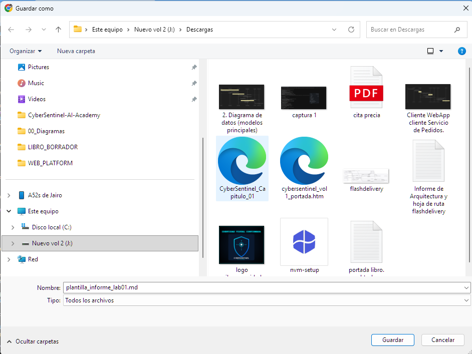
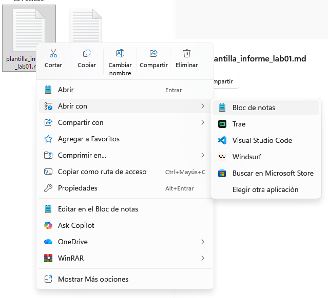
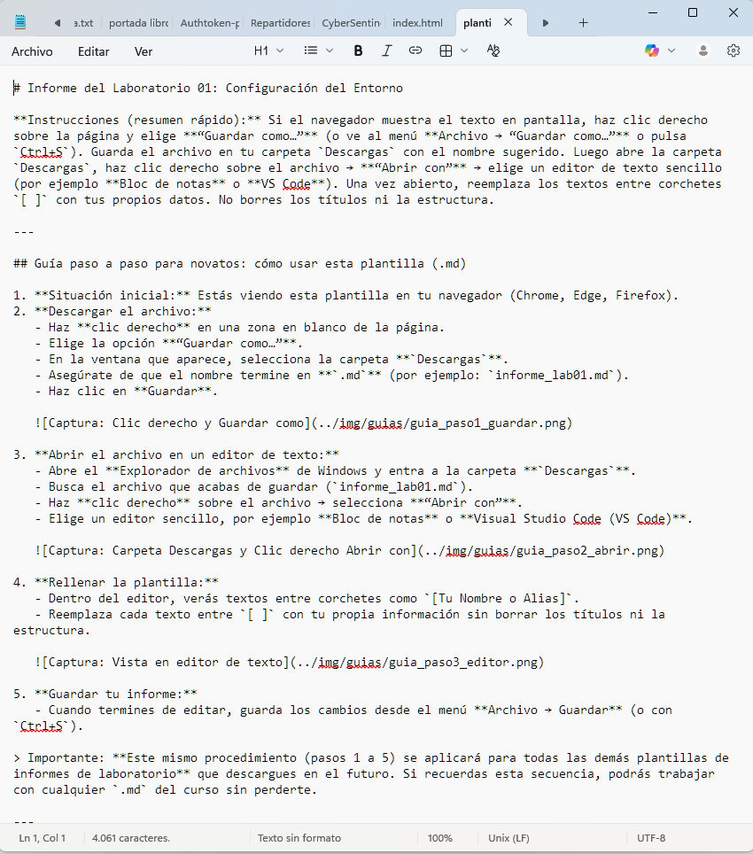

# Informe del Laboratorio 01: Configuración del Entorno

**Instrucciones (resumen rápido):** Si el navegador muestra el texto en pantalla, haz clic derecho sobre la página y elige **“Guardar como…”** (o ve al menú **Archivo → “Guardar como…”** o pulsa `Ctrl+S`). Guarda el archivo en tu carpeta `Descargas` con el nombre sugerido. Luego abre la carpeta `Descargas`, haz clic derecho sobre el archivo → **“Abrir con”** → elige un editor de texto sencillo (por ejemplo **Bloc de notas** o **VS Code**). Una vez abierto, reemplaza los textos entre corchetes `[ ]` con tus propios datos. No borres los títulos ni la estructura.

---

## Guía paso a paso para novatos: cómo usar esta plantilla (.md)

1. **Situación inicial:** Estás viendo esta plantilla en tu navegador (Chrome, Edge, Firefox).  
2. **Descargar el archivo:**  
   - Haz **clic derecho** en una zona en blanco de la página.  
   - Elige la opción **“Guardar como…”**.  
   - En la ventana que aparece, selecciona la carpeta **`Descargas`**.  
   - Asegúrate de que el nombre termine en **`.md`** (por ejemplo: `informe_lab01.md`).  
   - Haz clic en **Guardar**.  

   

3. **Abrir el archivo en un editor de texto:**  
   - Abre el **Explorador de archivos** de Windows y entra a la carpeta **`Descargas`**.  
   - Busca el archivo que acabas de guardar (`informe_lab01.md`).  
   - Haz **clic derecho** sobre el archivo → selecciona **“Abrir con”**.  
   - Elige un editor sencillo, por ejemplo **Bloc de notas** o **Visual Studio Code (VS Code)**.  

   

4. **Rellenar la plantilla:**  
   - Dentro del editor, verás textos entre corchetes como `[Tu Nombre o Alias]`.  
   - Reemplaza cada texto entre `[ ]` con tu propia información sin borrar los títulos ni la estructura.  

   

5. **Guardar tu informe:**  
   - Cuando termines de editar, guarda los cambios desde el menú **Archivo → Guardar** (o con `Ctrl+S`).  

   

> Importante: **Este mismo procedimiento (pasos 1 a 5) se aplicará para todas las demás plantillas de informes de laboratorio** que descargues en el futuro. Si recuerdas esta secuencia, podrás trabajar con cualquier `.md` del curso sin perderte.

---

**Cadete:** [Tu Nombre o Alias]
**Fecha:** [Fecha de realización]
**Laboratorio:** 01 - Configuración del Laboratorio de Hacking

---

## 1. Verificación de Integridad de Herramientas
*Instrucción: Verifica el hash SHA256 del archivo descargado (Kali o VirtualBox) y compáralo con el oficial.*

*   **Herramienta Verificada:** [Ej: Kali Linux 2024.1 .7z / VirtualBox Installer]
*   **Hash Calculado:** `[Pega aquí el hash que obtuviste]`
*   **Resultado de Verificación:** [✅ EXITOSA / ❌ FALLIDA]
    *   *(Si falló, describe la acción tomada: ¿Descargaste de nuevo? ¿Verificaste la fuente?)*:

## 2. Configuración de Red (Conectividad)
*Instrucción: Asegura que ambas máquinas (Atacante y Víctima) estén en la misma red (Red NAT).*

*   **IP de Kali Linux (Atacante):** `[Ej: 10.0.2.15]`
*   **IP de Windows (Víctima):** `[Ej: 10.0.2.16]`
*   **Prueba de Ping (Kali -> Víctima):**
    *   Comando usado: `ping -c 4 [IP_VICTIMA]`
    *   Resultado: [✅ Éxito (Recibidos) / ❌ Fracaso (Tiempo de espera)]

## 3. Persistencia y Recuperación
*Instrucción: Confirma que has creado un punto de restauración limpio.*

*   **Nombre del Snapshot (Kali):** [Ej: "Base Kali - Instalación Limpia"]
*   **Nombre del Snapshot (Windows):** [Ej: "Base Windows - Configuración Inicial"]

## 4. Bitácora de Errores y Soluciones (Troubleshooting)
*Instrucción: Documenta cualquier obstáculo. Esto es vital para tu aprendizaje.*

| Problema Encontrado | Solución Aplicada |
| :--- | :--- |
| *[Ej: Error VERR_VM_DRIVER al iniciar]* | *[Ej: Reinstalé VirtualBox y reinicié el host]* |
| *[Problema 2]* | *[Solución 2]* |

---
**Conclusión General:**
*[Escribe brevemente qué aprendiste en este laboratorio]*
